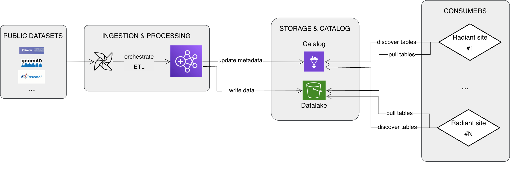

# radiant-open-datalake

**radiant-open-datalake** centralizes and automates the ingestion, management, and versioning of public third-party datasets (e.g., ClinVar, Ensembl, gnomAD) to be reused across all Radiant deployments and related projects.

## Overview

The project is organized as a monorepo:

- [**airflow**](airflow/README.md): Contains airflow code for orchestrating data ingestion, processing and publication workflows.
- [**spark**](spark/README.md): Contains Spark jobs for data transformation and normalization.

## Architecture diagram

## Links

[Chosen architecture ADR](https://github.com/radiant-network/architecture/blob/main/decisions/0010-public-datalake-architecture.md)
