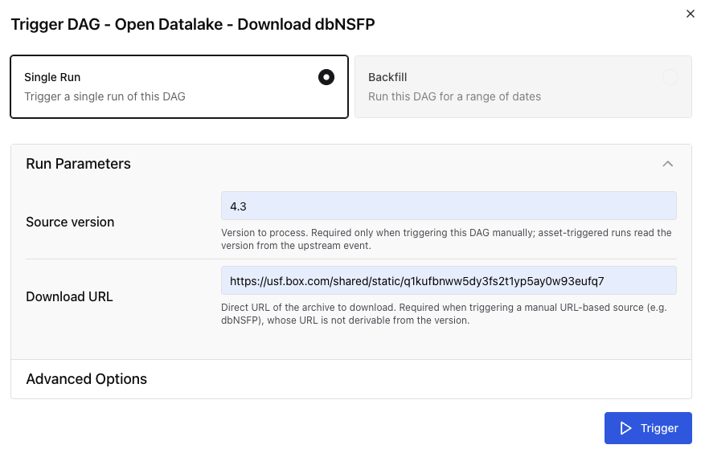
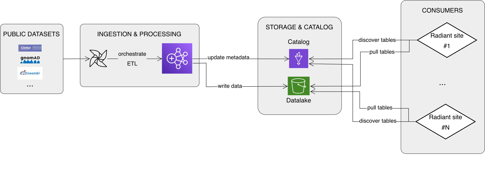

# radiant-open-datalake

**radiant-open-datalake** centralizes and automates the ingestion, management, and versioning of public third-party datasets (e.g., ClinVar, Ensembl, gnomAD) to be reused across all Radiant deployments and related projects.

## Overview

The project is organized as a monorepo:

- [**airflow**](airflow/README.md): Contains airflow code for orchestrating data ingestion, processing and publication workflows.
- [**spark**](spark/README.md): Contains Spark jobs for data transformation and normalization.

## Data sources

The following sources are currently included in the available data sources:

### Automatic

New versions are discovered and imported automatically.

| Source | Table | Release notes |
|--------|-------|---------------|
| [NCBI ClinVar](https://www.ncbi.nlm.nih.gov/clinvar/) | `clinvar_v1` | [v1](spark/doc/release-notes/clinvar/v1.md) |
| [NCBI dbSNP](https://www.ncbi.nlm.nih.gov/snp/) | `dbsnp_v1` | [v1](spark/doc/release-notes/dbsnp/v1.md) |
| [Mondo Disease Ontology](https://mondo.monarchinitiative.org/) | `mondo_v1` | [v1](spark/doc/release-notes/mondo/v1.md) |
| [Human Phenotype Ontology (Terms)](https://hpo.jax.org/) | `hpo_terms_v1` | [v1](spark/doc/release-notes/hpo_terms/v1.md) |
| [Human Phenotype Ontology (Genes)](https://hpo.jax.org/) | `hpo_genes_v1` | [v1](spark/doc/release-notes/hpo_genes/v1.md) |

### Manual

Imported on demand.

| Source | Table | Release notes |
|--------|-------|---------------|
| [1000 Genomes Project](https://www.internationalgenome.org/home) | `1000_genomes_v1` | [v1](spark/doc/release-notes/1000_genomes/v1.md) |
| [gnomAD Joint Frequency](https://gnomad.broadinstitute.org/) | `gnomad_joint_v1` | [v1](spark/doc/release-notes/gnomad_joint/v1.md) |
| [gnomAD Exome CNV](https://gnomad.broadinstitute.org/) | `gnomad_cnv_v1` | [v1](spark/doc/release-notes/gnomad_cnv/v1.md) |
| [gnomAD Structural Variants](https://gnomad.broadinstitute.org/data#v4-structural-variants) | `gnomad_sv_v1` | [v1](spark/doc/release-notes/gnomad_sv/v1.md) |
| [SpliceAI](https://github.com/Illumina/SpliceAI) | `spliceai_v1` | [v1](spark/doc/release-notes/spliceai/v1.md) |
| [dbNSFP](https://www.dbnsfp.org/) | `dbnsfp_v1` | [v1](spark/doc/release-notes/dbnsfp/v1.md) |

#### Downloading dbNSFP

Unlike the other sources, dbNSFP has no stable, predictable download URL: each release is distributed
through the official site behind an access/registration process, and the link is not derivable from a
version. So the exact archive URL is supplied **by hand** at trigger time.

To ingest a dbNSFP release:

1. **Get the download URL** from the official site ([dbnsfp.org](https://www.dbnsfp.org/)): complete
   their registration/access process and copy the download link they give you. The link may or may
   not end in `.zip` (it can be a signed or redirect link) — that's fine, as long as it resolves to
   the release's zip archive. Paste it **exactly as provided**, don't rewrite it.
2. **Trigger the _Download dbNSFP_ DAG** with two params:
   - `version` — the release, e.g. `4.9a` (names the landing folder `raw/landing/dbnsfp/<version>/`
     and the published branch of `dbnsfp_v1`).
   - `download_url` — the link from step 1, pasted verbatim (paste only the URL).
3. The download **stream-unzips** the archive directly to the landing zone (no local disk; it keeps
   only the per-chromosome `*_variant.chr*.gz` members). When it finishes, the **Import dbNSFP** DAG
   builds `dbnsfp_v1` automatically.

> A failed download restarts from the beginning — a zip stream cannot be resumed mid-archive.

See [airflow/README.md](airflow/README.md#manual-url-based-sources-dbnsfp) for the param mechanics and
[the release notes](spark/doc/release-notes/dbnsfp/v1.md) for the published schema.

Example for version `4.3` with link extracted from: https://sites.google.com/site/jpopgen/dbNSFP:

## Architecture diagram

## Links

[Chosen architecture ADR](https://github.com/radiant-network/architecture/blob/main/decisions/0010-public-datalake-architecture.md)
