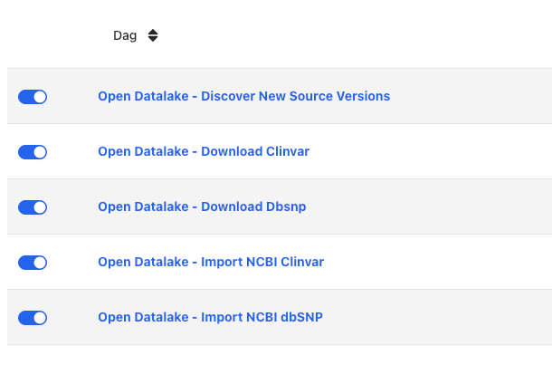

## Start minikube
```
minikube start
```

Note: was tested with the following config:
```
minikube config set memory 12000
minikube config set cpus 4
```

## run minikube tunnel in a separated terminal
```
minikube tunnel
```

## Create a namespace for the project

```
kubectl create namespace opendatalake
```

## Switch to the open datalake namespace
```
kubectl config set-context --current --namespace=opendatalake
```

## Install MinIO
```
kubectl apply -f sandbox/k8s/minio/
```

## Monitor Minio pods are running
```
kubectl get po | grep minio
```
Results 1 pod running and 1 pod completed:
```
opendatalake-minio-xxxxxxxxxx-xxxxx        1/1     Running     0          85s
opendatalake-minio-bucket-init-job-xxxxx   0/1     Completed   0          85s
```

## Install Apache Polaris (Iceberg catalog)

The Spark import jobs write Iceberg tables through a REST catalog. Deploy [Apache Polaris](https://polaris.apache.org/) (in-memory metastore, backed by the MinIO installed above) and bootstrap the `opendatalake` catalog. Requires MinIO to be running (the `opendatalake-dev` bucket must exist).

```
kubectl apply -f sandbox/k8s/polaris/
```

This starts Polaris (realm `POLARIS`, root principal `root`/`s3cr3t`) and runs a one-shot Job that creates the `opendatalake` catalog (`default-base-location` `s3://opendatalake-dev/iceberg`, path-style MinIO, no STS — Polaris vends the static MinIO credentials) plus the `reference` namespace.

## Monitor Polaris is running and the catalog was created
```
kubectl get po | grep polaris
```
Results 1 pod running and 1 pod completed:
```
polaris-xxxxxxxxxx-xxxxx           1/1     Running     0          60s
polaris-catalog-init-job-xxxxx     0/1     Completed   0          60s
```
Check the init job logs to confirm the catalog/namespace calls returned `200`/`201` (or `409` if already created):
```
kubectl logs job/polaris-catalog-init-job
```

Note: Polaris uses an in-memory metastore here — catalog metadata is lost if the Polaris pod restarts. Re-run `kubectl delete job polaris-catalog-init-job && kubectl apply -f sandbox/k8s/polaris/` to re-bootstrap.

## Install postgres
```
kubectl apply -f sandbox/k8s/postgres/
```

## Monitor Postgres pods are running
```
kubectl get po | grep postgres
```
Results 1 pod running and 1 pod completed:
```
postgres-xxxxxxxxxx-xxxxx             1/1     Running     0          23s
postgres-init-job-xxxxx               0/1     Completed   0          23s
```

## Mount volume for dags in minikube

In a new terminal, run the following command to mount the `opendatalake` package into the Airflow
DAGs folder in minikube. The package is mounted *under* the DAGs folder (not the DAGs folder
itself) so the DAG files' `from opendatalake... import` statements resolve — the DAGs folder
(`/opt/airflow/dags`) is on `PYTHONPATH`, and it must contain the `opendatalake/` package root.
```
minikube mount $(pwd)/opendatalake:/opt/airflow/dags/opendatalake
```

## Pre-building the Open Datalake ECS task operator image

Run the following command to build the image:

```
eval $(minikube -p minikube docker-env)  # To ensure the image is built inside minikube's docker environment
docker build -t ghcr.io/radiant-network/opendatalake-airflow-task-operator:latest -f Dockerfile.opendatalake.operator .
```

## Building the Spark ETL image

To let Airflow run the import (Spark) jobs on local Spark, build the Scala fat JAR and bake it into a Spark image inside minikube's docker environment. The Dockerfile (`airflow/sandbox/Dockerfile.opendatalake.spark`) builds `apache/spark:3.5.5` + the fat JAR; jobs run as `spark-submit --master local[*]`. Build the JAR from `spark/`, then build the image from `airflow/` with the `spark/` directory as the build context (COPY paths are relative to `spark/`).

```sh
# Build the fat JAR -> target/scala-2.12/radiant-open-datalake-spark.jar
cd ../spark
sbt clean assembly

# Back in airflow/, build the image inside minikube's docker so the KubernetesPodOperator can pull
# it locally. Dockerfile is in sandbox/; the build context is the sibling spark/ directory.
cd ../airflow
eval $(minikube -p minikube docker-env)
docker build -t ghcr.io/radiant-network/opendatalake-spark:latest -f sandbox/Dockerfile.opendatalake.spark ../spark
```

Note: `spark-sql`/`hadoop-client` are `Provided` (supplied by the base image); `hadoop-aws`, Iceberg and Glow are shaded into the JAR, so no `--packages` are needed at runtime.

## Switch download_source DAG from ECS to K8s operator (Optional)

You can swap the ECS operator for the K8s operator in the `download_source` DAG for local testing.

Run the following commands to switch:
```sh
cp sandbox/operators/k8s.py opendatalake/lib/operators/k8s.py
sed -i '' 's/operators\.ecs/operators\.k8s/g'  opendatalake/dags/download_source.py
```

To revert back to the ECS operator:
```sh
rm opendatalake/lib/operators/k8s.py
sed -i '' 's/operators\.k8s/operators\.ecs/g'  opendatalake/dags/download_source.py
```

Note: The swap commands will modify your code copy. Make sure you do not commit the operator swap to version control.

## SpliceAI download token (Optional — only to test the `spliceai` source)

The `spliceai` source downloads from an authenticated API. In AWS the token comes from Secrets Manager,
but the code itself only reads a plain env var (`SpliceAiConfig.from_env()` → `os.getenv`), so **the
sandbox needs no Secrets Manager** — just set the env var.

Put your test API key in `sandbox/values/airflow-values.yaml` under `extraEnv` (a placeholder entry is
already there) and re-run the `helm upgrade` below:

```yaml
  - name: OPENDATALAKE_SPLICEAI_ACCESS_TOKEN
    value: "<your-test-api-key>"
```

This covers version discovery and the VCF `direct_upload` (both run in the worker). For the tbi index,
which uploads via the K8s download pod, do the ECS→K8s swap above — `sandbox/operators/k8s.py` forwards
this token from the worker env into the pod (the ARN half of `secret_env_vars` is ignored locally).

Do **not** commit a real token.

## Switch import_source DAG from EMR to local Spark (Optional)

Swap the EMR Serverless operator for the local-Spark K8s operator so the `import_source` DAG runs `spark-submit` in a pod (against MinIO + Polaris) instead of AWS EMR. Requires the Spark image (built above) and Polaris (installed above).

Run the following commands to switch:
```sh
cp sandbox/operators/spark_k8s.py opendatalake/lib/operators/spark_k8s.py
sed -i '' 's/operators\.emr/operators\.spark_k8s/g' opendatalake/dags/import_source.py
```

To revert back to the EMR operator:
```sh
rm opendatalake/lib/operators/spark_k8s.py
sed -i '' 's/operators\.spark_k8s/operators\.emr/g' opendatalake/dags/import_source.py
```

The swap keeps the `EmrServerlessJobOperator` class name, so only the import path changes — DAG code is otherwise untouched. Raw files are read from MinIO via Hadoop S3A; Iceberg tables are written through Polaris (credential vending) to `s3://opendatalake-dev/iceberg/reference/`.

Note: The swap commands will modify your code copy. Make sure you do not commit the operator swap to version control.

## Install airflow volumes for logs and dags
```
kubectl apply -f sandbox/k8s/airflow/
```

## Install Airflow

```
helm repo add apache-airflow https://airflow.apache.org
helm repo update
helm upgrade --install airflow apache-airflow/airflow -f sandbox/values/airflow-values.yaml
```
Took 5 minutes to install Airflow

## Monitor Airflow pod are running
```
kubectl get po | grep airflow
```
Results 6 pods running:
```
airflow-api-server-xxxxxxxxxx-xxxxx      1/1     Running     0          2m11s
airflow-dag-processor-xxxxxxxxxx-xxxxx   2/2     Running     0          2m11s
airflow-redis-0                          1/1     Running     0          2m11s
airflow-scheduler-xxxxxxxxx-xxxxx        2/2     Running     0          2m11s
airflow-statsd-xxxxxxxxxx-xxxxx          1/1     Running     0          2m11s
airflow-triggerer-0                      2/2     Running     0          2m11s
airflow-worker-0                         2/2     Running     0          2m11s
```


## Connect to the Airflow UI
Connect to the Airflow UI at http://localhost:8080
- Username: airflow
- Password: airflow


## Create Pools

In the airflow UI, using the Admin tab, create pool "opendatalake_download_tasks_pool" with 1 slots.
Also create pool "opendatalake_direct_upload_tasks_pool" with 1 slots.

## Ensure DAGs are activated before running

In the airflow UI, toggle the activation for every DAG you want to import before triggering the `Open Datalake - Discover New Source Version` DAG.



## Run the SpliceAI source end-to-end (example)

SpliceAI exercises the authenticated-download path (BaseSpace V2 API, `x-access-token`) plus the
contract/WAP import. It needs the two operator swaps (ECS→K8s, EMR→local-Spark), the download token, and
**both** sandbox images rebuilt — they bake code that changed for this source:

- the **operator image** bakes `opendatalake/` (the download pod resolves the `spliceai` source config);
- the **Spark image** bakes the fat JAR + `dev.conf` (the `spliceai` command, `SpliceAi_v1` normalizer,
  and the regenerated dataset config live there).

The Airflow-side code is mounted (`minikube mount`), so only these two pod images need rebuilding.

From `airflow/`:

1. Confirm the token reaches BaseSpace (fail early):
   ```sh
   curl -s -H "x-access-token: <test-key>" https://api.basespace.illumina.com/v2/files/16525380715 | jq '.ETag'
   ```
   A non-null ETag means the key works. Ensure `OPENDATALAKE_SPLICEAI_ACCESS_TOKEN` is set in
   `sandbox/values/airflow-values.yaml` (see the token section above), then apply it:
   ```sh
   helm upgrade --install airflow apache-airflow/airflow -f sandbox/values/airflow-values.yaml
   ```

2. Apply both operator swaps (see the two "Switch … operator" sections above).

3. Rebuild both images inside minikube's docker (so the `IfNotPresent` pods pick up `:latest`):
   ```sh
   eval $(minikube -p minikube docker-env)
   docker build -t ghcr.io/radiant-network/opendatalake-airflow-task-operator:latest -f Dockerfile.opendatalake.operator .
   cd ../spark && sbt clean assembly && cd ../airflow
   docker build -t ghcr.io/radiant-network/opendatalake-spark:latest -f sandbox/Dockerfile.opendatalake.spark ../spark
   ```

4. Make sure the package mount and the two pools (above) are in place, and activate the `Discover New
   Source Versions`, `Download SpliceAI` and `Import SpliceAI` DAGs.

5. Trigger `Open Datalake - Discover New Source Versions`. It resolves the SpliceAI version (the VCF
   ETags), then the download and import DAGs run via the asset chain. The published table is
   `reference.spliceai_v1` on a branch named after the version — `main` is empty by WAP design (browse it
   with StarRocks below).

Notes:
- The SNV score VCF is large (tens of GB); `direct_upload` streams it through the worker into MinIO, so
  expect a long download and give the minikube node / MinIO PVC disk headroom. To just prove the wiring,
  the indel files are much smaller.
- The download and discovery tasks need internet egress to `api.basespace.illumina.com` (minikube NAT).

## Browse the Iceberg catalog with StarRocks (Optional)

Deploy StarRocks (single-container `allin1`: 1 FE + 1 BE) and attach the Polaris/Iceberg tables as an external catalog so you can browse the imported data with SQL. Requires MinIO + Polaris running and at least one Import DAG succeeded.

```
kubectl apply -f sandbox/k8s/starrocks/
```

### Wait for StarRocks to be ready
```
kubectl get po | grep starrocks
```
The FE accepts connections ~40s after the pod is Running; the BE self-registers a few seconds later. Confirm both are alive:
```
kubectl exec -it deploy/opendatalake-starrocks -- mysql -P9030 -h127.0.0.1 -uroot -e "SHOW BACKENDS\G"
```
Wait until `Alive: true`.

Note: StarRocks BE needs `vm.max_map_count >= 262144`. The deployment sets it via a privileged init container; if the BE still won't stay alive, set it on the node directly: `minikube ssh -- sudo sysctl -w vm.max_map_count=262144`.

### Create the external catalog
Run the catalog definition (`sandbox/starrocks/create_iceberg_catalog.sql`) — Polaris serves metadata over REST (OAuth2), StarRocks reads data files straight from MinIO with static creds:
```sh
kubectl exec -i deploy/opendatalake-starrocks -- mysql -P9030 -h127.0.0.1 -uroot \
  < sandbox/starrocks/create_iceberg_catalog.sql
```

### Browse
```sh
kubectl exec -it deploy/opendatalake-starrocks -- mysql -P9030 -h127.0.0.1 -uroot
```
```sql
SHOW CATALOGS;              -- default_catalog + opendatalake
SET CATALOG opendatalake;
SHOW DATABASES;             -- Iceberg namespaces (e.g. reference)
USE reference;
SHOW TABLES;
SELECT * FROM clinvar_v1 LIMIT 10;                 -- main branch should be empty
SELECT * FROM clinvar_v1 VERSION AS OF '20260804'; -- inspect version branch
```