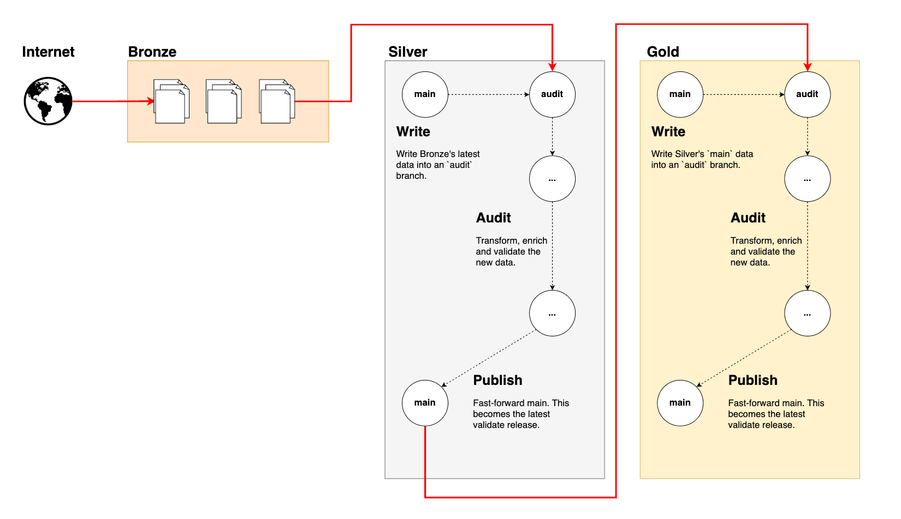

# SJRA-1546: Iceberg Tables Evolution

## Versions

- 2026-06-02: Initial draft

## 1. Introduction

The Open DataLake provides Open Datasets in a consumable fashion for developers requiring integration of those datasets within their applications.

### 1.1 Purpose & Scope

The evolution specification for those Open Datasets was defined in https://www.notion.so/ferlab/POC-open-datalake-versioning-360b0fcecb3d8050b64ccde3c3ccaa5c. 

- This manual contains the system architecture and defines the technical aspect of the evolution specification.
- It is intended to serve as the reference for developers implementing the solution.

### 1.2 Assumptions and Constraints

We use two independent version types:

- `contract_version`: Defines a specific data schema for a given dataset.
- `dataset_version`: Identifies the Open dataset from the 3rd parties (the original owners of the dataset). 

Important:

- Reading data from a specific `contract_version` can contain data from multiple `dataset_version` if there was no schema changes.
- Data rows for a specific `dataset_version` can exist in multiple `contract_version` if they have different schemas.

Example for an Iceberg table `Example_v1` (schema `MAJOR` version `1` for `Example` dataset):

| `dataset_version` | `col_A` | `col_B` |
|-------------------|---------|---------|
| 1                 | foo1    | bar1    |
| 1                 | foo2    | bar2    |
| 1                 | foo3    | bar3    |
| 2                 | alice1  | bob1    |
| 2                 | alice2  | bob2    |
| 2                 | alice3  | bob3    |

And at the same time, another Iceberg table `Example_v2` (schema `MAJOR` version `2` for `Example` dataset):

(In this new schema, the `col_B` was renamed `col_C`, which is a breaking change of schema)

| `dataset_version` | `col_A` | `col_C` |
|-------------------|---------|---------|
| 1                 | foo1    | bar1    |
| 1                 | foo2    | bar2    |
| 1                 | foo3    | bar3    |
| 2                 | alice1  | bob1    |
| 2                 | alice2  | bob2    |
| 2                 | alice3  | bob3    |

---

## 2. Data Architecture

### 2.1 Medallion Architecture

3-layer separation:

- **Bronze**: (Object store/S3) Raw files and artifacts.
- **Silver**: (Iceberg) Space where transformations and enrichments take place. 
- **Gold**: (Iceberg) Holds the consumable release of the data set (with all the transformations and enrichments applied).

**Important points**:
- Both **Silver** and **Gold** have their own Iceberg tables. 
- **Silver** is an internal/private table used for ETL purposes.
- **Gold** is the user facing, "safe" (validated) release of the data set. 

### 2.2 Write-Audit-Publish (WAP) ingestion pattern

The Write-Audit-Pattern is a standard pattern supported by most Iceberg's catalog implementations. (At least the ones we are interested in)
(https://aws.amazon.com/fr/blogs/big-data/build-write-audit-publish-pattern-with-apache-iceberg-branching-and-aws-glue-data-quality/)

The concept is simple, it uses two branches, `audit` and `main`. 

- `audit`: Staging area where changes take place. This is a temporary transient branch that is deleted once the changes are committed to `main`.
- `main`: Area where changes end up. 

In the context of our medallion architecture, both **Silver** and **Gold** layers will have their separate WAP branches.

The following diagram describes the high-level data flow through the different medallion layers using the WAP pattern:



## 3. Implementation details

### 3.1 `contract_version` configuration stored in `contracts.yml` 

`contract_version` is a YAML configuration that lives in the ETL code as a `contracts.yml` (exact name irrelevant for now) file.
Fields are defined for `source.{name}.contracts` like this:

| Field           | Description                                                                              | Example                                                  |
|-----------------|------------------------------------------------------------------------------------------|----------------------------------------------------------|
| `lineage`       | Describes to which `{MAJOR}.{MINOR}` the contract corresponds. (Dot separated)           | 1.0                                                      | 
| `table`         | The iceberg table name linked with that specific `lineage`'s `MAJOR`.                    | `clinvar_v1`                                             | 
| `normalizer`    | Which normalizer contains the schema definition for that particular `lineage`'s `MAJOR`. | `org.radiant.opendatalake.normalized.clinvar.clinvar_v1` | 
| `release_notes` | Path to release notes for that specific `lineage`'s `MAJOR`.                             | `doc/release-notes/clinvar/v2.md`                        | 

Example:

```yaml
# contracts.yml
sources:
  clinvar:
    contracts:
      - lineage: "1.0"  
        table: "clinvar_v1"
        normalizer: "org.radiant.opendatalake.normalized.clinvar.clinvar_v1"  # See Normalizers as schemas section
        release_notes: "doc/release-notes/clinvar/v1.md"                      # See Release notes section
      - lineage: "2.0"          
        table: "clinvar_v2"
        normalizer: "org.radiant.opendatalake.normalized.clinvar.clinvar_v2"
        release_notes: "doc/release-notes/clinvar/v2.md"
```

For the example above, all the normalizers are executed every time a new `clinvar` version is detected.

> **Note**: Pushing contract split as late as possible in the pipeline
> 
> No assumption is made on the implementation's parallelism. Re-transforming several times the same data with minor
> schema differences might be very wasteful in terms of resources. Transient data should be re-used as much as possible
> while being transformed. Different contracts will yield different tables, but if their intermediate transformation steps
> can be shared, it is highly encouraged.

### 3.2 `dataset_version` storage

The `dataset_version` is stored as a regular column on each Iceberg table. Every row carries the `dataset_version`
it originated from. This is the source of truth for "which dataset versions are present in this table".

**Rationale (why a column over snapshot summary / table properties / partitioning):**

- **Directly readable in StarRocks.** SQL, no dependency on metadata tables (the Iceberg metadata tables,
  e.g. `table$snapshots`/`table$refs`, only became available in StarRocks v3.4.1).
  ```sql
  SELECT DISTINCT dataset_version FROM opendatalake.reference.clinvar;   -- full set present
  SELECT MAX(dataset_version)     FROM opendatalake.reference.clinvar;   -- latest present
  ```
- The cardinality is small (a few versions). Parquet dictionary + RLE encoding make the size on disk negligible for a low cardinality field. (Source: https://parquet.apache.org/docs/file-format/data-pages/encodings/)
  Iceberg also keeps per-column min/max in the manifests, so `MAX(dataset_version)` can resolve from metadata without scanning data files. (Source: https://iceberg.apache.org/docs/latest/performance/)
- Unlike a snapshot `summary`, the column is not lost when snapshots are expired or when files are compacted/rewritten.
- A single `contract_version` table can hold rows from multiple `dataset_version`s

`dataset_version` is to be injected as a `STRING` type from the Airflow DAG. It will be set as is for each new row corresponding to that specific version. 

#### 3.2.1 Spark-based fan-out

Airflow should have no knowledge of `contract_version`. Airflow's responsibility is to verify if a source has changed based on its `dataset_version` only since 
`contract_version` is useful for identifying schema drift for ETL or consumption purposes, not orchestration.

Therefore, Airflow will only inject the `dataset_version` (from the Asset event). The ETL writes that value into the
`dataset_version` column of every row it produces for that run.

### 3.3 Versions table to keep track of contracts

Contract versions history will be kept in a `versions` Iceberg table with the following columns:

| Column Name         | Type     | Description                                                                                                 |
|---------------------|----------|-------------------------------------------------------------------------------------------------------------|
| dataset_name        | String   | Identifier of the data set (e.g.: `clinvar`).                                                               |
| contract_version    | String   | Keeps the MAJOR.MINOR.PATCH of the current dataset.                                                         |
| active              | Boolean  | If the contract is active or not (non-active could mean the ETL is broken, it will be skipped at next run). |
| status              | String   | The current status of the contract (See `statuses` sub-section for details).                                |  
| last_run            | Datetime | Datetime of the last run.                                                                                   |
| last_successful_run | Datetime | Datetime of the last successful run.                                                                        |
| created_at          | Datetime | Datetime of creation.                                                                                       |
| updated_at          | Datetime | Datetime of the latest update to this row.                                                                  |

**Concepts**:

- The `versions` table contains the "what's in Iceberg", meaning the contracts for which there was at least 1 successful run. It tracks what currently exist in Iceberg, not the work to do. 
- The `contracts.yml` file contains the "what needs to be done", meaning that it is the source of truth to define which contracts are executed by the ETL.

**Important points:**

- At ETL run time, the `contract_version` existing in the `versions` table, but not in the `contracts.yml` will be set to `active=FALSE` and `status=STOPPED` at the corresponding row.
- At ETL run time, the `contract_version` existing in the `contracts.yml`, but not in the `versions` table will be created as a new row and set to `active=TRUE` and `status=NORMAL`.
- This table is available to consumers. This serve as the "status page" for each data sets, with which they can validate if the table can be imported or not.
- `last_run` and `last_successful_run` are used to handle ETL failures. A `last_run > last_successful_run` means we are retrying from a previous failure. 
- The `versions` table is updated **ONLY AFTER A SUCCESSFUL COMMIT** (Except for the `last_run` and `UPDATING` status, see detail below). This means:
   - `PATCH` is not incremented at each attempt. 
   - A new `MINOR` or `MAJOR` doesn't appear in the `versions` table if a failure occurred.
   - **Exception**: `last_run` and `status=UPDATING` are set before doing any changes to the data set's Iceberg table. 

**Data Upgrades**:

- Tables are idempotent. The same version re-runs will overwrite the data.
- Updates for new `MAJOR` versions are for future `dataset_version` (exception for the `dataset_version` at the time of creating the new `MAJOR`)
   - This means no historical re-runs. (Might be required, but will be handled case-by-case manually, not covered by automation)

**Statuses**

- `NORMAL`: Normal operation. This is considered safe to use.
- `ERROR`: Abnormal situation where developer intervention is needed. The table will not be updated further until resolved.
- `STOPPED`: This was stopped as part of normal operations and should not be used anymore. This is not an indication or error.
- `UPDATING`: This means an ETL process acquired a lock for this contract and is currently doing some work.

### 3.4 Normalizers as schemas

The normalizers are the single sources of truth for a `MAJOR`'s schema. This is then translated into an actual Iceberg's schema when data is written to a table. 

Contract schemas are validated within the normalizer as part of the transformation pipeline. 

Schema validation can have 3 different outcomes:

- **No schema change** ---> see bump `PATCH`
- **Non-breaking schema change** ---> see bump `MINOR`
- **Schema changes are not handled automatically** ---> see bump `MAJOR`

| Bump  | PR required | Edit to `contracts.yml`                                                       | Code change                                                        | Table impact                                                                                             |
|-------|-------------|-------------------------------------------------------------------------------|--------------------------------------------------------------------|----------------------------------------------------------------------------------------------------------|
| PATCH | No          | none                                                                          | none                                                               | new snapshot on the existing table; new tag `contract_v{MAJOR}.{MINOR}.{PATCH+1}`                        |
| MINOR | Yes         | bump `lineage` (e.g. `"1.3"` → `"1.4"`) on the existing row                   | edit the same normalizer class to add new columns                  | Iceberg schema evolution adds columns to the existing table; PATCH counter resets to 0 for the new MINOR |
| MAJOR | Yes         | add a new row `(major: N+1, lineage: "{N+1}.0", table: "<source>_v{N+1}", …)` | add a new normalizer class (`{source}_v{N+1}`, …) + new `contract` | new Iceberg table created on first run; old MAJOR row stays in the file and keeps ingesting in parallel  |

**Important points:**

- `contracts.yml` will be modified manually by developers when updating the schemas. 
- Bugfixes and improvements in the code requires bumping the `MINOR`. A `PATCH` is **RESERVED** for the ETL automation, any manual intervention minimally bumps the `MINOR`.
- A `PATCH` ETL run is always the expected default when no changes have been made to the contract. 
    - Since `MAJOR` or `MINOR` updates needs to be vetted by a developer, the ETL always assume its in `PATCH` mode.
    - A desired update needs to be planned a-priori and a new `MINOR`/`MAJOR` (case-by-case) needs to be defined in an upcoming PR.
    - A failure needs to be reacted a-posteriori and a new `MAJOR` needs to be defined in an upcoming PR.

### 3.5 Governance and lifecycle

Initially, no specific policies applied to the versions. They will be kept until manually retired. 

For initial implementation, assume we keep everything. 

### 3.6 Release notes

Release notes are written per data source and located in `doc/release-notes/{dataset_name}/v{MAJOR}.md`. 

At a minimum, they are available by browsing Github's `Releases` section. 

> Note: 
> 
> Ideally published in a documentation website and synchronized. 
> This is an improvement for future versions of the Open DataLake.

## 4. Implementation Checklist

**Contracts & fan-out**
- [ ] Add the `contracts.yml` file to the ETL repository and a loader/parser for it.
- [ ] Implement the `spark` operator that submits one job per active contract and injects the `dataset_version` (from the Asset event).
- [ ] Write `dataset_version` (STRING) as a column on every row of each Iceberg table.

**Versions table**
- [ ] Create the `versions` table (StarRocks-readable) with the defined columns.
- [ ] Reconcile against `contracts.yml` at run time: row in `versions` but not in `contracts.yml` → `active=FALSE`, `status=STOPPED`; row in `contracts.yml` but not in `versions` → new row, `active=TRUE`, `status=NORMAL`.
- [ ] Set `last_run` + `status=UPDATING` (acquire lock) before touching the table; commit the rest of the row only after a successful Iceberg commit.
- [ ] Expose the table to consumers as the per-dataset status page.

**Idempotency & restart**
- [ ] Implement idempotent overwrite per `dataset_version` (delete `WHERE dataset_version = X` + append, single transaction) so re-runs converge without duplicates.
- [ ] Implement resume logic: `last_run > last_successful_run` -> retry-from-failure; 
- [ ] Implement the `v{MAJOR}.{MINOR}.{PATCH}` Iceberg tagging, idempotent per `dataset_version` (no duplicate tag / no PATCH incrementation on retry).
- [ ] Auto-increment `PATCH` only on a new successful commit, derived from the `versions` table (`PATCH` reserved to automation).

**Schema validation & failure handling**
- [ ] Implement in-normalizer schema validation classifying the run as `PATCH` / `MINOR` / `MAJOR`.
- [ ] On a breaking change (or other failure), set `status=ERROR` in the `versions` table before exiting; block further updates to that contract.
- [ ] Define the `MINOR` (schema evolution: add columns) and `MAJOR` (new table + new normalizer class) implementations.

## 5. References

- Versioning spec: https://www.notion.so/ferlab/POC-open-datalake-versioning-360b0fcecb3d8050b64ccde3c3ccaa5c