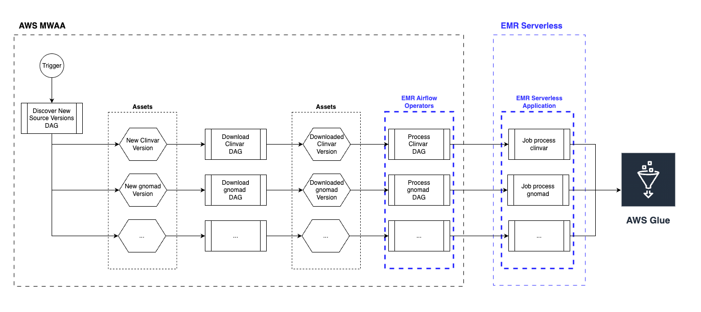
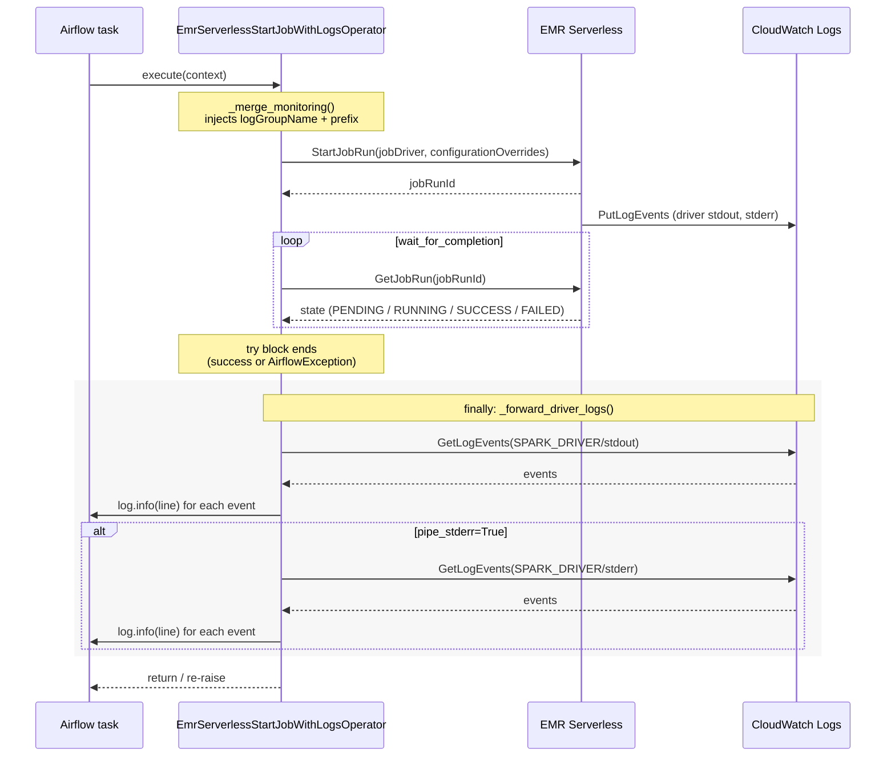
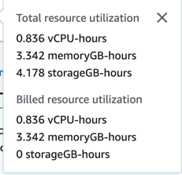

# SJRA-1374 — POC: EMR Serverless for OpenDataLake

Proof-of-concept running the `radiant-open-datalake` Spark/Scala ETL on **AWS EMR Serverless**, orchestrated by Airflow, with **AWS Glue** as the Iceberg catalog. 

ClinVar is the chosen workload used in this POC, since it's available in the sources list and is of manageable size (small).

## 1. Goal

Evaluate a deployment using EMR Serverless to run the Spark-based transformations. 

In more detail, we need to validate that:

- The existing fat JAR (`org.radiant.opendatalake.ImportPublicTable`) runs unchanged on EMR Serverless.
- Airflow can submit EMR Serverless jobs, poll for completion, and surface driver logs in the task log.

Additionally, we need to collect information about:

- IAM permissions can be scoped appropriately for both the EMR execution role and the Airflow caller.
- Cost / latency profile is acceptable for the open-datalake workload.

ClinVar was chosen as the first dataset: small (~4M rows), self-contained, distributed as VCF (so it exercises Glow), and has no upstream dependencies.

## 2. Background

### 2.1 What is EMR?

**Amazon EMR** (Elastic MapReduce) is AWS's managed runtime for the Hadoop/Spark ecosystem (Spark, Hive, Trino, Presto, HBase, Flink). 
AWS distributes a curated **EMR release** (e.g. `emr-7.12.0`) bundling tested versions of those engines, the JDK, S3 connectors, and Glue/Lake Formation integrations. 
We only use the Spark side.

Other releases are available here: https://docs.aws.amazon.com/emr/latest/ReleaseGuide/emr-release-components.html

EMR offers three deployment modes:

| Mode               | What runs your job                                                                |
|--------------------|-----------------------------------------------------------------------------------|
| **EMR on EC2**     | A long-lived or transient cluster of EC2 instances (master + core + task nodes)   |
| **EMR on EKS**     | Kubernetes pods on an existing EKS cluster                                        |
| **EMR Serverless** | A managed worker pool the service provisions on demand from a logical application |

This POC uses **EMR Serverless**.

### 2.2 Spark concepts in EMR Serverless

Plain Spark has three roles: a **driver** (orchestrates the job, holds the SparkContext), **executors** (run tasks), and a **cluster manager** (allocates resources — YARN, Kubernetes, Standalone…). 
EMR Serverless plays the role of the cluster manager and supplies both the driver and executor processes from its own pool of workers.

| Spark concept         | Plain Spark / `spark-submit`                                       | EMR on EC2                                                  | EMR Serverless                                                          |
|-----------------------|--------------------------------------------------------------------|-------------------------------------------------------------|-------------------------------------------------------------------------|
| **Cluster manager**   | YARN / Kubernetes / Standalone                                     | YARN on the EMR master node                                 | Hidden — managed by the service                                         |
| **Driver process**    | Local JVM (client mode) or a YARN AM (cluster mode)                | YARN AM on a core node                                      | One worker dedicated to the driver (4 vCPU / 14 GB default)             |
| **Executors**         | JVMs requested via `--num-executors` / dynamic allocation          | YARN containers on core/task nodes                          | Workers scaled by Spark dynamic allocation, capped by app maxCapacity   |
| **Resource unit**     | YARN container (vCPU + RAM)                                        | YARN container                                              | "Worker" — fixed bundle of vCPU + RAM + disk                            |
| **Submit endpoint**   | `spark-submit ...`                                                 | EMR `Step` API (`AddJobFlowSteps`)                          | `StartJobRun` API on an Application                                     |
| **Logs**              | stdout/stderr of the driver process                                | YARN aggregated logs in S3 + on-cluster files               | CloudWatch Logs and/or S3 (configured per job)                          |

Key consequence: a `spark-submit` invocation that runs locally maps almost 1:1 onto an EMR Serverless `StartJobRun` — the JAR, main class, and `--conf` settings are unchanged; only the resource-allocation flags differ.

### 2.3 The two EMR Serverless objects: Application and Job Run

EMR Serverless splits "the cluster" into two long-lived API objects:

- **Application** — a *template* declaring the EMR release, the engine type (`SPARK` or `HIVE`), an architecture (`x86_64` / `arm64`), VPC/subnet config, max capacity, and optional pre-initialized capacity. 
It costs nothing while idle (unless you enable pre-init). 
This POC's app is `poc-emr-opendatalake`.
- **Job Run** — a single `spark-submit` execution against an application. Carries the JAR, entry args, Spark conf, and per-job `configurationOverrides` (e.g. CloudWatch monitoring). 
Job runs are the billable unit.

### 2.4 Pricing model

EMR Serverless bills three meters per second, with a **1-minute minimum per worker**:

- **vCPU-hours** (≈ \$0.0526 / vCPU-hr in `us-east-1`, 2026 rates)
- **memoryGB-hours** (≈ \$0.0058 / GB-hr)
- **storageGB-hours** above 20 GB / worker; **0 with serverless storage**

There is no per-cluster, per-hour, or "EMR uplift" charge on top — workers are billed only while running. Idle applications cost nothing (unless pre-init capacity is enabled, in which case the warm pool is billed continuously).

## 3. Architecture

The following diagram exposes at a logical level how EMR Serverless would fit into the Airflow + Spark ecosystem for this POC. 
The custom operator `EmrServerlessStartJobWithLogsOperator` encapsulates the EMR Serverless job submission, monitoring, and log forwarding logic.

> **Note:** 
> 
> For the purpose of this POC, the DAGs are unique for each source. This is not necessarily going to be the case in the production version of this system.
> This simplification was used to make it easier to understand the data flow and logic of the ETL.



More details about the oprations:

```
Airflow (MWAA / local)
  └─ DAG: x-emr-serverless-poc
       └─ EmrServerlessStartJobWithLogsOperator (custom)
              ├─ submits spark-submit to EMR Serverless application
              │     ├─ entryPoint: fat JAR on S3 (radiant-open-datalake-spark.jar)
              │     ├─ Iceberg + Glue catalog conf
              │     └─ in-memory session catalog (avoids Hive)
              ├─ polls until terminal status
              └─ collects CloudWatch driver stdout/stderr into the Airflow task log
```

### 3.1 AWS resources provisioned

| Resource                   | Identifier                                                                          |
|----------------------------|-------------------------------------------------------------------------------------|
| EMR Serverless application | `poc-emr-opendatalake` (id `00g59743sbl50409`)                                      |
| Region / account           | `us-east-1` / `418295705741`                                                        |
| Execution role             | `arn:aws:iam::418295705741:role/service-role/AmazonEMR-ExecutionRole-1777389601404` |
| Glue database              | `opendatalake_poc`                                                                  |
| CloudWatch log group       | `/aws/emr-serverless/poc-emr-opendatalake`                                          |
| CloudWatch stream prefix   | `poc_emr`                                                                           |
| Warehouse bucket / prefix  | `s3://radiant-tst-datalake-qa/opendatalake/`                                        |
| Fat JAR location           | `s3://radiant-tst-datalake-qa/opendatalake/jars/radiant-open-datalake-spark.jar`    |

### 3.2 EMR Serverless vs EC2 

The main differences between Serverless and EC2 modes are summarized in the table below:

| Dimension                   | A. EMR Serverless                                                                             | B. EMR on EC2 transient                                                                                                  | 
|-----------------------------|-----------------------------------------------------------------------------------------------|--------------------------------------------------------------------------------------------------------------------------|
| **Model**                   | Per-job Spark app on auto-scaled pool; pay per vCPU-s / GB-s                                  | Transient cluster per job/DAG run via `EmrCreateJobFlowOperator` + `EmrAddStepsOperator` + `EmrTerminateJobFlowOperator` |
| **Sizing fit**              | Per-job right-sizing; no idle cost                                                            | One cluster shape per job;  Resize is node-based.                                                                        |
| **Startup latency**         | Cold-start in seconds; pre-init capacity for hot paths                                        | 5–8 min bootstrap per cluster                                                                                            |
| **Cost — bursty workload**  | Pay-per-use fits idle gaps                                                                    | Bootstrap × N jobs                                                                                                       |
| **Cost — sustained load**   | ~20–30% above Spot EC2 at >70% util                                                           | Cheapest (Spot core fleet)                                                                                               |
| **Spark / Iceberg version** | Spark 3.5.x + Iceberg 1.10 first-class on EMR 7.x; magic S3A committer default                | Same EMR 7.x runtime                                                                                                     |
| **Airflow integration**     | `EmrServerlessStartJobOperator` in `apache-airflow-providers-amazon` 9.12.0 (already in MWAA) | Same provider, EMR job-flow operators                                                                                    |
| **Ops burden**              | Zero cluster ops                                                                              | AMIs, bootstrap scripts, version upgrades                                                                                |
| **Debugging**               | No SSH; CloudWatch + Spark UI only; coarser executor shapes                                   | SSH, full instance control                                                                                               |
| **New platform commitment** | None                                                                                          | None                                                                                                                     |

References: 
- [EMR Serverless release notes](https://docs.aws.amazon.com/emr/latest/ReleaseGuide/emr-serverless-release-versions.html) 
- [EmrServerlessStartJobOperator (Airflow operator)](https://airflow.apache.org/docs/apache-airflow-providers-amazon/stable/operators/emr/emr_serverless.html) 
- [EMR Serverless custom images](https://docs.aws.amazon.com/emr/latest/EMR-Serverless-UserGuide/application-custom-image.html)


## 4. IAM

Two distinct policies are involved: 
- one on the **EMR execution role** (what the Spark job can do) 
- one on the **Airflow caller** (what Airflow can do to submit/poll).

### 4.1 Execution role policy

Statements:

- **CloudWatch Logs** — `CreateLogGroup`, `CreateLogStream`, `PutLogEvents` on `/aws/emr-serverless/poc-emr-opendatalake[:*]`; `DescribeLogGroups/Streams` on `*`. Without these, EMR Serverless silently drops driver logs.
- **S3** — `ListBucket` (scoped via prefix condition to `opendatalake/*`) and read/write on `s3://radiant-tst-datalake-qa/opendatalake/*`.
- **Glue read** — scoped to `opendatalake_poc`, plus `default` and `global_temp` (see §4.3).
- **Glue write** — strictly scoped to `opendatalake_poc`.

```json
{
    "Version": "2012-10-17",
    "Statement": [
        {
            "Sid": "CloudWatchLogsForDriverAndExecutor",
            "Effect": "Allow",
            "Action": [
                "logs:CreateLogGroup",
                "logs:CreateLogStream",
                "logs:PutLogEvents"
            ],
            "Resource": [
                "arn:aws:logs:us-east-1:418295705741:log-group:/aws/emr-serverless/poc-emr-opendatalake",
                "arn:aws:logs:us-east-1:418295705741:log-group:/aws/emr-serverless/poc-emr-opendatalake:*"
            ]
        },
        {
            "Sid": "CloudWatchLogsDescribe",
            "Effect": "Allow",
            "Action": [
                "logs:DescribeLogGroups",
                "logs:DescribeLogStreams"
            ],
            "Resource": "*"
        },
        {
            "Sid": "S3ListBucketScopedToOpendatalakePrefix",
            "Effect": "Allow",
            "Action": [
                "s3:ListBucket",
                "s3:GetBucketLocation"
            ],
            "Resource": "arn:aws:s3:::radiant-tst-datalake-qa",
            "Condition": {
                "StringLike": {
                    "s3:prefix": [
                        "opendatalake",
                        "opendatalake/*"
                    ]
                }
            }
        },
        {
            "Sid": "S3ReadWriteOnOpendatalakeObjects",
            "Effect": "Allow",
            "Action": [
                "s3:GetObject",
                "s3:GetObjectVersion",
                "s3:PutObject",
                "s3:DeleteObject",
                "s3:AbortMultipartUpload",
                "s3:ListMultipartUploadParts"
            ],
            "Resource": "arn:aws:s3:::radiant-tst-datalake-qa/opendatalake/*"
        },
        {
            "Sid": "GlueCatalogRead",
            "Effect": "Allow",
            "Action": [
                "glue:GetDatabase",
                "glue:GetDatabases",
                "glue:GetTable",
                "glue:GetTables",
                "glue:GetPartition",
                "glue:GetPartitions",
                "glue:GetUserDefinedFunctions",
                "glue:GetUserDefinedFunction",
                "glue:GetCatalogImportStatus"
            ],
            "Resource": [
                "arn:aws:glue:us-east-1:418295705741:catalog",
                "arn:aws:glue:us-east-1:418295705741:database/default",
                "arn:aws:glue:us-east-1:418295705741:database/global_temp",
                "arn:aws:glue:us-east-1:418295705741:database/opendatalake_poc",
                "arn:aws:glue:us-east-1:418295705741:table/opendatalake_poc/*",
                "arn:aws:glue:us-east-1:418295705741:userDefinedFunction/default/*",
                "arn:aws:glue:us-east-1:418295705741:userDefinedFunction/opendatalake_poc/*"
            ]
        },
        {
            "Sid": "GlueCatalogWriteOpenDatalakePocOnly",
            "Effect": "Allow",
            "Action": [
                "glue:CreateTable",
                "glue:UpdateTable",
                "glue:CreatePartition",
                "glue:UpdatePartition",
                "glue:BatchCreatePartition"
            ],
            "Resource": [
                "arn:aws:glue:us-east-1:418295705741:catalog",
                "arn:aws:glue:us-east-1:418295705741:database/opendatalake_poc",
                "arn:aws:glue:us-east-1:418295705741:table/opendatalake_poc/*"
            ]
        }
    ]
}
```

### 4.2 Airflow policy (job submission + log read)

```json
{
    "Action": [
        "emr-serverless:ListApplications",
        "emr-serverless:GetApplication",
        "emr-serverless:StartApplication",
        "emr-serverless:StartJobRun",
        "emr-serverless:GetJobRun"
    ],
    "Effect": "Allow",
    "Resource": "arn:aws:emr-serverless:us-east-1:418295705741:/applications/*"
},
{
    "Action": "iam:PassRole",
    "Effect": "Allow",
    "Resource": "arn:aws:iam::418295705741:role/service-role/AmazonEMR-ExecutionRole-1777389601404"
},
{
    "Effect": "Allow",
    "Action": [
        "logs:GetLogEvents",
        "logs:DescribeLogStreams",
        "logs:FilterLogEvents"
    ],
    "Resource": "arn:aws:logs:us-east-1:418295705741:log-group:/aws/emr-serverless/poc-emr-opendatalake:*"
}
```

## 5. Worker sizing

You can size the EMR Serverless worker by changing the Spark submit parameters.

The worker specification are available here: https://docs.aws.amazon.com/emr/latest/EMR-Serverless-UserGuide/app-behavior.html#worker-configs

Sizes can be specified for both minimum and maximum capacity (limiting the Serverless scaling).

It can be useful to specify the worker configuration in those scenarios:

- Avoid under (introduces delays in the dynamic scaling) or over-provisioning (the default worker config might be too big already).
- Avoid extra cost (by capping the worker size in the configuration)

> Ref.: https://docs.aws.amazon.com/emr/latest/EMR-Serverless-UserGuide/app-behavior.html#worker-configs

## 6. DAG implementation

The following snippet contains the DAG used for the POC. It was deployed in CHOP's Airflow environment and ran successfully using Airflow 2.10.5.
The goal was to test the integration of the custom Airflow operator for EMR Serverless and also validate that the Spark job is able to communicate to AWS Glue to store the data.

> **Note**: 
> The `"spark.sql.catalogImplementation": "in-memory"` to avoid using the Hive metastore client to simplify the POC. 
> This is not necessarily going to be the case in the production version.

```python
from airflow import DAG
from radiant.dags.operators.emr import EmrServerlessStartJobWithLogsOperator

# The following values are hardcoded, in a production setting they should be fetched from the environment (or Airflow variables / secrets)
APPLICATION_ID = "00g59743sbl50409"
EXECUTION_ROLE_ARN = "arn:aws:iam::418295705741:role/service-role/AmazonEMR-ExecutionRole-1777389601404"

JAR_S3 = "s3://radiant-tst-datalake-qa/opendatalake/jars/radiant-open-datalake-spark.jar"
WAREHOUSE_S3 = "s3://radiant-tst-datalake-qa/opendatalake/"
GLUE_CATALOG_ID = "418295705741"
AWS_REGION = "us-east-1"

LOG_GROUP_NAME = "/aws/emr-serverless/poc-emr-opendatalake"
LOG_STREAM_PREFIX = "poc_emr"

ENTRY_CLASS = "org.radiant.opendatalake.ImportPublicTable"
ENTRY_ARGS = [
    "clinvar",
    "--config", "config/poc.conf",  # A specific config file was created for this POC, overloading some defaults to allow running ClinVar transformation with Glue
    "--steps", "default",
    "--app-name", "clinvar-poc",
]

SPARK_CONF = {
    # Cap dynamic allocation — small dataset, prevent runaway cost
    "spark.dynamicAllocation.maxExecutors": "4",
    "spark.dynamicAllocation.initialExecutors": "1",

    # Iceberg + Glue catalog
    "spark.sql.extensions": "org.apache.iceberg.spark.extensions.IcebergSparkSessionExtensions",
    "spark.sql.catalogImplementation": "in-memory", 
    "spark.sql.catalog.opendatalake": "org.apache.iceberg.spark.SparkCatalog",
    "spark.sql.catalog.opendatalake.default-namespace": "opendatalake_poc",
    "spark.sql.catalog.opendatalake.catalog-impl": "org.apache.iceberg.aws.glue.GlueCatalog",
    "spark.sql.catalog.opendatalake.io-impl": "org.apache.iceberg.aws.s3.S3FileIO",
    "spark.sql.catalog.opendatalake.glue.id": GLUE_CATALOG_ID,
    "spark.sql.catalog.opendatalake.warehouse": WAREHOUSE_S3,
    "spark.sql.catalog.opendatalake.client.region": AWS_REGION,
    "spark.sql.defaultCatalog": "opendatalake",

    # Small dataset — keep shuffle partitions modest
    "spark.sql.shuffle.partitions": "16",
}

SPARK_SUBMIT_PARAMS = " ".join(
    [f"--class {ENTRY_CLASS}"]
    + [f"--conf {k}={v}" for k, v in SPARK_CONF.items()]
)

JOB_DRIVER = {
    "sparkSubmit": {
        "entryPoint": JAR_S3,
        "entryPointArguments": ENTRY_ARGS,
        "sparkSubmitParameters": SPARK_SUBMIT_PARAMS,
    }
}

with DAG(
    dag_id="x-emr-serverless-poc",
    dag_display_name="[POC] EMR OpenDataLake POC",
    catchup=False,
    tags=["emr", "serverless", "opendatalake", "poc", "manual"],
) as dag:
    run_emr_job = EmrServerlessStartJobWithLogsOperator(
        task_id="start_clinvar_job",
        application_id=APPLICATION_ID,
        execution_role_arn=EXECUTION_ROLE_ARN,
        name="poc_emr_clinvar_1.0.0_{{ ts_nodash }}",
        job_driver=JOB_DRIVER,
        cloudwatch_log_group=LOG_GROUP_NAME,
        cloudwatch_log_stream_prefix=LOG_STREAM_PREFIX,
        cloudwatch_region=AWS_REGION,
        enable_application_ui_links=True,
        waiter_delay=30,
        waiter_max_attempts=60,
    )
```

## 7. Custom operator — `EmrServerlessStartJobWithLogsOperator`

By default, the Airflow EMR Serverless operator doesn't forward driver logs into the task log.
A custom operator was implemented to fetch the driver (`stdout` and `stderr`) logs from Cloudwatch to display them in Airflow.
A caveat is that logs are only fetched after the job reaches a terminal state (success or failure), so they won't appear in real time during execution.

> **Note**: We could probably 

### 7.1 Responsibilities

1. **Inject CloudWatch monitoring config** into the `StartJobRun` request unless the caller already set one. Done by `_merge_monitoring`, which builds `configuration_overrides.monitoringConfiguration.cloudWatchLoggingConfiguration` with `enabled=true`, the configured log group, and stream prefix.
2. **Wait for job completion** (default `wait_for_completion=True`).
3. **Forward driver logs** — after the job exits (success **or** failure), read the `SPARK_DRIVER` stdout (and optionally stderr) streams from CloudWatch and forward them line-by-line into the Airflow task log. Done in a `finally` block so logs surface even on job failure.



### 7.2 CloudWatch stream naming

Stream path constructed by EMR Serverless:

```
{stream_prefix}/applications/{application_id}/jobs/{job_run_id}/SPARK_DRIVER/{stdout|stderr}
```

For this POC, the stderr stream lands at:
`poc_emr/applications/00g59743sbl50409/jobs/<job_id>/SPARK_DRIVER/stderr`.

Three streams are created per job run: driver stderr, driver stdout, and `job-metadata-log`.

### 7.3 Constructor knobs

| Param                          | Default  | Purpose                                                 |
|--------------------------------|----------|---------------------------------------------------------|
| `cloudwatch_log_group`         | required | Log group name                                          |
| `cloudwatch_log_stream_prefix` | `None`   | Namespace within the log group                          |
| `cloudwatch_region`            | `None`   | Passed to `AwsLogsHook`; falls back to boto/AWS default |
| `pipe_stderr`                  | `False`  | Also fetch stderr. **Should be `True` for Spark.**      |

### 7.4 Source

The following is the full source code of the custom operator, which extends `EmrServerlessStartJobOperator` to add the monitoring config injection and log forwarding logic.

> Note: This wasn't thoroughly tested, it's ai-generated prototype code, not production ready.

```python
import logging
from typing import Any

from airflow.providers.amazon.aws.hooks.logs import AwsLogsHook
from airflow.providers.amazon.aws.operators.emr import EmrServerlessStartJobOperator
from airflow.utils.context import Context


class EmrServerlessStartJobWithLogsOperator(EmrServerlessStartJobOperator):
    """EMR Serverless start-job operator that pipes Spark driver logs into the Airflow task log.

    Injects a CloudWatch monitoring config into the EMR job request (unless caller already set
    one), runs the job to completion, then forwards SPARK_DRIVER stdout/stderr from CloudWatch
    Logs into the task log — even on job failure.
    """

    template_fields = (
        *EmrServerlessStartJobOperator.template_fields,
        "cloudwatch_log_group",
        "cloudwatch_log_stream_prefix",
    )

    def __init__(
        self,
        *,
        cloudwatch_log_group: str,
        cloudwatch_log_stream_prefix: str | None = None,
        cloudwatch_region: str | None = None,
        pipe_stderr: bool = False,
        **kwargs,
    ):
        kwargs.setdefault("wait_for_completion", True)
        kwargs["configuration_overrides"] = self._merge_monitoring(
            kwargs.get("configuration_overrides"),
            cloudwatch_log_group,
            cloudwatch_log_stream_prefix,
        )
        super().__init__(**kwargs)
        self.cloudwatch_log_group = cloudwatch_log_group
        self.cloudwatch_log_stream_prefix = cloudwatch_log_stream_prefix
        self.cloudwatch_region = cloudwatch_region
        self.pipe_stderr = pipe_stderr

    @staticmethod
    def _merge_monitoring(overrides: dict | None, log_group: str, stream_prefix: str | None) -> dict:
        overrides = dict(overrides or {})
        monitoring = dict(overrides.get("monitoringConfiguration") or {})
        cw = dict(monitoring.get("cloudWatchLoggingConfiguration") or {})
        cw.setdefault("enabled", True)
        cw.setdefault("logGroupName", log_group)
        if stream_prefix and "logStreamNamePrefix" not in cw:
            cw["logStreamNamePrefix"] = stream_prefix
        monitoring["cloudWatchLoggingConfiguration"] = cw
        overrides["monitoringConfiguration"] = monitoring
        return overrides

    def execute(self, context: Context) -> Any:
        try:
            return super().execute(context)
        finally:
            self._forward_driver_logs()

    def _forward_driver_logs(self) -> None:
        log = logging.getLogger("airflow.task")
        job_run_id = getattr(self, "job_id", None)
        if not job_run_id:
            log.warning("No job_run_id available; skipping driver log forwarding.")
            return

        hook = AwsLogsHook(aws_conn_id=self.aws_conn_id, region_name=self.cloudwatch_region)
        base = f"applications/{self.application_id}/jobs/{job_run_id}/SPARK_DRIVER"
        if self.cloudwatch_log_stream_prefix:
            base = f"{self.cloudwatch_log_stream_prefix}/{base}"
        not_found = hook.get_conn().exceptions.ResourceNotFoundException

        kinds = ["stdout"]
        if self.pipe_stderr:
            kinds.append("stderr")

        for kind in kinds:
            stream = f"{base}/{kind}"
            log.info("===== SPARK_DRIVER/%s (%s) =====", kind, stream)
            try:
                empty = True
                for evt in hook.get_log_events(log_group=self.cloudwatch_log_group, log_stream_name=stream):
                    log.info(evt["message"])
                    empty = False
                if empty:
                    log.info("(no events)")
            except not_found:
                log.warning("Stream not found: %s", stream)
```

## 8. Run — ClinVar

Driver-log timing for the run that committed successfully:

| Stage                                             | Start        | End          | Elapsed           |
|---------------------------------------------------|--------------|--------------|-------------------|
| Spark init & executor allocation                  | 00:01:44     | 00:02:21     | ~37 s             |
| Extract (VCF header read — Job 0, stages 0 & 1)   | 00:02:21     | 00:02:30     | ~9 s (job: 8.4 s) |
| Transform setup (Glue/Iceberg catalog load, plan) | 00:02:30     | 00:02:35     | ~5 s              |
| Load — Stage 2 (read VCF + shuffle map)           | 00:02:35     | 00:03:11     | ~36 s             |
| Load — Stage 4 (write Parquet / saveAsTable)      | 00:03:12     | 00:05:40     | ~148 s            |
| Publish (Iceberg commit + Glue metadata refresh)  | 00:05:40     | 00:05:42     | ~2 s              |
| Shutdown                                          | 00:05:42     | 00:05:42     | <1 s              |
| **Total wall-clock**                              | **00:01:44** | **00:05:42** | **~3 min 58 s**   |


The total run time of the job from the EMR Serverless console was **5 minutes and 9 seconds**.

The difference between the wall-clock time and the total run time is explained by:
- Cold Start latency (EMR Serverless provisioning)
- Driver JVM boot
- Log upload (post-job completion)

### 8.1 Cost reading

Running the successful ClinVar import job cost approximately **$0.06330**. 



**Breakdown**:

| Resource | Billed Usage | Rate (USD) | Cost (USD) |
|---|---|---|---|
| vCPU | 0.836 vCPU-hours | $0.052624 / vCPU-hour | $0.04399 |
| Memory | 3.342 GB-hours | $0.0057785 / GB-hour | $0.01931 |
| Storage | 0 GB-hours | $0.000111 / GB-hour | $0.00000 |
| **Total** | | | **$0.06330** |

> **Note on storage**: From the [EMR Serverless pricing page](https://aws.amazon.com/emr/pricing/):
> Pricing details (ephemeral storage)
> Standard storage: The first 20 GB of ephemeral storage is available for all workers by default, and you pay only for any additional storage configured per worker.

## 9. References

- [EMR Serverless User Guide](https://docs.aws.amazon.com/emr/latest/EMR-Serverless-UserGuide/emr-serverless.html)
- [EMR Serverless worker config](https://docs.aws.amazon.com/emr/latest/EMR-Serverless-UserGuide/jobs-spark.html#spark-jobs-worker-configurations)
- [EMR Serverless CloudWatch logs](https://docs.aws.amazon.com/emr/latest/EMR-Serverless-UserGuide/jobs-log-storage.html#jobs-log-storage-cw)
- [EMR Serverless IAM examples](https://docs.aws.amazon.com/emr/latest/EMR-Serverless-UserGuide/security_iam_id-based-policy-examples.html)
- [Job concurrency & queuing](https://docs.aws.amazon.com/emr/latest/EMR-Serverless-UserGuide/applications-concurrency-queuing.html)
- [Application max capacity](https://docs.aws.amazon.com/emr/latest/EMR-Serverless-UserGuide/app-behavior.html#max-capacity)
- [AWS Glue resource ARNs](https://docs.aws.amazon.com/glue/latest/dg/glue-specifying-resource-arns.html)
- [Iceberg AWS Glue catalog (1.10.0)](https://iceberg.apache.org/docs/1.10.0/aws/#glue-catalog)
- [Iceberg Spark catalog config](https://iceberg.apache.org/docs/latest/spark-configuration/#catalog-configuration)
- [Glow getting started](https://glow.readthedocs.io/en/latest/getting-started.html)
- [ClinVar VCF FTP (NCBI)](https://ftp.ncbi.nlm.nih.gov/pub/clinvar/vcf_GRCh38/)
- [Spark tuning — Kryo](https://spark.apache.org/docs/latest/tuning.html#data-serialization)
- [VPC S3 Gateway endpoints](https://docs.aws.amazon.com/vpc/latest/privatelink/vpc-endpoints-s3.html)
- [Top 10 best practices for EMR Serverless](https://aws.amazon.com/blogs/big-data/top-10-best-practices-for-amazon-emr-serverless/)


# Appendix

The following appendices provide additional context and artifacts from the POC runs.

- [Appendix A: `clinvar` Iceberg metadata and metrics](#appendix-a-clinvar-iceberg-metadata-and-metrics) — snapshot of the `clinvar` table metadata after the Spark job committed, showing the schema, partitioning, and snapshot details.
- [Appendix B: Airflow logs](#appendix-a-airflow-logs) — example Airflow task log showing the operator successfully reading and forwarding CloudWatch logs.

## Appendix A: `clinvar` Iceberg metadata and metrics

Snapshot of the `clinvar` Iceberg table state after the Spark job committed (timestamp `2026-05-04 00:05:30.921 UTC`, snapshot `8067143916351935291`).

### B.1 Identity

| Property            | Value                                                                                                                                  |
|---------------------|----------------------------------------------------------------------------------------------------------------------------------------|
| Identifier          | `opendatalake_poc.clinvar`                                                                                                             |
| Format version      | `2`                                                                                                                                    |
| Table UUID          | `edc3978f-3d5d-4dc0-bf33-385995e7080f`                                                                                                 |
| Data location       | `s3a://radiant-tst-datalake-qa/opendatalake/normalized/clinvar`                                                                        |
| Metadata location   | `…/normalized/clinvar/metadata/00009-15949d46-55b0-47c9-b54e-c64698434059.metadata.json`                                               |
| Last updated        | `1777853130921` ms (`2026-05-04 00:05:30.921 UTC`)                                                                                     |

### B.2 Schema

> Schema id `0` (current) · field count `47` · no identifier fields · all columns `optional`.

<details>
<summary>Full column list (47 fields) — click to expand</summary>

| #   | Column                | Type            |
|-----|-----------------------|-----------------|
| 1   | `chromosome`          | `string`        |
| 2   | `start`               | `long`          |
| 3   | `end`                 | `long`          |
| 4   | `reference`           | `string`        |
| 5   | `alternate`           | `string`        |
| 6   | `interpretations`     | `list<string>`  |
| 7   | `name`                | `string`        |
| 8   | `clin_sig`            | `list<string>`  |
| 9   | `clin_sig_conflict`   | `list<string>`  |
| 10  | `af_exac`             | `double`        |
| 11  | `clnvcso`             | `string`        |
| 12  | `sciscv`              | `list<string>`  |
| 13  | `geneinfo`            | `string`        |
| 14  | `clnsigincl`          | `list<string>`  |
| 15  | `oncdn`               | `list<string>`  |
| 16  | `clnvi`               | `list<string>`  |
| 17  | `clndisdb`            | `list<string>`  |
| 18  | `sciincl`             | `list<string>`  |
| 19  | `clnrevstat`          | `list<string>`  |
| 20  | `onc`                 | `list<string>`  |
| 21  | `oncdnincl`           | `list<string>`  |
| 22  | `alleleid`            | `int`           |
| 23  | `scidisdbincl`        | `list<string>`  |
| 24  | `origin`              | `list<string>`  |
| 25  | `scidisdb`            | `list<string>`  |
| 26  | `clnsigscv`           | `list<string>`  |
| 27  | `clndnincl`           | `list<string>`  |
| 28  | `oncscv`              | `list<string>`  |
| 29  | `scirevstat`          | `list<string>`  |
| 30  | `sci`                 | `list<string>`  |
| 31  | `rs`                  | `list<string>`  |
| 32  | `dbvarid`             | `list<string>`  |
| 33  | `af_tgp`              | `double`        |
| 34  | `oncdisdb`            | `list<string>`  |
| 35  | `clnvc`               | `string`        |
| 36  | `clnhgvs`             | `list<string>`  |
| 37  | `mc`                  | `list<string>`  |
| 38  | `oncincl`             | `list<string>`  |
| 39  | `oncconf`             | `list<string>`  |
| 40  | `af_esp`              | `double`        |
| 41  | `scidn`               | `list<string>`  |
| 42  | `clndisdbincl`        | `list<string>`  |
| 43  | `scidnincl`           | `list<string>`  |
| 44  | `oncdisdbincl`        | `list<string>`  |
| 45  | `oncrevstat`          | `list<string>`  |
| 46  | `conditions`          | `list<string>`  |
| 47  | `inheritance`         | `list<string>`  |

</details>

Only one schema in history (`schema_id=0`, current).

### B.3 Layout — partitioning, sort order, properties

| Aspect          | Value                                                                                            |
|-----------------|--------------------------------------------------------------------------------------------------|
| Partition spec  | *(empty)* — unpartitioned (`spec_id=0`)                                                          |
| Sort order      | *(empty)* — unsorted (`order_id=0`)                                                              |
| Properties      | `owner=hadoop`, `write.parquet.compression-codec=zstd`                                           |
| Refs            | `main` → branch → snapshot `8067143916351935291`                                                 |

### B.4 Current snapshot

> **`8067143916351935291`** · `OVERWRITE` · committed `2026-05-04 00:05:30.921 UTC` · `parent_id=None` · `schema_id=0`

### B.5 Snapshot history (10 commits)

All commits to date were `OVERWRITE` operations with no parent (each rewrote the table from scratch); the current branch tip is the last row.

| #  | Committed at (UTC)          | Snapshot ID            | Op          | Spark app id        |
|----|-----------------------------|------------------------|-------------|---------------------|
| 0  | 2026-05-01 15:30:36.871     | `7670193727697618001`  | overwrite   | `00g5bknbcgfq5o0b`  |
| 1  | 2026-05-01 15:55:23.822     | `1556577534404968890`  | overwrite   | `00g5bl63tc6r280b`  |
| 2  | 2026-05-01 16:07:44.075     | `728937993639078359`   | overwrite   | `00g5blccsssd780b`  |
| 3  | 2026-05-01 16:54:07.857     | `7243006493393104399`  | overwrite   | `00g5bm7dh670lg0b`  |
| 4  | 2026-05-01 17:32:39.384     | `6731003876887496818`  | overwrite   | `00g5bmt21kl4io0b`  |
| 5  | 2026-05-01 17:51:21.083     | `353372119837653765`   | overwrite   | `00g5bn7par4uq00b`  |
| 6  | 2026-05-01 18:54:36.038     | `7702257049510211058`  | overwrite   | `00g5bocf1lvd700b`  |
| 7  | 2026-05-02 00:05:30.063     | `857993956772901117`   | overwrite   | `00g5bttu7snli00b`  |
| 8  | 2026-05-03 00:05:26.905     | `6269319172384720034`  | overwrite   | `00g5cnlsu08pt00b`  |
| 9  | **2026-05-04 00:05:30.921** | **`8067143916351935291`** | overwrite   | `00g5dhds4t4hvo0b`  |

`inspect.history()` flags only row 9 with `is_current_ancestor=True` — confirming each `OVERWRITE` orphans the previous snapshots from the `main` branch lineage.

### B.6 Files and partitions (current snapshot)

#### Manifest

| Field                          | Value                            |
|--------------------------------|----------------------------------|
| Manifest length                | 12,522 bytes                     |
| Added snapshot                 | `8067143916351935291`            |
| Added data files               | 1                                |
| Existing / deleted data files  | 0 / 0                            |
| Delete files (added/exist/del) | 0 / 0 / 0                        |
| Partition summaries            | *(empty — unpartitioned)*        |

#### Single (unpartitioned) bucket

| Metric                          | Value                                |
|---------------------------------|--------------------------------------|
| Record count                    | **4,185,298**                        |
| File count                      | **1**                                |
| Total data-file size            | **165,060,724 bytes** (~0.17 GB)     |
| Position-delete records / files | 0 / 0                                |
| Equality-delete records / files | 0 / 0                                |
| Last updated                    | 2026-05-04 00:05:30.921 UTC          |

#### Data file

| Field             | Value                                                                  |
|-------------------|------------------------------------------------------------------------|
| Format            | `PARQUET`                                                              |
| Path              | `…/normalized/clinvar/data/<single-file>.parquet`                      |
| Spec / partition  | `spec_id=0`, partition `{}`                                            |
| Record count      | 4,185,298                                                              |
| Split offsets     | `[4, 132040507]`                                                       |
| Sort order id     | `0`                                                                    |
| Upper bounds      | `chromosome → 'Y'`, `af_tgp → 1.0`, …                                  |
| Key metadata      | `None`                                                                 |

### B.7 Sample rows (first 10 of 4,185,298)

Subset of columns shown (full row is 47 wide). All sampled rows are chromosome 1 SNVs with germline origin.

| #  | chrom | start  | end    | ref | alt | interpretations           | conditions                          | inheritance  |
|----|-------|--------|--------|-----|-----|---------------------------|-------------------------------------|--------------|
| 0  | 1     | 926018 | 926019 | G   | A   | Uncertain_significance    | not provided                        | germline     |
| 1  | 1     | 930199 | 930200 | C   | T   | Likely_benign             | not provided                        | germline     |
| 2  | 1     | 930201 | 930202 | C   | T   | Uncertain_significance    | not provided                        | germline     |
| 3  | 1     | 930323 | 930324 | A   | G   | Uncertain_significance    | not provided, not specified         | germline     |
| 4  | 1     | 930347 | 930348 | C   | G   | Likely_benign             | not provided                        | germline     |
| 5  | 1     | 931041 | 931042 | T   | C   | Uncertain_significance    | not provided                        | germline     |
| 6  | 1     | 931089 | 931090 | G   | A   | Uncertain_significance    | not provided                        | germline     |
| 7  | 1     | 931108 | 931109 | G   | A   | Likely_benign             | not provided                        | germline     |
| 8  | 1     | 935793 | 935794 | C   | T   | Likely_benign             | not provided                        | germline     |
| 9  | 1     | 935819 | 935820 | G   | T   | Uncertain_significance    | not provided, not specified         | germline     |

### B.8 Headline numbers

| Metric                          | Value                            |
|---------------------------------|----------------------------------|
| Total rows                      | **4,185,298**                    |
| Total data files                | **1** Parquet (zstd)             |
| Total size on S3                | **~165 MB**                      |
| Schema fields                   | 47 (all optional)                |
| Snapshots in history            | 10 (all `OVERWRITE`)             |
| Current branch                  | `main` → `8067143916351935291`   |


## Appendix B: Airflow logs

The following is an example of the Airflow task log for a run with `pipe_stderr=True`, showing the operator successfully reading and forwarding both stdout and stderr from the CloudWatch driver logs:

(In this example, the job doesn't output any `stdout` events, but does for `stderr`, hence the "Stream not found" warning for the `stdout` stream and the presence of events under `stderr`.)

```
*** Reading remote log from Cloudwatch log_group: airflow-radiant-tst-qa-airflow-Task log_stream: dag_id=x-emr-serverless-poc/run_id=scheduled__2026-05-03T00_00_00+00_00/task_id=start_clinvar_job/attempt=1.log.
[2026-05-04, 00:00:03 UTC] {local_task_job_runner.py:123} ▼ Pre task execution logs
[2026-05-04, 00:00:03 UTC] {taskinstance.py:2613} INFO - Dependencies all met for dep_context=non-requeueable deps ti=<TaskInstance: x-emr-serverless-poc.start_clinvar_job scheduled__2026-05-03T00:00:00+00:00 [queued]>
[2026-05-04, 00:00:03 UTC] {taskinstance.py:2613} INFO - Dependencies all met for dep_context=requeueable deps ti=<TaskInstance: x-emr-serverless-poc.start_clinvar_job scheduled__2026-05-03T00:00:00+00:00 [queued]>
[2026-05-04, 00:00:03 UTC] {taskinstance.py:2866} INFO - Starting attempt 1 of 1
[2026-05-04, 00:00:03 UTC] {taskinstance.py:2889} INFO - Executing <Task(EmrServerlessStartJobWithLogsOperator): start_clinvar_job> on 2026-05-03 00:00:00+00:00
[2026-05-04, 00:00:03 UTC] {standard_task_runner.py:72} INFO - Started process 22116 to run task
[2026-05-04, 00:00:03 UTC] {standard_task_runner.py:104} INFO - Running: ['airflow', 'tasks', 'run', 'x-emr-serverless-poc', 'start_clinvar_job', 'scheduled__2026-05-03T00:00:00+00:00', '--job-id', '14226', '--raw', '--subdir', 'DAGS_FOLDER/radiant/dags/emr-poc.py', '--cfg-path', '/tmp/tmpt35uza2g']
[2026-05-04, 00:00:03 UTC] {standard_task_runner.py:105} INFO - Job 14226: Subtask start_clinvar_job
[2026-05-04, 00:00:04 UTC] {taskinstance.py:3132} INFO - Exporting env vars: AIRFLOW_CTX_DAG_OWNER='poc-emr' AIRFLOW_CTX_DAG_ID='x-emr-serverless-poc' AIRFLOW_CTX_TASK_ID='start_clinvar_job' AIRFLOW_CTX_EXECUTION_DATE='2026-05-03T00:00:00+00:00' AIRFLOW_CTX_TRY_NUMBER='1' AIRFLOW_CTX_DAG_RUN_ID='scheduled__2026-05-03T00:00:00+00:00'
[2026-05-04, 00:00:04 UTC] {taskinstance.py:731} ▲▲▲ Log group end
[2026-05-04, 00:00:04 UTC] {baseoperator.py:416} WARNING - EmrServerlessStartJobWithLogsOperator.execute cannot be called outside TaskInstance!
[2026-05-04, 00:00:04 UTC] {base.py:84} INFO - Retrieving connection 'aws_default'
[2026-05-04, 00:00:05 UTC] {emr.py:1177} INFO - Application state is STOPPED
[2026-05-04, 00:00:05 UTC] {emr.py:1178} INFO - Starting application 00g59743sbl50409
[2026-05-04, 00:00:05 UTC] {waiter_with_logging.py:88} INFO - Serverless Application status is: STARTING - User initiated.
[2026-05-04, 00:00:35 UTC] {emr.py:1201} INFO - Starting job on Application: 00g59743sbl50409
[2026-05-04, 00:00:35 UTC] {emr.py:1221} INFO - EMR serverless job started: 00g5dhds4t4hvo0b
[2026-05-04, 00:00:36 UTC] {emr.py:1391} INFO - CloudWatch logs available at: https://console.aws.amazon.com/cloudwatch/home?region=us-east-1#logsV2:log-groups/log-group/%2Faws%2Femr-serverless%2Fpoc-emr-opendatalake$3FlogStreamNameFilter$3Dpoc_emr%2Fapplications%2F00g59743sbl50409%2Fjobs%2F00g5dhds4t4hvo0b
[2026-05-04, 00:00:36 UTC] {waiter_with_logging.py:88} INFO - Serverless Job status is: PENDING - The JobRun is pending scheduling.
[2026-05-04, 00:01:06 UTC] {waiter_with_logging.py:88} INFO - Serverless Job status is: SCHEDULED - The job has been scheduled and is acquiring resources to run.
[2026-05-04, 00:01:36 UTC] {waiter_with_logging.py:88} INFO - Serverless Job status is: RUNNING
[2026-05-04, 00:02:06 UTC] {waiter_with_logging.py:88} INFO - Serverless Job status is: RUNNING
[2026-05-04, 00:02:36 UTC] {waiter_with_logging.py:88} INFO - Serverless Job status is: RUNNING
[2026-05-04, 00:03:06 UTC] {waiter_with_logging.py:88} INFO - Serverless Job status is: RUNNING
[2026-05-04, 00:03:36 UTC] {waiter_with_logging.py:88} INFO - Serverless Job status is: RUNNING
[2026-05-04, 00:04:06 UTC] {waiter_with_logging.py:88} INFO - Serverless Job status is: RUNNING
[2026-05-04, 00:04:36 UTC] {waiter_with_logging.py:88} INFO - Serverless Job status is: RUNNING
[2026-05-04, 00:05:06 UTC] {waiter_with_logging.py:88} INFO - Serverless Job status is: RUNNING
[2026-05-04, 00:05:36 UTC] {waiter_with_logging.py:88} INFO - Serverless Job status is: RUNNING
[2026-05-04, 00:06:06 UTC] {base.py:84} INFO - Retrieving connection 'aws_default'
[2026-05-04, 00:06:07 UTC] {emr.py:82} INFO - ===== SPARK_DRIVER/stdout (poc_emr/applications/00g59743sbl50409/jobs/00g5dhds4t4hvo0b/SPARK_DRIVER/stdout) =====
[2026-05-04, 00:06:07 UTC] {emr.py:91} WARNING - Stream not found: poc_emr/applications/00g59743sbl50409/jobs/00g5dhds4t4hvo0b/SPARK_DRIVER/stdout
[2026-05-04, 00:06:07 UTC] {emr.py:82} INFO - ===== SPARK_DRIVER/stderr (poc_emr/applications/00g59743sbl50409/jobs/00g5dhds4t4hvo0b/SPARK_DRIVER/stderr) =====
[2026-05-04, 00:06:07 UTC] {emr.py:86} INFO - 26/05/04 00:01:37 WARN MetricsConfig: Cannot locate configuration: tried hadoop-metrics2-s3a-file-system.properties,hadoop-metrics2.properties
[2026-05-04, 00:06:07 UTC] {emr.py:86} INFO - 26/05/04 00:01:54 INFO RuntimeETLContext: Loading config file: [config/poc.conf]
[2026-05-04, 00:06:07 UTC] {emr.py:86} INFO - 26/05/04 00:01:54 INFO HiveConf: Found configuration file file:/etc/spark/conf/hive-site.xml
[2026-05-04, 00:06:07 UTC] {emr.py:86} INFO - 26/05/04 00:01:54 INFO EMRParamSideChannel: Setting FGAC mode to false
[2026-05-04, 00:06:07 UTC] {emr.py:86} INFO - 26/05/04 00:01:54 INFO SparkContext: Running Spark version 3.5.6-amzn-1
[2026-05-04, 00:06:07 UTC] {emr.py:86} INFO - 26/05/04 00:01:54 INFO SparkContext: OS info Linux, 6.1.166, amd64
[2026-05-04, 00:06:07 UTC] {emr.py:86} INFO - 26/05/04 00:01:54 INFO SparkContext: Java version 17.0.17
[2026-05-04, 00:06:07 UTC] {emr.py:86} INFO - 26/05/04 00:01:54 WARN SparkConf: Note that spark.local.dir will be overridden by the value set by the cluster manager (via SPARK_LOCAL_DIRS in mesos/standalone/kubernetes and LOCAL_DIRS in YARN).
[2026-05-04, 00:06:07 UTC] {emr.py:86} INFO - 26/05/04 00:01:54 INFO ResourceUtils: ==============================================================
[2026-05-04, 00:06:07 UTC] {emr.py:86} INFO - 26/05/04 00:01:54 INFO ResourceUtils: No custom resources configured for spark.driver.
[2026-05-04, 00:06:07 UTC] {emr.py:86} INFO - 26/05/04 00:01:54 INFO ResourceUtils: ==============================================================
[2026-05-04, 00:06:07 UTC] {emr.py:86} INFO - 26/05/04 00:01:54 INFO SparkContext: Submitted application: clinvar-poc
[2026-05-04, 00:06:07 UTC] {emr.py:86} INFO - 26/05/04 00:01:54 INFO ResourceProfile: Default ResourceProfile created, executor resources: Map(executorType -> name: executorType, amount: 1, script: , vendor: , cores -> name: cores, amount: 4, script: , vendor: , memory -> name: memory, amount: 14336, script: , vendor: , offHeap -> name: offHeap, amount: 0, script: , vendor: ), task resources: Map(cpus -> name: cpus, amount: 1.0)
[2026-05-04, 00:06:07 UTC] {emr.py:86} INFO - 26/05/04 00:01:54 INFO ResourceProfile: Limiting resource is cpus at 4 tasks per executor
[2026-05-04, 00:06:07 UTC] {emr.py:86} INFO - 26/05/04 00:01:54 INFO ResourceProfileManager: Added ResourceProfile id: 0
[2026-05-04, 00:06:07 UTC] {emr.py:86} INFO - 26/05/04 00:01:54 INFO ResourceProfile: User executor ResourceProfile created, executor resources: Map(executorType -> name: executorType, amount: 1, script: , vendor: , cores -> name: cores, amount: 4, script: , vendor: , memory -> name: memory, amount: 14336, script: , vendor: , offHeap -> name: offHeap, amount: 0, script: , vendor: ), task resources: Map(cpus -> name: cpus, amount: 1.0)
[2026-05-04, 00:06:07 UTC] {emr.py:86} INFO - 26/05/04 00:01:54 INFO ResourceProfile: Limiting resource is cpus at 4 tasks per executor
[2026-05-04, 00:06:07 UTC] {emr.py:86} INFO - 26/05/04 00:01:54 INFO ResourceProfileManager: Added ResourceProfile id: 1
[2026-05-04, 00:06:07 UTC] {emr.py:86} INFO - 26/05/04 00:01:55 INFO SecurityManager: Changing view acls to: hadoop
[2026-05-04, 00:06:07 UTC] {emr.py:86} INFO - 26/05/04 00:01:55 INFO SecurityManager: Changing modify acls to: hadoop
[2026-05-04, 00:06:07 UTC] {emr.py:86} INFO - 26/05/04 00:01:55 INFO SecurityManager: Changing view acls groups to: 
[2026-05-04, 00:06:07 UTC] {emr.py:86} INFO - 26/05/04 00:01:55 INFO SecurityManager: Changing modify acls groups to: 
[2026-05-04, 00:06:07 UTC] {emr.py:86} INFO - 26/05/04 00:01:55 INFO SecurityManager: SecurityManager: authentication enabled; ui acls disabled; users with view permissions: hadoop; groups with view permissions: EMPTY; users with modify permissions: hadoop; groups with modify permissions: EMPTY
[2026-05-04, 00:06:07 UTC] {emr.py:86} INFO - 26/05/04 00:01:55 INFO Utils: Successfully started service 'sparkDriver' on port 38819.
[2026-05-04, 00:06:07 UTC] {emr.py:86} INFO - 26/05/04 00:01:55 INFO SparkEnv: Registering MapOutputTracker
[2026-05-04, 00:06:07 UTC] {emr.py:86} INFO - 26/05/04 00:01:55 INFO SparkEnv: Registering BlockManagerMaster
[2026-05-04, 00:06:07 UTC] {emr.py:86} INFO - 26/05/04 00:01:55 INFO BlockManagerMasterEndpoint: Using org.apache.spark.storage.DefaultTopologyMapper for getting topology information
[2026-05-04, 00:06:07 UTC] {emr.py:86} INFO - 26/05/04 00:01:55 INFO BlockManagerMasterEndpoint: BlockManagerMasterEndpoint up
[2026-05-04, 00:06:07 UTC] {emr.py:86} INFO - 26/05/04 00:01:55 INFO SparkEnv: Registering BlockManagerMasterHeartbeat
[2026-05-04, 00:06:07 UTC] {emr.py:86} INFO - 26/05/04 00:01:55 INFO DiskBlockManager: Created local directory at /tmp/membrain/blockmgr-fb3128eb-1d69-446e-b4be-a87a18fb5b79
[2026-05-04, 00:06:07 UTC] {emr.py:86} INFO - 26/05/04 00:01:55 INFO MemoryStore: MemoryStore started with capacity 8.2 GiB
[2026-05-04, 00:06:07 UTC] {emr.py:86} INFO - 26/05/04 00:01:55 INFO SparkEnv: Registering OutputCommitCoordinator
[2026-05-04, 00:06:07 UTC] {emr.py:86} INFO - 26/05/04 00:01:55 INFO SubResultCacheManager: Sub-result caches are disabled.
[2026-05-04, 00:06:07 UTC] {emr.py:86} INFO - 26/05/04 00:01:55 INFO JettyUtils: Start Jetty 0.0.0.0:4040 for SparkUI
[2026-05-04, 00:06:07 UTC] {emr.py:86} INFO - 26/05/04 00:01:55 INFO Utils: Successfully started service 'SparkUI' on port 4040.
[2026-05-04, 00:06:07 UTC] {emr.py:86} INFO - 26/05/04 00:01:55 INFO SparkContext: Added JAR s3://radiant-tst-datalake-qa/opendatalake/jars/radiant-open-datalake-spark.jar at s3://radiant-tst-datalake-qa/opendatalake/jars/radiant-open-datalake-spark.jar with timestamp 1777852914944
[2026-05-04, 00:06:07 UTC] {emr.py:86} INFO - 26/05/04 00:01:55 INFO Utils: Using effectiveMaxExecutors = 4, (spark.dynamicAllocation.maxExecutors * spark.dynamicAllocation.maxExecutorsRatio)
[2026-05-04, 00:06:07 UTC] {emr.py:86} INFO - 26/05/04 00:01:55 INFO Utils: Using initial executors = 3, min of effectiveMaxExecutors, (max of spark.dynamicAllocation.initialExecutors, spark.dynamicAllocation.minExecutors and spark.executor.instances)
[2026-05-04, 00:06:07 UTC] {emr.py:86} INFO - 26/05/04 00:01:55 INFO ExecutorContainerAllocator: Set total expected execs to {0=3}
[2026-05-04, 00:06:07 UTC] {emr.py:86} INFO - 26/05/04 00:01:55 INFO Utils: Successfully started service 'org.apache.spark.network.netty.NettyBlockTransferService' on port 34121.
[2026-05-04, 00:06:07 UTC] {emr.py:86} INFO - 26/05/04 00:01:55 INFO NettyBlockTransferService: Server created on [2600:1f18:17c0:7100:dac6:b3e9:1cf7:bffc]:34121
[2026-05-04, 00:06:07 UTC] {emr.py:86} INFO - 26/05/04 00:01:55 INFO BlockManager: Using org.apache.spark.storage.RandomBlockReplicationPolicy for block replication policy
[2026-05-04, 00:06:07 UTC] {emr.py:86} INFO - 26/05/04 00:01:55 INFO BlockManagerMaster: Registering BlockManager BlockManagerId(driver, [2600:1f18:17c0:7100:dac6:b3e9:1cf7:bffc], 34121, None)
[2026-05-04, 00:06:07 UTC] {emr.py:86} INFO - 26/05/04 00:01:55 INFO BlockManagerMasterEndpoint: Registering block manager [2600:1f18:17c0:7100:dac6:b3e9:1cf7:bffc]:34121 with 8.2 GiB RAM, BlockManagerId(driver, [2600:1f18:17c0:7100:dac6:b3e9:1cf7:bffc], 34121, None)
[2026-05-04, 00:06:07 UTC] {emr.py:86} INFO - 26/05/04 00:01:55 INFO BlockManagerMaster: Registered BlockManager BlockManagerId(driver, [2600:1f18:17c0:7100:dac6:b3e9:1cf7:bffc], 34121, None)
[2026-05-04, 00:06:07 UTC] {emr.py:86} INFO - 26/05/04 00:01:55 INFO BlockManager: Initialized BlockManager: BlockManagerId(driver, [2600:1f18:17c0:7100:dac6:b3e9:1cf7:bffc], 34121, None)
[2026-05-04, 00:06:07 UTC] {emr.py:86} INFO - 26/05/04 00:01:55 INFO ExecutorContainerAllocator: Going to request 3 executors for ResourceProfile Id: 0, target: 3 already provisioned: 0.
[2026-05-04, 00:06:07 UTC] {emr.py:86} INFO - 26/05/04 00:01:55 INFO DefaultEmrServerlessRMClient: Creating containers with container role SPARK_EXECUTOR and keys: Set(1, 2, 3)
[2026-05-04, 00:06:07 UTC] {emr.py:86} INFO - 26/05/04 00:01:55 INFO TimeBasedRotatingEventLogFilesWriter: rotationIntervalInSeconds = 300, eventFileMinSize = 1048576, maxFilesToRetain = 2
[2026-05-04, 00:06:07 UTC] {emr.py:86} INFO - 26/05/04 00:01:55 INFO TimeBasedRotatingEventLogFilesWriter: Logging events to file:/var/log/spark/apps/eventlog_v2_00g5dhds4t4hvo0b/00g5dhds4t4hvo0b.inprogress
[2026-05-04, 00:06:07 UTC] {emr.py:86} INFO - 26/05/04 00:01:56 INFO Utils: Using effectiveMaxExecutors = 4, (spark.dynamicAllocation.maxExecutors * spark.dynamicAllocation.maxExecutorsRatio)
[2026-05-04, 00:06:07 UTC] {emr.py:86} INFO - 26/05/04 00:01:56 INFO Utils: Using initial executors = 3, min of effectiveMaxExecutors, (max of spark.dynamicAllocation.initialExecutors, spark.dynamicAllocation.minExecutors and spark.executor.instances)
[2026-05-04, 00:06:07 UTC] {emr.py:86} INFO - 26/05/04 00:01:56 INFO ExecutorContainerAllocator: Set total expected execs to {0=3}
[2026-05-04, 00:06:07 UTC] {emr.py:86} INFO - 26/05/04 00:01:56 INFO DefaultEmrServerlessRMClient: Containers created with container role SPARK_EXECUTOR. key to container id map: Map(2 -> 84cef824-b7b9-f726-cc7c-a08c171b9f9c, 1 -> e0cef824-b7cf-0d81-f356-56f59498d6ae, 3 -> bccef824-b7c2-1a0c-fc2d-4ad596b9d274)
[2026-05-04, 00:06:07 UTC] {emr.py:86} INFO - 26/05/04 00:02:12 INFO EmrServerlessClusterSchedulerBackend$EmrServerlessDriverEndpoint: No executor found for 2600:1f18:17c0:7100:b3f9:6bf9:5a6c:1951:42876
[2026-05-04, 00:06:07 UTC] {emr.py:86} INFO - 26/05/04 00:02:12 INFO EmrServerlessClusterSchedulerBackend$EmrServerlessDriverEndpoint: No executor found for 2600:1f18:17c0:7100:2078:77fe:47d:901f:56428
[2026-05-04, 00:06:07 UTC] {emr.py:86} INFO - 26/05/04 00:02:12 INFO EmrServerlessClusterSchedulerBackend$EmrServerlessDriverEndpoint: Registered executor NettyRpcEndpointRef(spark-client://Executor) (2600:1f18:17c0:7100:b3f9:6bf9:5a6c:1951:42886) with ID 3,  ResourceProfileId 0
[2026-05-04, 00:06:07 UTC] {emr.py:86} INFO - 26/05/04 00:02:12 INFO ExecutorMonitor: New executor 3 has registered (new total is 1)
[2026-05-04, 00:06:07 UTC] {emr.py:86} INFO - 26/05/04 00:02:12 INFO BlockManagerMasterEndpoint: Registering block manager [2600:1f18:17c0:7100:b3f9:6bf9:5a6c:1951]:33585 with 7.9 GiB RAM, BlockManagerId(3, [2600:1f18:17c0:7100:b3f9:6bf9:5a6c:1951], 33585, None)
[2026-05-04, 00:06:07 UTC] {emr.py:86} INFO - 26/05/04 00:02:12 INFO EmrServerlessClusterSchedulerBackend$EmrServerlessDriverEndpoint: Registered executor NettyRpcEndpointRef(spark-client://Executor) (2600:1f18:17c0:7100:2078:77fe:47d:901f:56440) with ID 1,  ResourceProfileId 0
[2026-05-04, 00:06:07 UTC] {emr.py:86} INFO - 26/05/04 00:02:12 INFO ExecutorMonitor: New executor 1 has registered (new total is 2)
[2026-05-04, 00:06:07 UTC] {emr.py:86} INFO - 26/05/04 00:02:13 INFO BlockManagerMasterEndpoint: Registering block manager [2600:1f18:17c0:7100:2078:77fe:47d:901f]:35955 with 7.9 GiB RAM, BlockManagerId(1, [2600:1f18:17c0:7100:2078:77fe:47d:901f], 35955, None)
[2026-05-04, 00:06:07 UTC] {emr.py:86} INFO - 26/05/04 00:02:13 INFO EmrServerlessClusterSchedulerBackend$EmrServerlessDriverEndpoint: No executor found for 2600:1f18:17c0:7100:e040:979f:d721:132b:57660
[2026-05-04, 00:06:07 UTC] {emr.py:86} INFO - 26/05/04 00:02:13 INFO EmrServerlessClusterSchedulerBackend$EmrServerlessDriverEndpoint: Registered executor NettyRpcEndpointRef(spark-client://Executor) (2600:1f18:17c0:7100:e040:979f:d721:132b:57674) with ID 2,  ResourceProfileId 0
[2026-05-04, 00:06:07 UTC] {emr.py:86} INFO - 26/05/04 00:02:13 INFO ExecutorMonitor: New executor 2 has registered (new total is 3)
[2026-05-04, 00:06:07 UTC] {emr.py:86} INFO - 26/05/04 00:02:13 INFO EmrServerlessClusterSchedulerBackend: SchedulerBackend is ready for scheduling beginning after reached minRegisteredResourcesRatio: 0.8
[2026-05-04, 00:06:07 UTC] {emr.py:86} INFO - 26/05/04 00:02:13 INFO BlockManagerMasterEndpoint: Registering block manager [2600:1f18:17c0:7100:e040:979f:d721:132b]:39741 with 7.9 GiB RAM, BlockManagerId(2, [2600:1f18:17c0:7100:e040:979f:d721:132b], 39741, None)
[2026-05-04, 00:06:07 UTC] {emr.py:86} INFO - 26/05/04 00:02:15 INFO Clinvar: RUN steps: 		 extract -> transform -> load -> publish
[2026-05-04, 00:06:07 UTC] {emr.py:86} INFO - 26/05/04 00:02:15 INFO Clinvar: RUN lastRunValue: 	 None
[2026-05-04, 00:06:07 UTC] {emr.py:86} INFO - 26/05/04 00:02:15 INFO Clinvar: RUN currentRunValue: 	 None
[2026-05-04, 00:06:07 UTC] {emr.py:86} INFO - 26/05/04 00:02:15 INFO SharedState: Setting hive.metastore.warehouse.dir ('null') to the value of spark.sql.warehouse.dir.
[2026-05-04, 00:06:07 UTC] {emr.py:86} INFO - 26/05/04 00:02:15 INFO SharedState: Warehouse path is 'file:/home/hadoop/spark-warehouse'.
[2026-05-04, 00:06:07 UTC] {emr.py:86} INFO - 26/05/04 00:02:15 INFO InMemoryFileIndex: It took 49 ms to list leaf files for 1 paths.
[2026-05-04, 00:06:07 UTC] {emr.py:86} INFO - 26/05/04 00:02:16 INFO SparkContext: Starting job: collect at VCFHeaderUtils.scala:130
[2026-05-04, 00:06:07 UTC] {emr.py:86} INFO - 26/05/04 00:02:16 INFO MembrainClientProvider: Updated host list. Size: 54
[2026-05-04, 00:06:07 UTC] {emr.py:86} INFO - 26/05/04 00:02:16 INFO elasticshuffle/openshuffle: registering shuffle 87f3c18b-bf9c-453a-a0aa-d0ada79ca157 with 12 streams and 12 queues on aggregator [2600:1f18:3be7:8903:8e71:c2f7:5a35:ad8b]:9200
[2026-05-04, 00:06:07 UTC] {emr.py:86} INFO - 26/05/04 00:02:16 INFO DAGScheduler: Registering RDD 3 (keyBy at VCFHeaderUtils.scala:129) as input to shuffle 0
[2026-05-04, 00:06:07 UTC] {emr.py:86} INFO - 26/05/04 00:02:16 INFO DAGScheduler: Got job 0 (collect at VCFHeaderUtils.scala:130) with 12 output partitions
[2026-05-04, 00:06:07 UTC] {emr.py:86} INFO - 26/05/04 00:02:16 INFO DAGScheduler: Final stage: ResultStage 1 (collect at VCFHeaderUtils.scala:130)
[2026-05-04, 00:06:07 UTC] {emr.py:86} INFO - 26/05/04 00:02:16 INFO DAGScheduler: Parents of final stage: List(ShuffleMapStage 0)
[2026-05-04, 00:06:07 UTC] {emr.py:86} INFO - 26/05/04 00:02:16 INFO DAGScheduler: Missing parents: List(ShuffleMapStage 0)
[2026-05-04, 00:06:07 UTC] {emr.py:86} INFO - 26/05/04 00:02:16 INFO DAGScheduler: Submitting ShuffleMapStage 0 (MapPartitionsRDD[3] at keyBy at VCFHeaderUtils.scala:129), which has no missing parents
[2026-05-04, 00:06:07 UTC] {emr.py:86} INFO - 26/05/04 00:02:16 INFO MemoryStore: Block broadcast_0 stored as values in memory (estimated size 136.3 KiB, free 8.2 GiB)
[2026-05-04, 00:06:07 UTC] {emr.py:86} INFO - 26/05/04 00:02:16 INFO MemoryStore: Block broadcast_0_piece0 stored as bytes in memory (estimated size 51.5 KiB, actual size: 51.5 KiB, free 8.2 GiB)
[2026-05-04, 00:06:07 UTC] {emr.py:86} INFO - 26/05/04 00:02:16 INFO BlockManagerInfo: Added broadcast_0_piece0 in memory on [2600:1f18:17c0:7100:dac6:b3e9:1cf7:bffc]:34121 (size: 51.5 KiB, free: 8.2 GiB)
[2026-05-04, 00:06:07 UTC] {emr.py:86} INFO - 26/05/04 00:02:16 INFO SparkContext: Created broadcast 0 from broadcast at DAGScheduler.scala:1721
[2026-05-04, 00:06:07 UTC] {emr.py:86} INFO - 26/05/04 00:02:16 INFO DAGScheduler: Submitting 12 missing tasks from ShuffleMapStage 0 (MapPartitionsRDD[3] at keyBy at VCFHeaderUtils.scala:129) (first 15 tasks are for partitions Vector(0, 1, 2, 3, 4, 5, 6, 7, 8, 9, 10, 11))
[2026-05-04, 00:06:07 UTC] {emr.py:86} INFO - 26/05/04 00:02:16 INFO TaskSchedulerImpl: Adding task set 0.0 with 12 tasks resource profile 0
[2026-05-04, 00:06:07 UTC] {emr.py:86} INFO - 26/05/04 00:02:21 INFO TaskSetManager: Starting task 0.0 in stage 0.0 (TID 0) ([2600:1f18:17c0:7100:b3f9:6bf9:5a6c:1951], executor 3, partition 0, PROCESS_LOCAL, 9335 bytes) 
[2026-05-04, 00:06:07 UTC] {emr.py:86} INFO - 26/05/04 00:02:21 INFO TaskSetManager: Starting task 1.0 in stage 0.0 (TID 1) ([2600:1f18:17c0:7100:b3f9:6bf9:5a6c:1951], executor 3, partition 1, PROCESS_LOCAL, 9335 bytes) 
[2026-05-04, 00:06:07 UTC] {emr.py:86} INFO - 26/05/04 00:02:21 INFO TaskSetManager: Starting task 2.0 in stage 0.0 (TID 2) ([2600:1f18:17c0:7100:b3f9:6bf9:5a6c:1951], executor 3, partition 2, PROCESS_LOCAL, 9335 bytes) 
[2026-05-04, 00:06:07 UTC] {emr.py:86} INFO - 26/05/04 00:02:22 INFO TaskSetManager: Starting task 3.0 in stage 0.0 (TID 3) ([2600:1f18:17c0:7100:b3f9:6bf9:5a6c:1951], executor 3, partition 3, PROCESS_LOCAL, 9335 bytes) 
[2026-05-04, 00:06:07 UTC] {emr.py:86} INFO - 26/05/04 00:02:22 INFO TaskSetManager: Starting task 4.0 in stage 0.0 (TID 4) ([2600:1f18:17c0:7100:2078:77fe:47d:901f], executor 1, partition 4, PROCESS_LOCAL, 9335 bytes) 
[2026-05-04, 00:06:07 UTC] {emr.py:86} INFO - 26/05/04 00:02:22 INFO TaskSetManager: Starting task 5.0 in stage 0.0 (TID 5) ([2600:1f18:17c0:7100:2078:77fe:47d:901f], executor 1, partition 5, PROCESS_LOCAL, 9335 bytes) 
[2026-05-04, 00:06:07 UTC] {emr.py:86} INFO - 26/05/04 00:02:22 INFO TaskSetManager: Starting task 6.0 in stage 0.0 (TID 6) ([2600:1f18:17c0:7100:2078:77fe:47d:901f], executor 1, partition 6, PROCESS_LOCAL, 9335 bytes) 
[2026-05-04, 00:06:07 UTC] {emr.py:86} INFO - 26/05/04 00:02:22 INFO TaskSetManager: Starting task 7.0 in stage 0.0 (TID 7) ([2600:1f18:17c0:7100:2078:77fe:47d:901f], executor 1, partition 7, PROCESS_LOCAL, 9335 bytes) 
[2026-05-04, 00:06:07 UTC] {emr.py:86} INFO - 26/05/04 00:02:22 INFO BlockManagerInfo: Added broadcast_0_piece0 in memory on [2600:1f18:17c0:7100:b3f9:6bf9:5a6c:1951]:33585 (size: 51.5 KiB, free: 7.9 GiB)
[2026-05-04, 00:06:07 UTC] {emr.py:86} INFO - 26/05/04 00:02:22 INFO BlockManagerInfo: Added broadcast_0_piece0 in memory on [2600:1f18:17c0:7100:2078:77fe:47d:901f]:35955 (size: 51.5 KiB, free: 7.9 GiB)
[2026-05-04, 00:06:07 UTC] {emr.py:86} INFO - 26/05/04 00:02:22 INFO TaskSetManager: Starting task 8.0 in stage 0.0 (TID 8) ([2600:1f18:17c0:7100:e040:979f:d721:132b], executor 2, partition 8, PROCESS_LOCAL, 9335 bytes) 
[2026-05-04, 00:06:07 UTC] {emr.py:86} INFO - 26/05/04 00:02:22 INFO TaskSetManager: Starting task 9.0 in stage 0.0 (TID 9) ([2600:1f18:17c0:7100:e040:979f:d721:132b], executor 2, partition 9, PROCESS_LOCAL, 9335 bytes) 
[2026-05-04, 00:06:07 UTC] {emr.py:86} INFO - 26/05/04 00:02:22 INFO TaskSetManager: Starting task 10.0 in stage 0.0 (TID 10) ([2600:1f18:17c0:7100:e040:979f:d721:132b], executor 2, partition 10, PROCESS_LOCAL, 9335 bytes) 
[2026-05-04, 00:06:07 UTC] {emr.py:86} INFO - 26/05/04 00:02:22 INFO TaskSetManager: Starting task 11.0 in stage 0.0 (TID 11) ([2600:1f18:17c0:7100:e040:979f:d721:132b], executor 2, partition 11, PROCESS_LOCAL, 9407 bytes) 
[2026-05-04, 00:06:07 UTC] {emr.py:86} INFO - 26/05/04 00:02:22 INFO BlockManagerInfo: Added broadcast_0_piece0 in memory on [2600:1f18:17c0:7100:e040:979f:d721:132b]:39741 (size: 51.5 KiB, free: 7.9 GiB)
[2026-05-04, 00:06:07 UTC] {emr.py:86} INFO - 26/05/04 00:02:23 INFO TaskSetManager: Finished task 3.0 in stage 0.0 (TID 3) in 1367 ms on [2600:1f18:17c0:7100:b3f9:6bf9:5a6c:1951] (executor 3) (1/12)
[2026-05-04, 00:06:07 UTC] {emr.py:86} INFO - 26/05/04 00:02:23 INFO TaskSetManager: Finished task 2.0 in stage 0.0 (TID 2) in 1369 ms on [2600:1f18:17c0:7100:b3f9:6bf9:5a6c:1951] (executor 3) (2/12)
[2026-05-04, 00:06:07 UTC] {emr.py:86} INFO - 26/05/04 00:02:23 INFO TaskSetManager: Finished task 0.0 in stage 0.0 (TID 0) in 1385 ms on [2600:1f18:17c0:7100:b3f9:6bf9:5a6c:1951] (executor 3) (3/12)
[2026-05-04, 00:06:07 UTC] {emr.py:86} INFO - 26/05/04 00:02:23 INFO TaskSetManager: Finished task 1.0 in stage 0.0 (TID 1) in 1371 ms on [2600:1f18:17c0:7100:b3f9:6bf9:5a6c:1951] (executor 3) (4/12)
[2026-05-04, 00:06:07 UTC] {emr.py:86} INFO - 26/05/04 00:02:23 INFO TaskSetManager: Finished task 6.0 in stage 0.0 (TID 6) in 1374 ms on [2600:1f18:17c0:7100:2078:77fe:47d:901f] (executor 1) (5/12)
[2026-05-04, 00:06:07 UTC] {emr.py:86} INFO - 26/05/04 00:02:23 INFO TaskSetManager: Finished task 7.0 in stage 0.0 (TID 7) in 1374 ms on [2600:1f18:17c0:7100:2078:77fe:47d:901f] (executor 1) (6/12)
[2026-05-04, 00:06:07 UTC] {emr.py:86} INFO - 26/05/04 00:02:23 INFO TaskSetManager: Finished task 5.0 in stage 0.0 (TID 5) in 1378 ms on [2600:1f18:17c0:7100:2078:77fe:47d:901f] (executor 1) (7/12)
[2026-05-04, 00:06:07 UTC] {emr.py:86} INFO - 26/05/04 00:02:23 INFO TaskSetManager: Finished task 4.0 in stage 0.0 (TID 4) in 1381 ms on [2600:1f18:17c0:7100:2078:77fe:47d:901f] (executor 1) (8/12)
[2026-05-04, 00:06:07 UTC] {emr.py:86} INFO - 26/05/04 00:02:23 INFO ExecutorContainerAllocator: Set total expected execs to {0=1}
[2026-05-04, 00:06:07 UTC] {emr.py:86} INFO - 26/05/04 00:02:23 INFO TaskSetManager: Finished task 10.0 in stage 0.0 (TID 10) in 1381 ms on [2600:1f18:17c0:7100:e040:979f:d721:132b] (executor 2) (9/12)
[2026-05-04, 00:06:07 UTC] {emr.py:86} INFO - 26/05/04 00:02:23 INFO TaskSetManager: Finished task 8.0 in stage 0.0 (TID 8) in 1383 ms on [2600:1f18:17c0:7100:e040:979f:d721:132b] (executor 2) (10/12)
[2026-05-04, 00:06:07 UTC] {emr.py:86} INFO - 26/05/04 00:02:23 INFO TaskSetManager: Finished task 9.0 in stage 0.0 (TID 9) in 1384 ms on [2600:1f18:17c0:7100:e040:979f:d721:132b] (executor 2) (11/12)
[2026-05-04, 00:06:07 UTC] {emr.py:86} INFO - 26/05/04 00:02:24 INFO TaskSetManager: Finished task 11.0 in stage 0.0 (TID 11) in 1589 ms on [2600:1f18:17c0:7100:e040:979f:d721:132b] (executor 2) (12/12)
[2026-05-04, 00:06:07 UTC] {emr.py:86} INFO - 26/05/04 00:02:24 INFO TaskSchedulerImpl: Removed TaskSet 0.0, whose tasks have all completed, from pool 
[2026-05-04, 00:06:07 UTC] {emr.py:86} INFO - 26/05/04 00:02:24 INFO DAGScheduler: ShuffleMapStage 0 (keyBy at VCFHeaderUtils.scala:129) finished in 7.578 s
[2026-05-04, 00:06:07 UTC] {emr.py:86} INFO - 26/05/04 00:02:24 INFO DAGScheduler: looking for newly runnable stages
[2026-05-04, 00:06:07 UTC] {emr.py:86} INFO - 26/05/04 00:02:24 INFO DAGScheduler: running: Set()
[2026-05-04, 00:06:07 UTC] {emr.py:86} INFO - 26/05/04 00:02:24 INFO DAGScheduler: waiting: Set(ResultStage 1)
[2026-05-04, 00:06:07 UTC] {emr.py:86} INFO - 26/05/04 00:02:24 INFO DAGScheduler: failed: Set()
[2026-05-04, 00:06:07 UTC] {emr.py:86} INFO - 26/05/04 00:02:24 INFO DAGScheduler: Submitting ResultStage 1 (MapPartitionsRDD[5] at values at VCFHeaderUtils.scala:130), which has no missing parents
[2026-05-04, 00:06:07 UTC] {emr.py:86} INFO - 26/05/04 00:02:24 INFO MemoryStore: Block broadcast_1 stored as values in memory (estimated size 6.4 KiB, free 8.2 GiB)
[2026-05-04, 00:06:07 UTC] {emr.py:86} INFO - 26/05/04 00:02:24 INFO MemoryStore: Block broadcast_1_piece0 stored as bytes in memory (estimated size 3.5 KiB, actual size: 3.5 KiB, free 8.2 GiB)
[2026-05-04, 00:06:07 UTC] {emr.py:86} INFO - 26/05/04 00:02:24 INFO BlockManagerInfo: Added broadcast_1_piece0 in memory on [2600:1f18:17c0:7100:dac6:b3e9:1cf7:bffc]:34121 (size: 3.5 KiB, free: 8.2 GiB)
[2026-05-04, 00:06:07 UTC] {emr.py:86} INFO - 26/05/04 00:02:24 INFO SparkContext: Created broadcast 1 from broadcast at DAGScheduler.scala:1721
[2026-05-04, 00:06:07 UTC] {emr.py:86} INFO - 26/05/04 00:02:24 INFO DAGScheduler: Submitting 12 missing tasks from ResultStage 1 (MapPartitionsRDD[5] at values at VCFHeaderUtils.scala:130) (first 15 tasks are for partitions Vector(0, 1, 2, 3, 4, 5, 6, 7, 8, 9, 10, 11))
[2026-05-04, 00:06:07 UTC] {emr.py:86} INFO - 26/05/04 00:02:24 INFO TaskSchedulerImpl: Adding task set 1.0 with 12 tasks resource profile 0
[2026-05-04, 00:06:07 UTC] {emr.py:86} INFO - 26/05/04 00:02:24 INFO TaskSetManager: Starting task 0.0 in stage 1.0 (TID 12) ([2600:1f18:17c0:7100:e040:979f:d721:132b], executor 2, partition 0, ANY, 9168 bytes) 
[2026-05-04, 00:06:07 UTC] {emr.py:86} INFO - 26/05/04 00:02:24 INFO TaskSetManager: Starting task 1.0 in stage 1.0 (TID 13) ([2600:1f18:17c0:7100:2078:77fe:47d:901f], executor 1, partition 1, ANY, 9168 bytes) 
[2026-05-04, 00:06:07 UTC] {emr.py:86} INFO - 26/05/04 00:02:24 INFO TaskSetManager: Starting task 2.0 in stage 1.0 (TID 14) ([2600:1f18:17c0:7100:b3f9:6bf9:5a6c:1951], executor 3, partition 2, ANY, 9168 bytes) 
[2026-05-04, 00:06:07 UTC] {emr.py:86} INFO - 26/05/04 00:02:24 INFO TaskSetManager: Starting task 3.0 in stage 1.0 (TID 15) ([2600:1f18:17c0:7100:e040:979f:d721:132b], executor 2, partition 3, ANY, 9168 bytes) 
[2026-05-04, 00:06:07 UTC] {emr.py:86} INFO - 26/05/04 00:02:24 INFO TaskSetManager: Starting task 4.0 in stage 1.0 (TID 16) ([2600:1f18:17c0:7100:2078:77fe:47d:901f], executor 1, partition 4, ANY, 9168 bytes) 
[2026-05-04, 00:06:07 UTC] {emr.py:86} INFO - 26/05/04 00:02:24 INFO TaskSetManager: Starting task 5.0 in stage 1.0 (TID 17) ([2600:1f18:17c0:7100:b3f9:6bf9:5a6c:1951], executor 3, partition 5, ANY, 9168 bytes) 
[2026-05-04, 00:06:07 UTC] {emr.py:86} INFO - 26/05/04 00:02:24 INFO TaskSetManager: Starting task 6.0 in stage 1.0 (TID 18) ([2600:1f18:17c0:7100:e040:979f:d721:132b], executor 2, partition 6, ANY, 9168 bytes) 
[2026-05-04, 00:06:07 UTC] {emr.py:86} INFO - 26/05/04 00:02:24 INFO TaskSetManager: Starting task 7.0 in stage 1.0 (TID 19) ([2600:1f18:17c0:7100:2078:77fe:47d:901f], executor 1, partition 7, ANY, 9168 bytes) 
[2026-05-04, 00:06:07 UTC] {emr.py:86} INFO - 26/05/04 00:02:24 INFO TaskSetManager: Starting task 8.0 in stage 1.0 (TID 20) ([2600:1f18:17c0:7100:b3f9:6bf9:5a6c:1951], executor 3, partition 8, ANY, 9168 bytes) 
[2026-05-04, 00:06:07 UTC] {emr.py:86} INFO - 26/05/04 00:02:24 INFO TaskSetManager: Starting task 9.0 in stage 1.0 (TID 21) ([2600:1f18:17c0:7100:e040:979f:d721:132b], executor 2, partition 9, ANY, 9168 bytes) 
[2026-05-04, 00:06:07 UTC] {emr.py:86} INFO - 26/05/04 00:02:24 INFO TaskSetManager: Starting task 10.0 in stage 1.0 (TID 22) ([2600:1f18:17c0:7100:2078:77fe:47d:901f], executor 1, partition 10, ANY, 9168 bytes) 
[2026-05-04, 00:06:07 UTC] {emr.py:86} INFO - 26/05/04 00:02:24 INFO TaskSetManager: Starting task 11.0 in stage 1.0 (TID 23) ([2600:1f18:17c0:7100:b3f9:6bf9:5a6c:1951], executor 3, partition 11, ANY, 9168 bytes) 
[2026-05-04, 00:06:07 UTC] {emr.py:86} INFO - 26/05/04 00:02:24 INFO BlockManagerInfo: Added broadcast_1_piece0 in memory on [2600:1f18:17c0:7100:2078:77fe:47d:901f]:35955 (size: 3.5 KiB, free: 7.9 GiB)
[2026-05-04, 00:06:07 UTC] {emr.py:86} INFO - 26/05/04 00:02:24 INFO BlockManagerInfo: Added broadcast_1_piece0 in memory on [2600:1f18:17c0:7100:b3f9:6bf9:5a6c:1951]:33585 (size: 3.5 KiB, free: 7.9 GiB)
[2026-05-04, 00:06:07 UTC] {emr.py:86} INFO - 26/05/04 00:02:24 INFO BlockManagerInfo: Added broadcast_1_piece0 in memory on [2600:1f18:17c0:7100:e040:979f:d721:132b]:39741 (size: 3.5 KiB, free: 7.9 GiB)
[2026-05-04, 00:06:07 UTC] {emr.py:86} INFO - 26/05/04 00:02:24 INFO TaskSetManager: Finished task 11.0 in stage 1.0 (TID 23) in 289 ms on [2600:1f18:17c0:7100:b3f9:6bf9:5a6c:1951] (executor 3) (1/12)
[2026-05-04, 00:06:07 UTC] {emr.py:86} INFO - 26/05/04 00:02:24 INFO TaskSetManager: Finished task 10.0 in stage 1.0 (TID 22) in 291 ms on [2600:1f18:17c0:7100:2078:77fe:47d:901f] (executor 1) (2/12)
[2026-05-04, 00:06:07 UTC] {emr.py:86} INFO - 26/05/04 00:02:24 INFO TaskSetManager: Finished task 1.0 in stage 1.0 (TID 13) in 298 ms on [2600:1f18:17c0:7100:2078:77fe:47d:901f] (executor 1) (3/12)
[2026-05-04, 00:06:07 UTC] {emr.py:86} INFO - 26/05/04 00:02:24 INFO TaskSetManager: Finished task 8.0 in stage 1.0 (TID 20) in 294 ms on [2600:1f18:17c0:7100:b3f9:6bf9:5a6c:1951] (executor 3) (4/12)
[2026-05-04, 00:06:07 UTC] {emr.py:86} INFO - 26/05/04 00:02:24 INFO TaskSetManager: Finished task 0.0 in stage 1.0 (TID 12) in 302 ms on [2600:1f18:17c0:7100:e040:979f:d721:132b] (executor 2) (5/12)
[2026-05-04, 00:06:07 UTC] {emr.py:86} INFO - 26/05/04 00:02:24 INFO TaskSetManager: Finished task 3.0 in stage 1.0 (TID 15) in 300 ms on [2600:1f18:17c0:7100:e040:979f:d721:132b] (executor 2) (6/12)
[2026-05-04, 00:06:07 UTC] {emr.py:86} INFO - 26/05/04 00:02:24 INFO TaskSetManager: Finished task 7.0 in stage 1.0 (TID 19) in 298 ms on [2600:1f18:17c0:7100:2078:77fe:47d:901f] (executor 1) (7/12)
[2026-05-04, 00:06:07 UTC] {emr.py:86} INFO - 26/05/04 00:02:24 INFO TaskSetManager: Finished task 5.0 in stage 1.0 (TID 17) in 301 ms on [2600:1f18:17c0:7100:b3f9:6bf9:5a6c:1951] (executor 3) (8/12)
[2026-05-04, 00:06:07 UTC] {emr.py:86} INFO - 26/05/04 00:02:24 INFO TaskSetManager: Finished task 2.0 in stage 1.0 (TID 14) in 302 ms on [2600:1f18:17c0:7100:b3f9:6bf9:5a6c:1951] (executor 3) (9/12)
[2026-05-04, 00:06:07 UTC] {emr.py:86} INFO - 26/05/04 00:02:24 INFO TaskSetManager: Finished task 9.0 in stage 1.0 (TID 21) in 298 ms on [2600:1f18:17c0:7100:e040:979f:d721:132b] (executor 2) (10/12)
[2026-05-04, 00:06:07 UTC] {emr.py:86} INFO - 26/05/04 00:02:24 INFO TaskSetManager: Finished task 4.0 in stage 1.0 (TID 16) in 303 ms on [2600:1f18:17c0:7100:2078:77fe:47d:901f] (executor 1) (11/12)
[2026-05-04, 00:06:07 UTC] {emr.py:86} INFO - 26/05/04 00:02:24 INFO TaskSetManager: Finished task 6.0 in stage 1.0 (TID 18) in 302 ms on [2600:1f18:17c0:7100:e040:979f:d721:132b] (executor 2) (12/12)
[2026-05-04, 00:06:07 UTC] {emr.py:86} INFO - 26/05/04 00:02:24 INFO TaskSchedulerImpl: Removed TaskSet 1.0, whose tasks have all completed, from pool 
[2026-05-04, 00:06:07 UTC] {emr.py:86} INFO - 26/05/04 00:02:24 INFO DAGScheduler: ResultStage 1 (collect at VCFHeaderUtils.scala:130) finished in 0.335 s
[2026-05-04, 00:06:07 UTC] {emr.py:86} INFO - 26/05/04 00:02:24 INFO DAGScheduler: Job 0 is finished. Cancelling potential speculative or zombie tasks for this job
[2026-05-04, 00:06:07 UTC] {emr.py:86} INFO - 26/05/04 00:02:24 INFO TaskSchedulerImpl: Killing all running tasks in stage 1: Stage finished
[2026-05-04, 00:06:07 UTC] {emr.py:86} INFO - 26/05/04 00:02:24 INFO DAGScheduler: Job 0 finished: collect at VCFHeaderUtils.scala:130, took 8.380157 s
[2026-05-04, 00:06:07 UTC] {emr.py:86} INFO - 26/05/04 00:02:24 INFO ExecutorContainerAllocator: Set total expected execs to {0=0}
[2026-05-04, 00:06:07 UTC] {emr.py:86} INFO - 26/05/04 00:02:25 INFO elasticshuffle: Unregistering shuffle 0 ...
[2026-05-04, 00:06:07 UTC] {emr.py:86} INFO - 26/05/04 00:02:25 INFO elasticshuffle: calling unregisterShuffle for 87f3c18b-bf9c-453a-a0aa-d0ada79ca157 on the driver
[2026-05-04, 00:06:07 UTC] {emr.py:86} INFO - 26/05/04 00:02:25 INFO elasticshuffle/openshuffle: Deleting shuffle 87f3c18b-bf9c-453a-a0aa-d0ada79ca157
[2026-05-04, 00:06:07 UTC] {emr.py:86} INFO - 26/05/04 00:02:25 INFO MembrainClientProvider: Updated host list. Size: 54
[2026-05-04, 00:06:07 UTC] {emr.py:86} INFO - 26/05/04 00:02:26 INFO BlockManagerInfo: Removed broadcast_1_piece0 on [2600:1f18:17c0:7100:2078:77fe:47d:901f]:35955 in memory (size: 3.5 KiB, free: 7.9 GiB)
[2026-05-04, 00:06:07 UTC] {emr.py:86} INFO - 26/05/04 00:02:26 INFO BlockManagerInfo: Removed broadcast_1_piece0 on [2600:1f18:17c0:7100:b3f9:6bf9:5a6c:1951]:33585 in memory (size: 3.5 KiB, free: 7.9 GiB)
[2026-05-04, 00:06:07 UTC] {emr.py:86} INFO - 26/05/04 00:02:26 INFO BlockManagerInfo: Removed broadcast_1_piece0 on [2600:1f18:17c0:7100:e040:979f:d721:132b]:39741 in memory (size: 3.5 KiB, free: 7.9 GiB)
[2026-05-04, 00:06:07 UTC] {emr.py:86} INFO - 26/05/04 00:02:26 INFO BlockManagerInfo: Removed broadcast_1_piece0 on [2600:1f18:17c0:7100:dac6:b3e9:1cf7:bffc]:34121 in memory (size: 3.5 KiB, free: 8.2 GiB)
[2026-05-04, 00:06:07 UTC] {emr.py:86} INFO - 26/05/04 00:02:26 INFO BlockManagerInfo: Removed broadcast_0_piece0 on [2600:1f18:17c0:7100:b3f9:6bf9:5a6c:1951]:33585 in memory (size: 51.5 KiB, free: 7.9 GiB)
[2026-05-04, 00:06:07 UTC] {emr.py:86} INFO - 26/05/04 00:02:26 INFO BlockManagerInfo: Removed broadcast_0_piece0 on [2600:1f18:17c0:7100:2078:77fe:47d:901f]:35955 in memory (size: 51.5 KiB, free: 7.9 GiB)
[2026-05-04, 00:06:07 UTC] {emr.py:86} INFO - 26/05/04 00:02:26 INFO BlockManagerInfo: Removed broadcast_0_piece0 on [2600:1f18:17c0:7100:e040:979f:d721:132b]:39741 in memory (size: 51.5 KiB, free: 7.9 GiB)
[2026-05-04, 00:06:07 UTC] {emr.py:86} INFO - 26/05/04 00:02:26 INFO BlockManagerInfo: Removed broadcast_0_piece0 on [2600:1f18:17c0:7100:dac6:b3e9:1cf7:bffc]:34121 in memory (size: 51.5 KiB, free: 8.2 GiB)
[2026-05-04, 00:06:07 UTC] {emr.py:86} INFO - 26/05/04 00:02:26 INFO RedshiftStrategy: No redshift relations, skip push down
[2026-05-04, 00:06:07 UTC] {emr.py:86} INFO - 26/05/04 00:02:26 INFO RedshiftStrategy: No redshift relations, skip push down
[2026-05-04, 00:06:07 UTC] {emr.py:86} INFO - 26/05/04 00:02:26 INFO SQLExecution: Generating and posting SparkListenerSQLExecutionObfuscatedInfo...
[2026-05-04, 00:06:07 UTC] {emr.py:86} INFO - 26/05/04 00:02:26 INFO SQLExecution: Posted SparkListenerSQLExecutionObfuscatedInfo in 9 ms
[2026-05-04, 00:06:07 UTC] {emr.py:86} INFO - 26/05/04 00:02:27 INFO CatalogUtil: Loading custom FileIO implementation: org.apache.iceberg.aws.s3.S3FileIO
[2026-05-04, 00:06:07 UTC] {emr.py:86} INFO - 26/05/04 00:02:27 INFO AuditContextUtil: Getting current Glue AuditContext
[2026-05-04, 00:06:07 UTC] {emr.py:86} INFO - 26/05/04 00:02:27 INFO AuditContextUtil: Using AuditContext: {"platformType":"EMR_SERVERLESS","jobIdentifier":"00g59743sbl50409/00g5dhds4t4hvo0b"}
[2026-05-04, 00:06:07 UTC] {emr.py:86} INFO - 26/05/04 00:02:27 INFO GlueUtil: Not use extensions: table Table(Name=clinvar, DatabaseName=opendatalake_poc, CreateTime=2026-05-01T15:30:37Z, UpdateTime=2026-05-03T00:05:27Z, Retention=0, StorageDescriptor=StorageDescriptor(Columns=[Column(Name=chromosome, Type=string, Parameters={iceberg.field.current=true, iceberg.field.id=1, iceberg.field.optional=true}), Column(Name=start, Type=bigint, Parameters={iceberg.field.current=true, iceberg.field.id=2, iceberg.field.optional=true}), Column(Name=end, Type=bigint, Parameters={iceberg.field.current=true, iceberg.field.id=3, iceberg.field.optional=true}), Column(Name=reference, Type=string, Parameters={iceberg.field.current=true, iceberg.field.id=4, iceberg.field.optional=true}), Column(Name=alternate, Type=string, Parameters={iceberg.field.current=true, iceberg.field.id=5, iceberg.field.optional=true}), Column(Name=interpretations, Type=array<string>, Parameters={iceberg.field.current=true, iceberg.field.id=6, iceberg.field.optional=true}), Column(Name=name, Type=string, Parameters={iceberg.field.current=true, iceberg.field.id=7, iceberg.field.optional=true}), Column(Name=clin_sig, Type=array<string>, Parameters={iceberg.field.current=true, iceberg.field.id=8, iceberg.field.optional=true}), Column(Name=clin_sig_conflict, Type=array<string>, Parameters={iceberg.field.current=true, iceberg.field.id=9, iceberg.field.optional=true}), Column(Name=af_exac, Type=double, Parameters={iceberg.field.current=true, iceberg.field.id=10, iceberg.field.optional=true}), Column(Name=clnvcso, Type=string, Parameters={iceberg.field.current=true, iceberg.field.id=11, iceberg.field.optional=true}), Column(Name=sciscv, Type=array<string>, Parameters={iceberg.field.current=true, iceberg.field.id=12, iceberg.field.optional=true}), Column(Name=geneinfo, Type=string, Parameters={iceberg.field.current=true, iceberg.field.id=13, iceberg.field.optional=true}), Column(Name=clnsigincl, Type=array<string>, Parameters={iceberg.field.current=true, iceberg.field.id=14, iceberg.field.optional=true}), Column(Name=oncdn, Type=array<string>, Parameters={iceberg.field.current=true, iceberg.field.id=15, iceberg.field.optional=true}), Column(Name=clnvi, Type=array<string>, Parameters={iceberg.field.current=true, iceberg.field.id=16, iceberg.field.optional=true}), Column(Name=clndisdb, Type=array<string>, Parameters={iceberg.field.current=true, iceberg.field.id=17, iceberg.field.optional=true}), Column(Name=sciincl, Type=array<string>, Parameters={iceberg.field.current=true, iceberg.field.id=18, iceberg.field.optional=true}), Column(Name=clnrevstat, Type=array<string>, Parameters={iceberg.field.current=true, iceberg.field.id=19, iceberg.field.optional=true}), Column(Name=onc, Type=array<string>, Parameters={iceberg.field.current=true, iceberg.field.id=20, iceberg.field.optional=true}), Column(Name=oncdnincl, Type=array<string>, Parameters={iceberg.field.current=true, iceberg.field.id=21, iceberg.field.optional=true}), Column(Name=alleleid, Type=int, Parameters={iceberg.field.current=true, iceberg.field.id=22, iceberg.field.optional=true}), Column(Name=scidisdbincl, Type=array<string>, Parameters={iceberg.field.current=true, iceberg.field.id=23, iceberg.field.optional=true}), Column(Name=origin, Type=array<string>, Parameters={iceberg.field.current=true, iceberg.field.id=24, iceberg.field.optional=true}), Column(Name=scidisdb, Type=array<string>, Parameters={iceberg.field.current=true, iceberg.field.id=25, iceberg.field.optional=true}), Column(Name=clnsigscv, Type=array<string>, Parameters={iceberg.field.current=true, iceberg.field.id=26, iceberg.field.optional=true}), Column(Name=clndnincl, Type=array<string>, Parameters={iceberg.field.current=true, iceberg.field.id=27, iceberg.field.optional=true}), Column(Name=oncscv, Type=array<string>, Parameters={iceberg.field.current=true, iceberg.field.id=28, iceberg.field.optional=true}), Column(Name=scirevstat, Type=array<string>, Parameters={iceberg.field.current=true, iceberg.field.id=29, iceberg.field.optional=true}), Column(Name=sci, Type=array<string>, Parameters={iceberg.field.current=true, iceberg.field.id=30, iceberg.field.optional=true}), Column(Name=rs, Type=array<string>, Parameters={iceberg.field.current=true, iceberg.field.id=31, iceberg.field.optional=true}), Column(Name=dbvarid, Type=array<string>, Parameters={iceberg.field.current=true, iceberg.field.id=32, iceberg.field.optional=true}), Column(Name=af_tgp, Type=double, Parameters={iceberg.field.current=true, iceberg.field.id=33, iceberg.field.optional=true}), Column(Name=oncdisdb, Type=array<string>, Parameters={iceberg.field.current=true, iceberg.field.id=34, iceberg.field.optional=true}), Column(Name=clnvc, Type=string, Parameters={iceberg.field.current=true, iceberg.field.id=35, iceberg.field.optional=true}), Column(Name=clnhgvs, Type=array<string>, Parameters={iceberg.field.current=true, iceberg.field.id=36, iceberg.field.optional=true}), Column(Name=mc, Type=array<string>, Parameters={iceberg.field.current=true, iceberg.field.id=37, iceberg.field.optional=true}), Column(Name=oncincl, Type=array<string>, Parameters={iceberg.field.current=true, iceberg.field.id=38, iceberg.field.optional=true}), Column(Name=oncconf, Type=array<string>, Parameters={iceberg.field.current=true, iceberg.field.id=39, iceberg.field.optional=true}), Column(Name=af_esp, Type=double, Parameters={iceberg.field.current=true, iceberg.field.id=40, iceberg.field.optional=true}), Column(Name=scidn, Type=array<string>, Parameters={iceberg.field.current=true, iceberg.field.id=41, iceberg.field.optional=true}), Column(Name=clndisdbincl, Type=array<string>, Parameters={iceberg.field.current=true, iceberg.field.id=42, iceberg.field.optional=true}), Column(Name=scidnincl, Type=array<string>, Parameters={iceberg.field.current=true, iceberg.field.id=43, iceberg.field.optional=true}), Column(Name=oncdisdbincl, Type=array<string>, Parameters={iceberg.field.current=true, iceberg.field.id=44, iceberg.field.optional=true}), Column(Name=oncrevstat, Type=array<string>, Parameters={iceberg.field.current=true, iceberg.field.id=45, iceberg.field.optional=true}), Column(Name=conditions, Type=array<string>, Parameters={iceberg.field.current=true, iceberg.field.id=46, iceberg.field.optional=true}), Column(Name=inheritance, Type=array<string>, Parameters={iceberg.field.current=true, iceberg.field.id=47, iceberg.field.optional=true})], Location=s3a://radiant-tst-datalake-qa/opendatalake/normalized/clinvar, AdditionalLocations=[], Compressed=false, NumberOfBuckets=0, SortColumns=[], StoredAsSubDirectories=false), TableType=EXTERNAL_TABLE, Parameters={metadata_location=s3a://radiant-tst-datalake-qa/opendatalake/normalized/clinvar/metadata/00008-b174e538-7b51-4952-ac66-d712ddb7e949.metadata.json, previous_metadata_location=s3a://radiant-tst-datalake-qa/opendatalake/normalized/clinvar/metadata/00007-7c5f80a5-341c-479b-85a7-039d6803b40b.metadata.json, table_type=ICEBERG}, CreatedBy=arn:aws:sts::418295705741:assumed-role/AmazonEMR-ExecutionRole-1777389601404/00g59743sbl50409,00g5bknbcgfq5o0b, IsRegisteredWithLakeFormation=false, CatalogId=418295705741, VersionId=8, IsMultiDialectView=false, IsMaterializedView=false) in catalog null with scanPlanningEnabled=false, dataCommitEnabled=false
[2026-05-04, 00:06:07 UTC] {emr.py:86} INFO - 26/05/04 00:02:27 INFO AuditContextUtil: Getting current Glue AuditContext
[2026-05-04, 00:06:07 UTC] {emr.py:86} INFO - 26/05/04 00:02:27 INFO AuditContextUtil: Using AuditContext: {"platformType":"EMR_SERVERLESS","jobIdentifier":"00g59743sbl50409/00g5dhds4t4hvo0b"}
[2026-05-04, 00:06:07 UTC] {emr.py:86} INFO - 26/05/04 00:02:27 INFO BaseMetastoreTableOperations: Refreshing table metadata from new version: s3a://radiant-tst-datalake-qa/opendatalake/normalized/clinvar/metadata/00008-b174e538-7b51-4952-ac66-d712ddb7e949.metadata.json
[2026-05-04, 00:06:07 UTC] {emr.py:86} INFO - 26/05/04 00:02:27 INFO GlueCatalog: Table loaded by catalog: opendatalake.opendatalake_poc.clinvar
[2026-05-04, 00:06:07 UTC] {emr.py:86} INFO - 26/05/04 00:02:27 WARN SparkStringUtils: Truncated the string representation of a plan since it was too large. This behavior can be adjusted by setting 'spark.sql.debug.maxToStringFields'.
[2026-05-04, 00:06:07 UTC] {emr.py:86} INFO - 26/05/04 00:02:27 INFO RedshiftStrategy: No redshift relations, skip push down
[2026-05-04, 00:06:07 UTC] {emr.py:86} INFO - 26/05/04 00:02:27 INFO RedshiftStrategy: No redshift relations, skip push down
[2026-05-04, 00:06:07 UTC] {emr.py:86} INFO - 26/05/04 00:02:27 INFO SparkTable: Table opendatalake.opendatalake_poc.clinvar loaded Spark schema: StructType(StructField(chromosome,StringType,true),StructField(start,LongType,true),StructField(end,LongType,true),StructField(reference,StringType,true),StructField(alternate,StringType,true),StructField(interpretations,ArrayType(StringType,true),true),StructField(name,StringType,true),StructField(clin_sig,ArrayType(StringType,true),true),StructField(clin_sig_conflict,ArrayType(StringType,true),true),StructField(af_exac,DoubleType,true),StructField(clnvcso,StringType,true),StructField(sciscv,ArrayType(StringType,true),true),StructField(geneinfo,StringType,true),StructField(clnsigincl,ArrayType(StringType,true),true),StructField(oncdn,ArrayType(StringType,true),true),StructField(clnvi,ArrayType(StringType,true),true),StructField(clndisdb,ArrayType(StringType,true),true),StructField(sciincl,ArrayType(StringType,true),true),StructField(clnrevstat,ArrayType(StringType,true),true),StructField(onc,ArrayType(StringType,true),true),StructField(oncdnincl,ArrayType(StringType,true),true),StructField(alleleid,IntegerType,true),StructField(scidisdbincl,ArrayType(StringType,true),true),StructField(origin,ArrayType(StringType,true),true),StructField(scidisdb,ArrayType(StringType,true),true),StructField(clnsigscv,ArrayType(StringType,true),true),StructField(clndnincl,ArrayType(StringType,true),true),StructField(oncscv,ArrayType(StringType,true),true),StructField(scirevstat,ArrayType(StringType,true),true),StructField(sci,ArrayType(StringType,true),true),StructField(rs,ArrayType(StringType,true),true),StructField(dbvarid,ArrayType(StringType,true),true),StructField(af_tgp,DoubleType,true),StructField(oncdisdb,ArrayType(StringType,true),true),StructField(clnvc,StringType,true),StructField(clnhgvs,ArrayType(StringType,true),true),StructField(mc,ArrayType(StringType,true),true),StructField(oncincl,ArrayType(StringType,true),true),StructField(oncconf,ArrayType(StringType,true),true),StructField(af_esp,DoubleType,true),StructField(scidn,ArrayType(StringType,true),true),StructField(clndisdbincl,ArrayType(StringType,true),true),StructField(scidnincl,ArrayType(StringType,true),true),StructField(oncdisdbincl,ArrayType(StringType,true),true),StructField(oncrevstat,ArrayType(StringType,true),true),StructField(conditions,ArrayType(StringType,true),true),StructField(inheritance,ArrayType(StringType,true),true))
[2026-05-04, 00:06:07 UTC] {emr.py:86} INFO - 26/05/04 00:02:27 INFO GlueCatalog: Table properties set at catalog level through catalog properties: {}
[2026-05-04, 00:06:07 UTC] {emr.py:86} INFO - 26/05/04 00:02:27 INFO GlueUtil: Not use extensions: table properties {owner=hadoop}
[2026-05-04, 00:06:07 UTC] {emr.py:86} INFO - 26/05/04 00:02:27 INFO CatalogUtil: Loading custom FileIO implementation: org.apache.iceberg.aws.s3.S3FileIO
[2026-05-04, 00:06:07 UTC] {emr.py:86} INFO - 26/05/04 00:02:27 INFO GlueCatalog: Table properties enforced at catalog level through catalog properties: {}
[2026-05-04, 00:06:07 UTC] {emr.py:86} INFO - 26/05/04 00:02:27 INFO AuditContextUtil: Getting current Glue AuditContext
[2026-05-04, 00:06:07 UTC] {emr.py:86} INFO - 26/05/04 00:02:27 INFO AuditContextUtil: Using AuditContext: {"platformType":"EMR_SERVERLESS","jobIdentifier":"00g59743sbl50409/00g5dhds4t4hvo0b"}
[2026-05-04, 00:06:07 UTC] {emr.py:86} INFO - 26/05/04 00:02:27 INFO BaseMetastoreTableOperations: Refreshing table metadata from new version: s3a://radiant-tst-datalake-qa/opendatalake/normalized/clinvar/metadata/00008-b174e538-7b51-4952-ac66-d712ddb7e949.metadata.json
[2026-05-04, 00:06:07 UTC] {emr.py:86} INFO - 26/05/04 00:02:27 INFO SparkTable: Table opendatalake_poc.clinvar loaded Spark schema: StructType(StructField(chromosome,StringType,true),StructField(start,LongType,true),StructField(end,LongType,true),StructField(reference,StringType,true),StructField(alternate,StringType,true),StructField(interpretations,ArrayType(StringType,true),true),StructField(name,StringType,true),StructField(clin_sig,ArrayType(StringType,true),true),StructField(clin_sig_conflict,ArrayType(StringType,true),true),StructField(af_exac,DoubleType,true),StructField(clnvcso,StringType,true),StructField(sciscv,ArrayType(StringType,true),true),StructField(geneinfo,StringType,true),StructField(clnsigincl,ArrayType(StringType,true),true),StructField(oncdn,ArrayType(StringType,true),true),StructField(clnvi,ArrayType(StringType,true),true),StructField(clndisdb,ArrayType(StringType,true),true),StructField(sciincl,ArrayType(StringType,true),true),StructField(clnrevstat,ArrayType(StringType,true),true),StructField(onc,ArrayType(StringType,true),true),StructField(oncdnincl,ArrayType(StringType,true),true),StructField(alleleid,IntegerType,true),StructField(scidisdbincl,ArrayType(StringType,true),true),StructField(origin,ArrayType(StringType,true),true),StructField(scidisdb,ArrayType(StringType,true),true),StructField(clnsigscv,ArrayType(StringType,true),true),StructField(clndnincl,ArrayType(StringType,true),true),StructField(oncscv,ArrayType(StringType,true),true),StructField(scirevstat,ArrayType(StringType,true),true),StructField(sci,ArrayType(StringType,true),true),StructField(rs,ArrayType(StringType,true),true),StructField(dbvarid,ArrayType(StringType,true),true),StructField(af_tgp,DoubleType,true),StructField(oncdisdb,ArrayType(StringType,true),true),StructField(clnvc,StringType,true),StructField(clnhgvs,ArrayType(StringType,true),true),StructField(mc,ArrayType(StringType,true),true),StructField(oncincl,ArrayType(StringType,true),true),StructField(oncconf,ArrayType(StringType,true),true),StructField(af_esp,DoubleType,true),StructField(scidn,ArrayType(StringType,true),true),StructField(clndisdbincl,ArrayType(StringType,true),true),StructField(scidnincl,ArrayType(StringType,true),true),StructField(oncdisdbincl,ArrayType(StringType,true),true),StructField(oncrevstat,ArrayType(StringType,true),true),StructField(conditions,ArrayType(StringType,true),true),StructField(inheritance,ArrayType(StringType,true),true))
[2026-05-04, 00:06:07 UTC] {emr.py:86} INFO - 26/05/04 00:02:28 INFO RedshiftStrategy: No redshift relations, skip push down
[2026-05-04, 00:06:07 UTC] {emr.py:86} INFO - 26/05/04 00:02:28 INFO RedshiftStrategy: No redshift relations, skip push down
[2026-05-04, 00:06:07 UTC] {emr.py:86} INFO - 26/05/04 00:02:28 INFO RedshiftStrategy: No redshift relations, skip push down
[2026-05-04, 00:06:07 UTC] {emr.py:86} INFO - 26/05/04 00:02:28 INFO RedshiftStrategy: No redshift relations, skip push down
[2026-05-04, 00:06:07 UTC] {emr.py:86} INFO - 26/05/04 00:02:28 INFO RedshiftStrategy: No redshift relations, skip push down
[2026-05-04, 00:06:07 UTC] {emr.py:86} INFO - 26/05/04 00:02:28 INFO RedshiftStrategy: No redshift relations, skip push down
[2026-05-04, 00:06:07 UTC] {emr.py:86} INFO - 26/05/04 00:02:28 INFO RedshiftStrategy: No redshift relations, skip push down
[2026-05-04, 00:06:07 UTC] {emr.py:86} INFO - 26/05/04 00:02:28 INFO RedshiftStrategy: No redshift relations, skip push down
[2026-05-04, 00:06:07 UTC] {emr.py:86} INFO - 26/05/04 00:02:28 INFO FileSourceStrategy: Pushed Filters: 
[2026-05-04, 00:06:07 UTC] {emr.py:86} INFO - 26/05/04 00:02:28 INFO FileSourceStrategy: Post-Scan Filters: (size(array_remove(array_union(split(regexp_replace(concat_ws(|, INFO_CLNSIG#30), ^_|\|_|/, |, 1), \|, -1), split(regexp_replace(concat_ws(|, INFO_CLNSIGCONF#42), \(\d{1,2}\), , 1), \|, -1)), ), true) > 0)
[2026-05-04, 00:06:07 UTC] {emr.py:86} INFO - 26/05/04 00:02:28 INFO VCFFileFormat: hlsUsage:[vcfRead,{"flattenInfoFields":true,"includeSampleIds":true,"useFilterParser":true,"useTabixIndex":true}]
[2026-05-04, 00:06:07 UTC] {emr.py:86} INFO - 26/05/04 00:02:28 INFO GPLNativeCodeLoader: Loaded native gpl library
[2026-05-04, 00:06:07 UTC] {emr.py:86} INFO - 26/05/04 00:02:28 INFO LzoCodec: Successfully loaded & initialized native-lzo library [hadoop-lzo rev 049362b7cf53ff5f739d6b1532457f2c6cd495e8]
[2026-05-04, 00:06:07 UTC] {emr.py:86} INFO - 26/05/04 00:02:28 INFO FileSourceScanExec: Planning scan with bin packing, max size: 16315616 bytes, open cost is considered as scanning 4194304 bytes, number of split files: 12, prefetch: false
[2026-05-04, 00:06:07 UTC] {emr.py:86} INFO - 26/05/04 00:02:28 INFO FileSourceScanExec: relation: None, fileSplitsInPartitionHistogram: Vector((1 fileSplits,12))
[2026-05-04, 00:06:07 UTC] {emr.py:86} INFO - 26/05/04 00:02:29 INFO CodeGenerator: Code generated in 454.26164 ms
[2026-05-04, 00:06:07 UTC] {emr.py:86} INFO - 26/05/04 00:02:29 INFO MembrainClientProvider: Updated host list. Size: 54
[2026-05-04, 00:06:07 UTC] {emr.py:86} INFO - 26/05/04 00:02:29 INFO elasticshuffle/openshuffle: registering shuffle 5eab07e0-b965-4161-a843-f0244ae2b2f4 with 12 streams and 16 queues on aggregator [2600:1f18:3be7:8903:3892:618:5f2f:d284]:9200
[2026-05-04, 00:06:07 UTC] {emr.py:86} INFO - 26/05/04 00:02:29 INFO DAGScheduler: Registering RDD 10 (saveAsTable at GenericLoader.scala:38) as input to shuffle 1
[2026-05-04, 00:06:07 UTC] {emr.py:86} INFO - 26/05/04 00:02:29 INFO DAGScheduler: Got map stage job 1 (saveAsTable at GenericLoader.scala:38) with 12 output partitions
[2026-05-04, 00:06:07 UTC] {emr.py:86} INFO - 26/05/04 00:02:29 INFO DAGScheduler: Final stage: ShuffleMapStage 2 (saveAsTable at GenericLoader.scala:38)
[2026-05-04, 00:06:07 UTC] {emr.py:86} INFO - 26/05/04 00:02:29 INFO DAGScheduler: Parents of final stage: List()
[2026-05-04, 00:06:07 UTC] {emr.py:86} INFO - 26/05/04 00:02:29 INFO DAGScheduler: Missing parents: List()
[2026-05-04, 00:06:07 UTC] {emr.py:86} INFO - 26/05/04 00:02:29 INFO DAGScheduler: Submitting ShuffleMapStage 2 (MapPartitionsRDD[10] at saveAsTable at GenericLoader.scala:38), which has no missing parents
[2026-05-04, 00:06:07 UTC] {emr.py:86} INFO - 26/05/04 00:02:29 INFO MemoryStore: Block broadcast_2 stored as values in memory (estimated size 299.2 KiB, free 8.2 GiB)
[2026-05-04, 00:06:07 UTC] {emr.py:86} INFO - 26/05/04 00:02:29 INFO MemoryStore: Block broadcast_2_piece0 stored as bytes in memory (estimated size 95.5 KiB, actual size: 95.5 KiB, free 8.2 GiB)
[2026-05-04, 00:06:07 UTC] {emr.py:86} INFO - 26/05/04 00:02:29 INFO BlockManagerInfo: Added broadcast_2_piece0 in memory on [2600:1f18:17c0:7100:dac6:b3e9:1cf7:bffc]:34121 (size: 95.5 KiB, free: 8.2 GiB)
[2026-05-04, 00:06:07 UTC] {emr.py:86} INFO - 26/05/04 00:02:29 INFO SparkContext: Created broadcast 2 from broadcast at DAGScheduler.scala:1721
[2026-05-04, 00:06:07 UTC] {emr.py:86} INFO - 26/05/04 00:02:29 INFO DAGScheduler: Submitting 12 missing tasks from ShuffleMapStage 2 (MapPartitionsRDD[10] at saveAsTable at GenericLoader.scala:38) (first 15 tasks are for partitions Vector(0, 1, 2, 3, 4, 5, 6, 7, 8, 9, 10, 11))
[2026-05-04, 00:06:07 UTC] {emr.py:86} INFO - 26/05/04 00:02:29 INFO TaskSchedulerImpl: Adding task set 2.0 with 12 tasks resource profile 0
[2026-05-04, 00:06:07 UTC] {emr.py:86} INFO - 26/05/04 00:02:29 INFO TaskSetManager: Starting task 0.0 in stage 2.0 (TID 24) ([2600:1f18:17c0:7100:2078:77fe:47d:901f], executor 1, partition 0, ANY, 10118 bytes) 
[2026-05-04, 00:06:07 UTC] {emr.py:86} INFO - 26/05/04 00:02:29 INFO TaskSetManager: Starting task 1.0 in stage 2.0 (TID 25) ([2600:1f18:17c0:7100:e040:979f:d721:132b], executor 2, partition 1, ANY, 10118 bytes) 
[2026-05-04, 00:06:07 UTC] {emr.py:86} INFO - 26/05/04 00:02:29 INFO TaskSetManager: Starting task 2.0 in stage 2.0 (TID 26) ([2600:1f18:17c0:7100:b3f9:6bf9:5a6c:1951], executor 3, partition 2, ANY, 10118 bytes) 
[2026-05-04, 00:06:07 UTC] {emr.py:86} INFO - 26/05/04 00:02:29 INFO TaskSetManager: Starting task 3.0 in stage 2.0 (TID 27) ([2600:1f18:17c0:7100:2078:77fe:47d:901f], executor 1, partition 3, ANY, 10118 bytes) 
[2026-05-04, 00:06:07 UTC] {emr.py:86} INFO - 26/05/04 00:02:29 INFO TaskSetManager: Starting task 4.0 in stage 2.0 (TID 28) ([2600:1f18:17c0:7100:e040:979f:d721:132b], executor 2, partition 4, ANY, 10118 bytes) 
[2026-05-04, 00:06:07 UTC] {emr.py:86} INFO - 26/05/04 00:02:29 INFO TaskSetManager: Starting task 5.0 in stage 2.0 (TID 29) ([2600:1f18:17c0:7100:b3f9:6bf9:5a6c:1951], executor 3, partition 5, ANY, 10118 bytes) 
[2026-05-04, 00:06:07 UTC] {emr.py:86} INFO - 26/05/04 00:02:29 INFO TaskSetManager: Starting task 6.0 in stage 2.0 (TID 30) ([2600:1f18:17c0:7100:2078:77fe:47d:901f], executor 1, partition 6, ANY, 10118 bytes) 
[2026-05-04, 00:06:07 UTC] {emr.py:86} INFO - 26/05/04 00:02:29 INFO TaskSetManager: Starting task 7.0 in stage 2.0 (TID 31) ([2600:1f18:17c0:7100:e040:979f:d721:132b], executor 2, partition 7, ANY, 10118 bytes) 
[2026-05-04, 00:06:07 UTC] {emr.py:86} INFO - 26/05/04 00:02:29 INFO TaskSetManager: Starting task 8.0 in stage 2.0 (TID 32) ([2600:1f18:17c0:7100:b3f9:6bf9:5a6c:1951], executor 3, partition 8, ANY, 10118 bytes) 
[2026-05-04, 00:06:07 UTC] {emr.py:86} INFO - 26/05/04 00:02:29 INFO TaskSetManager: Starting task 9.0 in stage 2.0 (TID 33) ([2600:1f18:17c0:7100:2078:77fe:47d:901f], executor 1, partition 9, ANY, 10118 bytes) 
[2026-05-04, 00:06:07 UTC] {emr.py:86} INFO - 26/05/04 00:02:29 INFO TaskSetManager: Starting task 10.0 in stage 2.0 (TID 34) ([2600:1f18:17c0:7100:e040:979f:d721:132b], executor 2, partition 10, ANY, 10118 bytes) 
[2026-05-04, 00:06:07 UTC] {emr.py:86} INFO - 26/05/04 00:02:29 INFO TaskSetManager: Starting task 11.0 in stage 2.0 (TID 35) ([2600:1f18:17c0:7100:b3f9:6bf9:5a6c:1951], executor 3, partition 11, ANY, 10118 bytes) 
[2026-05-04, 00:06:07 UTC] {emr.py:86} INFO - 26/05/04 00:02:29 INFO BlockManagerInfo: Added broadcast_2_piece0 in memory on [2600:1f18:17c0:7100:2078:77fe:47d:901f]:35955 (size: 95.5 KiB, free: 7.9 GiB)
[2026-05-04, 00:06:07 UTC] {emr.py:86} INFO - 26/05/04 00:02:29 INFO BlockManagerInfo: Added broadcast_2_piece0 in memory on [2600:1f18:17c0:7100:e040:979f:d721:132b]:39741 (size: 95.5 KiB, free: 7.9 GiB)
[2026-05-04, 00:06:07 UTC] {emr.py:86} INFO - 26/05/04 00:02:29 INFO BlockManagerInfo: Added broadcast_2_piece0 in memory on [2600:1f18:17c0:7100:b3f9:6bf9:5a6c:1951]:33585 (size: 95.5 KiB, free: 7.9 GiB)
[2026-05-04, 00:06:07 UTC] {emr.py:86} INFO - 26/05/04 00:02:54 INFO TaskSetManager: Finished task 11.0 in stage 2.0 (TID 35) in 24959 ms on [2600:1f18:17c0:7100:b3f9:6bf9:5a6c:1951] (executor 3) (1/12)
[2026-05-04, 00:06:07 UTC] {emr.py:86} INFO - 26/05/04 00:03:00 INFO TaskSetManager: Finished task 8.0 in stage 2.0 (TID 32) in 31284 ms on [2600:1f18:17c0:7100:b3f9:6bf9:5a6c:1951] (executor 3) (2/12)
[2026-05-04, 00:06:07 UTC] {emr.py:86} INFO - 26/05/04 00:03:01 INFO TaskSetManager: Finished task 2.0 in stage 2.0 (TID 26) in 31389 ms on [2600:1f18:17c0:7100:b3f9:6bf9:5a6c:1951] (executor 3) (3/12)
[2026-05-04, 00:06:07 UTC] {emr.py:86} INFO - 26/05/04 00:03:01 INFO TaskSetManager: Finished task 5.0 in stage 2.0 (TID 29) in 31898 ms on [2600:1f18:17c0:7100:b3f9:6bf9:5a6c:1951] (executor 3) (4/12)
[2026-05-04, 00:06:07 UTC] {emr.py:86} INFO - 26/05/04 00:03:03 INFO TaskSetManager: Finished task 9.0 in stage 2.0 (TID 33) in 33561 ms on [2600:1f18:17c0:7100:2078:77fe:47d:901f] (executor 1) (5/12)
[2026-05-04, 00:06:07 UTC] {emr.py:86} INFO - 26/05/04 00:03:03 INFO TaskSetManager: Finished task 6.0 in stage 2.0 (TID 30) in 33851 ms on [2600:1f18:17c0:7100:2078:77fe:47d:901f] (executor 1) (6/12)
[2026-05-04, 00:06:07 UTC] {emr.py:86} INFO - 26/05/04 00:03:03 INFO TaskSetManager: Finished task 3.0 in stage 2.0 (TID 27) in 33981 ms on [2600:1f18:17c0:7100:2078:77fe:47d:901f] (executor 1) (7/12)
[2026-05-04, 00:06:07 UTC] {emr.py:86} INFO - 26/05/04 00:03:03 INFO TaskSetManager: Finished task 0.0 in stage 2.0 (TID 24) in 34006 ms on [2600:1f18:17c0:7100:2078:77fe:47d:901f] (executor 1) (8/12)
[2026-05-04, 00:06:07 UTC] {emr.py:86} INFO - 26/05/04 00:03:03 INFO TaskSetManager: Finished task 1.0 in stage 2.0 (TID 25) in 34132 ms on [2600:1f18:17c0:7100:e040:979f:d721:132b] (executor 2) (9/12)
[2026-05-04, 00:06:07 UTC] {emr.py:86} INFO - 26/05/04 00:03:04 INFO TaskSetManager: Finished task 7.0 in stage 2.0 (TID 31) in 34372 ms on [2600:1f18:17c0:7100:e040:979f:d721:132b] (executor 2) (10/12)
[2026-05-04, 00:06:07 UTC] {emr.py:86} INFO - 26/05/04 00:03:04 INFO TaskSetManager: Finished task 4.0 in stage 2.0 (TID 28) in 34686 ms on [2600:1f18:17c0:7100:e040:979f:d721:132b] (executor 2) (11/12)
[2026-05-04, 00:06:07 UTC] {emr.py:86} INFO - 26/05/04 00:03:04 INFO TaskSetManager: Finished task 10.0 in stage 2.0 (TID 34) in 34814 ms on [2600:1f18:17c0:7100:e040:979f:d721:132b] (executor 2) (12/12)
[2026-05-04, 00:06:07 UTC] {emr.py:86} INFO - 26/05/04 00:03:04 INFO TaskSchedulerImpl: Removed TaskSet 2.0, whose tasks have all completed, from pool 
[2026-05-04, 00:06:07 UTC] {emr.py:86} INFO - 26/05/04 00:03:04 INFO DAGScheduler: ShuffleMapStage 2 (saveAsTable at GenericLoader.scala:38) finished in 34.916 s
[2026-05-04, 00:06:07 UTC] {emr.py:86} INFO - 26/05/04 00:03:04 INFO DAGScheduler: looking for newly runnable stages
[2026-05-04, 00:06:07 UTC] {emr.py:86} INFO - 26/05/04 00:03:04 INFO DAGScheduler: running: Set()
[2026-05-04, 00:06:07 UTC] {emr.py:86} INFO - 26/05/04 00:03:04 INFO DAGScheduler: waiting: Set()
[2026-05-04, 00:06:07 UTC] {emr.py:86} INFO - 26/05/04 00:03:04 INFO DAGScheduler: failed: Set()
[2026-05-04, 00:06:07 UTC] {emr.py:86} INFO - 26/05/04 00:03:04 INFO RedshiftStrategy: No redshift relations, skip push down
[2026-05-04, 00:06:07 UTC] {emr.py:86} INFO - 26/05/04 00:03:04 INFO RedshiftStrategy: No redshift relations, skip push down
[2026-05-04, 00:06:07 UTC] {emr.py:86} INFO - 26/05/04 00:03:04 INFO RedshiftStrategy: No redshift relations, skip push down
[2026-05-04, 00:06:07 UTC] {emr.py:86} INFO - 26/05/04 00:03:04 INFO RedshiftStrategy: No redshift relations, skip push down
[2026-05-04, 00:06:07 UTC] {emr.py:86} INFO - 26/05/04 00:03:04 INFO ShufflePartitionsUtil: For shuffle(1), advisory target size: 67108864, actual target size 67108864, minimum partition size: 1048576
[2026-05-04, 00:06:07 UTC] {emr.py:86} INFO - 26/05/04 00:03:04 INFO ShufflePartitionsUtil: For shuffle(1), advisory target size: 67108864, actual target size 67108864, minimum partition size: 1048576
[2026-05-04, 00:06:07 UTC] {emr.py:86} INFO - 26/05/04 00:03:04 INFO CodeGenerator: Code generated in 84.443037 ms
[2026-05-04, 00:06:07 UTC] {emr.py:86} INFO - 26/05/04 00:03:04 INFO MemoryStore: Block broadcast_3 stored as values in memory (estimated size 32.0 KiB, free 8.2 GiB)
[2026-05-04, 00:06:07 UTC] {emr.py:86} INFO - 26/05/04 00:03:04 INFO MemoryStore: Block broadcast_3_piece0 stored as bytes in memory (estimated size 4.6 KiB, actual size: 4.6 KiB, free 8.2 GiB)
[2026-05-04, 00:06:07 UTC] {emr.py:86} INFO - 26/05/04 00:03:04 INFO BlockManagerInfo: Removed broadcast_2_piece0 on [2600:1f18:17c0:7100:b3f9:6bf9:5a6c:1951]:33585 in memory (size: 95.5 KiB, free: 7.9 GiB)
[2026-05-04, 00:06:07 UTC] {emr.py:86} INFO - 26/05/04 00:03:04 INFO BlockManagerInfo: Added broadcast_3_piece0 in memory on [2600:1f18:17c0:7100:dac6:b3e9:1cf7:bffc]:34121 (size: 4.6 KiB, free: 8.2 GiB)
[2026-05-04, 00:06:07 UTC] {emr.py:86} INFO - 26/05/04 00:03:04 INFO BlockManagerInfo: Removed broadcast_2_piece0 on [2600:1f18:17c0:7100:e040:979f:d721:132b]:39741 in memory (size: 95.5 KiB, free: 7.9 GiB)
[2026-05-04, 00:06:07 UTC] {emr.py:86} INFO - 26/05/04 00:03:04 INFO BlockManagerInfo: Removed broadcast_2_piece0 on [2600:1f18:17c0:7100:2078:77fe:47d:901f]:35955 in memory (size: 95.5 KiB, free: 7.9 GiB)
[2026-05-04, 00:06:07 UTC] {emr.py:86} INFO - 26/05/04 00:03:04 INFO BlockManagerInfo: Removed broadcast_2_piece0 on [2600:1f18:17c0:7100:dac6:b3e9:1cf7:bffc]:34121 in memory (size: 95.5 KiB, free: 8.2 GiB)
[2026-05-04, 00:06:07 UTC] {emr.py:86} INFO - 26/05/04 00:03:04 INFO SparkContext: Created broadcast 3 from broadcast at SparkWrite.java:195
[2026-05-04, 00:06:07 UTC] {emr.py:86} INFO - 26/05/04 00:03:04 INFO OverwriteByExpressionExec: Start processing data source write support: IcebergBatchWrite(table=opendatalake_poc.clinvar, format=PARQUET). The input RDD has 1 partitions.
[2026-05-04, 00:06:07 UTC] {emr.py:86} INFO - 26/05/04 00:03:04 INFO SparkContext: Starting job: saveAsTable at GenericLoader.scala:38
[2026-05-04, 00:06:07 UTC] {emr.py:86} INFO - 26/05/04 00:03:04 INFO DAGScheduler: Got job 2 (saveAsTable at GenericLoader.scala:38) with 1 output partitions
[2026-05-04, 00:06:07 UTC] {emr.py:86} INFO - 26/05/04 00:03:04 INFO DAGScheduler: Final stage: ResultStage 4 (saveAsTable at GenericLoader.scala:38)
[2026-05-04, 00:06:07 UTC] {emr.py:86} INFO - 26/05/04 00:03:04 INFO DAGScheduler: Parents of final stage: List(ShuffleMapStage 3)
[2026-05-04, 00:06:07 UTC] {emr.py:86} INFO - 26/05/04 00:03:04 INFO DAGScheduler: Missing parents: List()
[2026-05-04, 00:06:07 UTC] {emr.py:86} INFO - 26/05/04 00:03:04 INFO DAGScheduler: Submitting ResultStage 4 (CoalescedRDD[14] at saveAsTable at GenericLoader.scala:38), which has no missing parents
[2026-05-04, 00:06:07 UTC] {emr.py:86} INFO - 26/05/04 00:03:04 INFO MemoryStore: Block broadcast_4 stored as values in memory (estimated size 335.4 KiB, free 8.2 GiB)
[2026-05-04, 00:06:07 UTC] {emr.py:86} INFO - 26/05/04 00:03:04 INFO MemoryStore: Block broadcast_4_piece0 stored as bytes in memory (estimated size 110.6 KiB, actual size: 110.6 KiB, free 8.2 GiB)
[2026-05-04, 00:06:07 UTC] {emr.py:86} INFO - 26/05/04 00:03:04 INFO BlockManagerInfo: Added broadcast_4_piece0 in memory on [2600:1f18:17c0:7100:dac6:b3e9:1cf7:bffc]:34121 (size: 110.6 KiB, free: 8.2 GiB)
[2026-05-04, 00:06:07 UTC] {emr.py:86} INFO - 26/05/04 00:03:04 INFO SparkContext: Created broadcast 4 from broadcast at DAGScheduler.scala:1721
[2026-05-04, 00:06:07 UTC] {emr.py:86} INFO - 26/05/04 00:03:04 INFO DAGScheduler: Submitting 1 missing tasks from ResultStage 4 (CoalescedRDD[14] at saveAsTable at GenericLoader.scala:38) (first 15 tasks are for partitions Vector(0))
[2026-05-04, 00:06:07 UTC] {emr.py:86} INFO - 26/05/04 00:03:04 INFO TaskSchedulerImpl: Adding task set 4.0 with 1 tasks resource profile 0
[2026-05-04, 00:06:07 UTC] {emr.py:86} INFO - 26/05/04 00:03:04 INFO TaskSetManager: Starting task 0.0 in stage 4.0 (TID 36) ([2600:1f18:17c0:7100:b3f9:6bf9:5a6c:1951], executor 3, partition 0, ANY, 10059 bytes) 
[2026-05-04, 00:06:07 UTC] {emr.py:86} INFO - 26/05/04 00:03:04 INFO BlockManagerInfo: Added broadcast_4_piece0 in memory on [2600:1f18:17c0:7100:b3f9:6bf9:5a6c:1951]:33585 (size: 110.6 KiB, free: 7.9 GiB)
[2026-05-04, 00:06:07 UTC] {emr.py:86} INFO - 26/05/04 00:03:05 INFO BlockManagerInfo: Added broadcast_3_piece0 in memory on [2600:1f18:17c0:7100:b3f9:6bf9:5a6c:1951]:33585 (size: 4.6 KiB, free: 7.9 GiB)
[2026-05-04, 00:06:07 UTC] {emr.py:86} INFO - 26/05/04 00:03:29 INFO MembrainClientProvider: Updated host list. Size: 54
[2026-05-04, 00:06:07 UTC] {emr.py:86} INFO - 26/05/04 00:04:03 INFO EmrServerlessClusterSchedulerBackend: Requesting to kill executor(s) 1
[2026-05-04, 00:06:07 UTC] {emr.py:86} INFO - 26/05/04 00:04:03 INFO EmrServerlessClusterSchedulerBackend: Actual list of executor(s) to be killed is 1
[2026-05-04, 00:06:07 UTC] {emr.py:86} INFO - 26/05/04 00:04:03 INFO ExecutorContainerAllocator: Set total expected execs to {0=0}
[2026-05-04, 00:06:07 UTC] {emr.py:86} INFO - 26/05/04 00:04:03 INFO ExecutorAllocationManager: Executors 1 removed due to idle timeout.
[2026-05-04, 00:06:07 UTC] {emr.py:86} INFO - 26/05/04 00:04:03 INFO TaskSchedulerImpl: Executor 1 on [2600:1f18:17c0:7100:2078:77fe:47d:901f] killed by driver.
[2026-05-04, 00:06:07 UTC] {emr.py:86} INFO - 26/05/04 00:04:03 INFO DAGScheduler: Executor lost: 1 (epoch 2)
[2026-05-04, 00:06:07 UTC] {emr.py:86} INFO - 26/05/04 00:04:03 INFO ExecutorMonitor: Executor 1 is removed. Remove reason statistics: (gracefully decommissioned: 0, decommision unfinished: 0, driver killed: 1, unexpectedly exited: 0).
[2026-05-04, 00:06:07 UTC] {emr.py:86} INFO - 26/05/04 00:04:03 INFO BlockManagerMasterEndpoint: Trying to remove executor 1 from BlockManagerMaster.
[2026-05-04, 00:06:07 UTC] {emr.py:86} INFO - 26/05/04 00:04:03 INFO BlockManagerMasterEndpoint: Removing block manager BlockManagerId(1, [2600:1f18:17c0:7100:2078:77fe:47d:901f], 35955, None)
[2026-05-04, 00:06:07 UTC] {emr.py:86} INFO - 26/05/04 00:04:03 INFO BlockManagerMaster: Removed 1 successfully in removeExecutor
[2026-05-04, 00:06:07 UTC] {emr.py:86} INFO - 26/05/04 00:04:03 INFO EmrServerlessClusterSchedulerBackend$EmrServerlessDriverEndpoint: No executor found for 2600:1f18:17c0:7100:2078:77fe:47d:901f:56440
[2026-05-04, 00:06:07 UTC] {emr.py:86} INFO - 26/05/04 00:04:04 INFO EmrServerlessClusterSchedulerBackend: Requesting to kill executor(s) 2
[2026-05-04, 00:06:07 UTC] {emr.py:86} INFO - 26/05/04 00:04:04 INFO EmrServerlessClusterSchedulerBackend: Actual list of executor(s) to be killed is 2
[2026-05-04, 00:06:07 UTC] {emr.py:86} INFO - 26/05/04 00:04:04 INFO ExecutorContainerAllocator: Set total expected execs to {0=0}
[2026-05-04, 00:06:07 UTC] {emr.py:86} INFO - 26/05/04 00:04:04 INFO ExecutorAllocationManager: Executors 2 removed due to idle timeout.
[2026-05-04, 00:06:07 UTC] {emr.py:86} INFO - 26/05/04 00:04:04 INFO TaskSchedulerImpl: Executor 2 on [2600:1f18:17c0:7100:e040:979f:d721:132b] killed by driver.
[2026-05-04, 00:06:07 UTC] {emr.py:86} INFO - 26/05/04 00:04:04 INFO DAGScheduler: Executor lost: 2 (epoch 2)
[2026-05-04, 00:06:07 UTC] {emr.py:86} INFO - 26/05/04 00:04:04 INFO BlockManagerMasterEndpoint: Trying to remove executor 2 from BlockManagerMaster.
[2026-05-04, 00:06:07 UTC] {emr.py:86} INFO - 26/05/04 00:04:04 INFO BlockManagerMasterEndpoint: Removing block manager BlockManagerId(2, [2600:1f18:17c0:7100:e040:979f:d721:132b], 39741, None)
[2026-05-04, 00:06:07 UTC] {emr.py:86} INFO - 26/05/04 00:04:04 INFO ExecutorMonitor: Executor 2 is removed. Remove reason statistics: (gracefully decommissioned: 0, decommision unfinished: 0, driver killed: 2, unexpectedly exited: 0).
[2026-05-04, 00:06:07 UTC] {emr.py:86} INFO - 26/05/04 00:04:04 INFO BlockManagerMaster: Removed 2 successfully in removeExecutor
[2026-05-04, 00:06:07 UTC] {emr.py:86} INFO - 26/05/04 00:04:04 INFO EmrServerlessClusterSchedulerBackend$EmrServerlessDriverEndpoint: No executor found for 2600:1f18:17c0:7100:e040:979f:d721:132b:57674
[2026-05-04, 00:06:07 UTC] {emr.py:86} INFO - 26/05/04 00:04:09 WARN DefaultEmrServerlessRMClient: Encountered errors when releasing containers: [ContainerError(ContainerGroupId=00cef824-b6fb-d431-a610-2b5e515cce5a, ContainerId=e0cef824-b7cf-0d81-f356-56f59498d6ae, ErrorCode=INTERNAL_ERROR)]
[2026-05-04, 00:06:07 UTC] {emr.py:86} INFO - 26/05/04 00:04:29 INFO MembrainClientProvider: Updated host list. Size: 54
[2026-05-04, 00:06:07 UTC] {emr.py:86} INFO - 26/05/04 00:05:29 INFO MembrainClientProvider: Updated host list. Size: 54
[2026-05-04, 00:06:07 UTC] {emr.py:86} INFO - 26/05/04 00:05:30 INFO TaskSetManager: Finished task 0.0 in stage 4.0 (TID 36) in 145691 ms on [2600:1f18:17c0:7100:b3f9:6bf9:5a6c:1951] (executor 3) (1/1)
[2026-05-04, 00:06:07 UTC] {emr.py:86} INFO - 26/05/04 00:05:30 INFO TaskSchedulerImpl: Removed TaskSet 4.0, whose tasks have all completed, from pool 
[2026-05-04, 00:06:07 UTC] {emr.py:86} INFO - 26/05/04 00:05:30 INFO DAGScheduler: ResultStage 4 (saveAsTable at GenericLoader.scala:38) finished in 145.747 s
[2026-05-04, 00:06:07 UTC] {emr.py:86} INFO - 26/05/04 00:05:30 INFO DAGScheduler: Job 2 is finished. Cancelling potential speculative or zombie tasks for this job
[2026-05-04, 00:06:07 UTC] {emr.py:86} INFO - 26/05/04 00:05:30 INFO TaskSchedulerImpl: Killing all running tasks in stage 4: Stage finished
[2026-05-04, 00:06:07 UTC] {emr.py:86} INFO - 26/05/04 00:05:30 INFO DAGScheduler: Job 2 finished: saveAsTable at GenericLoader.scala:38, took 145.754399 s
[2026-05-04, 00:06:07 UTC] {emr.py:86} INFO - 26/05/04 00:05:30 INFO OverwriteByExpressionExec: Data source write support IcebergBatchWrite(table=opendatalake_poc.clinvar, format=PARQUET) is committing.
[2026-05-04, 00:06:07 UTC] {emr.py:86} INFO - 26/05/04 00:05:30 INFO SparkWrite: Committing overwrite by filter true with 1 new data files to table opendatalake_poc.clinvar
[2026-05-04, 00:06:07 UTC] {emr.py:86} INFO - 26/05/04 00:05:30 INFO SnapshotProducer: Committed snapshot 8067143916351935291 (BaseOverwriteFiles)
[2026-05-04, 00:06:07 UTC] {emr.py:86} INFO - 26/05/04 00:05:30 INFO LoggingMetricsReporter: Received metrics report: CommitReport{tableName=opendatalake_poc.clinvar, snapshotId=8067143916351935291, sequenceNumber=10, operation=overwrite, commitMetrics=CommitMetricsResult{totalDuration=TimerResult{timeUnit=NANOSECONDS, totalDuration=PT0.399889351S, count=1}, attempts=CounterResult{unit=COUNT, value=1}, addedDataFiles=CounterResult{unit=COUNT, value=1}, removedDataFiles=null, totalDataFiles=CounterResult{unit=COUNT, value=1}, addedDeleteFiles=null, addedEqualityDeleteFiles=null, addedPositionalDeleteFiles=null, addedDVs=null, removedDeleteFiles=null, removedEqualityDeleteFiles=null, removedPositionalDeleteFiles=null, removedDVs=null, totalDeleteFiles=CounterResult{unit=COUNT, value=0}, addedRecords=CounterResult{unit=COUNT, value=4185298}, removedRecords=null, totalRecords=CounterResult{unit=COUNT, value=4185298}, addedFilesSizeInBytes=CounterResult{unit=BYTES, value=165060724}, removedFilesSizeInBytes=null, totalFilesSizeInBytes=CounterResult{unit=BYTES, value=165060724}, addedPositionalDeletes=null, removedPositionalDeletes=null, totalPositionalDeletes=CounterResult{unit=COUNT, value=0}, addedEqualityDeletes=null, removedEqualityDeletes=null, totalEqualityDeletes=CounterResult{unit=COUNT, value=0}, manifestsCreated=null, manifestsReplaced=null, manifestsKept=null, manifestEntriesProcessed=null}, metadata={engine-version=3.5.6-amzn-1, app-id=00g5dhds4t4hvo0b, engine-name=spark, iceberg-version=Apache Iceberg unknown (commit unknown)}}
[2026-05-04, 00:06:07 UTC] {emr.py:86} INFO - 26/05/04 00:05:31 INFO SparkWrite: Committed in 431 ms
[2026-05-04, 00:06:07 UTC] {emr.py:86} INFO - 26/05/04 00:05:31 INFO OverwriteByExpressionExec: Data source write support IcebergBatchWrite(table=opendatalake_poc.clinvar, format=PARQUET) committed.
[2026-05-04, 00:06:07 UTC] {emr.py:86} INFO - 26/05/04 00:05:31 INFO SQLExecution: Generating and posting SparkListenerSQLExecutionObfuscatedInfo...
[2026-05-04, 00:06:07 UTC] {emr.py:86} INFO - 26/05/04 00:05:31 INFO SQLExecution: Posted SparkListenerSQLExecutionObfuscatedInfo in 4 ms
[2026-05-04, 00:06:07 UTC] {emr.py:86} INFO - 26/05/04 00:05:31 INFO AuditContextUtil: Getting current Glue AuditContext
[2026-05-04, 00:06:07 UTC] {emr.py:86} INFO - 26/05/04 00:05:31 INFO AuditContextUtil: Using AuditContext: {"platformType":"EMR_SERVERLESS","jobIdentifier":"00g59743sbl50409/00g5dhds4t4hvo0b"}
[2026-05-04, 00:06:07 UTC] {emr.py:86} INFO - 26/05/04 00:05:31 INFO AuditContextUtil: Getting current Glue AuditContext
[2026-05-04, 00:06:07 UTC] {emr.py:86} INFO - 26/05/04 00:05:31 INFO AuditContextUtil: Using AuditContext: {"platformType":"EMR_SERVERLESS","jobIdentifier":"00g59743sbl50409/00g5dhds4t4hvo0b"}
[2026-05-04, 00:06:07 UTC] {emr.py:86} INFO - 26/05/04 00:05:31 INFO BaseMetastoreTableOperations: Successfully committed to table opendatalake.opendatalake_poc.clinvar in 304 ms
[2026-05-04, 00:06:07 UTC] {emr.py:86} INFO - 26/05/04 00:05:31 INFO SQLExecution: Generating and posting SparkListenerSQLExecutionObfuscatedInfo...
[2026-05-04, 00:06:07 UTC] {emr.py:86} INFO - 26/05/04 00:05:31 INFO SQLExecution: Posted SparkListenerSQLExecutionObfuscatedInfo in 1 ms
[2026-05-04, 00:06:07 UTC] {emr.py:86} INFO - 26/05/04 00:05:31 INFO Clinvar: Succeeded to load normalized_clinvar
[2026-05-04, 00:06:07 UTC] {emr.py:86} INFO - 26/05/04 00:05:31 INFO HiveUtils: Initializing HiveMetastoreConnection version 2.3.9-amzn-4 using Spark classes.
[2026-05-04, 00:06:07 UTC] {emr.py:86} INFO - 26/05/04 00:05:31 INFO HiveClientImpl: Warehouse location for Hive client (version 2.3.9) is file:/home/hadoop/spark-warehouse
[2026-05-04, 00:06:07 UTC] {emr.py:86} INFO - 26/05/04 00:05:31 INFO GlueUtils: Setting region to : us-east-1
[2026-05-04, 00:06:07 UTC] {emr.py:86} INFO - 26/05/04 00:05:31 INFO AWSGlueClientFactory: Setting glue service region to us-east-1
[2026-05-04, 00:06:07 UTC] {emr.py:86} INFO - 26/05/04 00:05:31 INFO GlueUtils: Setting region to : us-east-1
[2026-05-04, 00:06:07 UTC] {emr.py:86} INFO - 26/05/04 00:05:31 INFO GlueUtils: Setting region to : us-east-1
[2026-05-04, 00:06:07 UTC] {emr.py:86} INFO - 26/05/04 00:05:31 INFO AWSStsClientFactory: Setting sts service region to us-east-1
[2026-05-04, 00:06:07 UTC] {emr.py:86} INFO - 26/05/04 00:05:32 INFO CatalogUtil: Loading custom FileIO implementation: org.apache.iceberg.aws.s3.S3FileIO
[2026-05-04, 00:06:07 UTC] {emr.py:86} INFO - 26/05/04 00:05:32 INFO AuditContextUtil: Getting current Glue AuditContext
[2026-05-04, 00:06:07 UTC] {emr.py:86} INFO - 26/05/04 00:05:32 INFO AuditContextUtil: Using AuditContext: {"platformType":"EMR_SERVERLESS","jobIdentifier":"00g59743sbl50409/00g5dhds4t4hvo0b"}
[2026-05-04, 00:06:07 UTC] {emr.py:86} INFO - 26/05/04 00:05:32 INFO GlueUtil: Not use extensions: table Table(Name=clinvar, DatabaseName=opendatalake_poc, CreateTime=2026-05-01T15:30:37Z, UpdateTime=2026-05-04T00:05:31Z, Retention=0, StorageDescriptor=StorageDescriptor(Columns=[Column(Name=chromosome, Type=string, Parameters={iceberg.field.current=true, iceberg.field.id=1, iceberg.field.optional=true}), Column(Name=start, Type=bigint, Parameters={iceberg.field.current=true, iceberg.field.id=2, iceberg.field.optional=true}), Column(Name=end, Type=bigint, Parameters={iceberg.field.current=true, iceberg.field.id=3, iceberg.field.optional=true}), Column(Name=reference, Type=string, Parameters={iceberg.field.current=true, iceberg.field.id=4, iceberg.field.optional=true}), Column(Name=alternate, Type=string, Parameters={iceberg.field.current=true, iceberg.field.id=5, iceberg.field.optional=true}), Column(Name=interpretations, Type=array<string>, Parameters={iceberg.field.current=true, iceberg.field.id=6, iceberg.field.optional=true}), Column(Name=name, Type=string, Parameters={iceberg.field.current=true, iceberg.field.id=7, iceberg.field.optional=true}), Column(Name=clin_sig, Type=array<string>, Parameters={iceberg.field.current=true, iceberg.field.id=8, iceberg.field.optional=true}), Column(Name=clin_sig_conflict, Type=array<string>, Parameters={iceberg.field.current=true, iceberg.field.id=9, iceberg.field.optional=true}), Column(Name=af_exac, Type=double, Parameters={iceberg.field.current=true, iceberg.field.id=10, iceberg.field.optional=true}), Column(Name=clnvcso, Type=string, Parameters={iceberg.field.current=true, iceberg.field.id=11, iceberg.field.optional=true}), Column(Name=sciscv, Type=array<string>, Parameters={iceberg.field.current=true, iceberg.field.id=12, iceberg.field.optional=true}), Column(Name=geneinfo, Type=string, Parameters={iceberg.field.current=true, iceberg.field.id=13, iceberg.field.optional=true}), Column(Name=clnsigincl, Type=array<string>, Parameters={iceberg.field.current=true, iceberg.field.id=14, iceberg.field.optional=true}), Column(Name=oncdn, Type=array<string>, Parameters={iceberg.field.current=true, iceberg.field.id=15, iceberg.field.optional=true}), Column(Name=clnvi, Type=array<string>, Parameters={iceberg.field.current=true, iceberg.field.id=16, iceberg.field.optional=true}), Column(Name=clndisdb, Type=array<string>, Parameters={iceberg.field.current=true, iceberg.field.id=17, iceberg.field.optional=true}), Column(Name=sciincl, Type=array<string>, Parameters={iceberg.field.current=true, iceberg.field.id=18, iceberg.field.optional=true}), Column(Name=clnrevstat, Type=array<string>, Parameters={iceberg.field.current=true, iceberg.field.id=19, iceberg.field.optional=true}), Column(Name=onc, Type=array<string>, Parameters={iceberg.field.current=true, iceberg.field.id=20, iceberg.field.optional=true}), Column(Name=oncdnincl, Type=array<string>, Parameters={iceberg.field.current=true, iceberg.field.id=21, iceberg.field.optional=true}), Column(Name=alleleid, Type=int, Parameters={iceberg.field.current=true, iceberg.field.id=22, iceberg.field.optional=true}), Column(Name=scidisdbincl, Type=array<string>, Parameters={iceberg.field.current=true, iceberg.field.id=23, iceberg.field.optional=true}), Column(Name=origin, Type=array<string>, Parameters={iceberg.field.current=true, iceberg.field.id=24, iceberg.field.optional=true}), Column(Name=scidisdb, Type=array<string>, Parameters={iceberg.field.current=true, iceberg.field.id=25, iceberg.field.optional=true}), Column(Name=clnsigscv, Type=array<string>, Parameters={iceberg.field.current=true, iceberg.field.id=26, iceberg.field.optional=true}), Column(Name=clndnincl, Type=array<string>, Parameters={iceberg.field.current=true, iceberg.field.id=27, iceberg.field.optional=true}), Column(Name=oncscv, Type=array<string>, Parameters={iceberg.field.current=true, iceberg.field.id=28, iceberg.field.optional=true}), Column(Name=scirevstat, Type=array<string>, Parameters={iceberg.field.current=true, iceberg.field.id=29, iceberg.field.optional=true}), Column(Name=sci, Type=array<string>, Parameters={iceberg.field.current=true, iceberg.field.id=30, iceberg.field.optional=true}), Column(Name=rs, Type=array<string>, Parameters={iceberg.field.current=true, iceberg.field.id=31, iceberg.field.optional=true}), Column(Name=dbvarid, Type=array<string>, Parameters={iceberg.field.current=true, iceberg.field.id=32, iceberg.field.optional=true}), Column(Name=af_tgp, Type=double, Parameters={iceberg.field.current=true, iceberg.field.id=33, iceberg.field.optional=true}), Column(Name=oncdisdb, Type=array<string>, Parameters={iceberg.field.current=true, iceberg.field.id=34, iceberg.field.optional=true}), Column(Name=clnvc, Type=string, Parameters={iceberg.field.current=true, iceberg.field.id=35, iceberg.field.optional=true}), Column(Name=clnhgvs, Type=array<string>, Parameters={iceberg.field.current=true, iceberg.field.id=36, iceberg.field.optional=true}), Column(Name=mc, Type=array<string>, Parameters={iceberg.field.current=true, iceberg.field.id=37, iceberg.field.optional=true}), Column(Name=oncincl, Type=array<string>, Parameters={iceberg.field.current=true, iceberg.field.id=38, iceberg.field.optional=true}), Column(Name=oncconf, Type=array<string>, Parameters={iceberg.field.current=true, iceberg.field.id=39, iceberg.field.optional=true}), Column(Name=af_esp, Type=double, Parameters={iceberg.field.current=true, iceberg.field.id=40, iceberg.field.optional=true}), Column(Name=scidn, Type=array<string>, Parameters={iceberg.field.current=true, iceberg.field.id=41, iceberg.field.optional=true}), Column(Name=clndisdbincl, Type=array<string>, Parameters={iceberg.field.current=true, iceberg.field.id=42, iceberg.field.optional=true}), Column(Name=scidnincl, Type=array<string>, Parameters={iceberg.field.current=true, iceberg.field.id=43, iceberg.field.optional=true}), Column(Name=oncdisdbincl, Type=array<string>, Parameters={iceberg.field.current=true, iceberg.field.id=44, iceberg.field.optional=true}), Column(Name=oncrevstat, Type=array<string>, Parameters={iceberg.field.current=true, iceberg.field.id=45, iceberg.field.optional=true}), Column(Name=conditions, Type=array<string>, Parameters={iceberg.field.current=true, iceberg.field.id=46, iceberg.field.optional=true}), Column(Name=inheritance, Type=array<string>, Parameters={iceberg.field.current=true, iceberg.field.id=47, iceberg.field.optional=true})], Location=s3a://radiant-tst-datalake-qa/opendatalake/normalized/clinvar, AdditionalLocations=[], Compressed=false, NumberOfBuckets=0, SortColumns=[], StoredAsSubDirectories=false), TableType=EXTERNAL_TABLE, Parameters={metadata_location=s3a://radiant-tst-datalake-qa/opendatalake/normalized/clinvar/metadata/00009-15949d46-55b0-47c9-b54e-c64698434059.metadata.json, previous_metadata_location=s3a://radiant-tst-datalake-qa/opendatalake/normalized/clinvar/metadata/00008-b174e538-7b51-4952-ac66-d712ddb7e949.metadata.json, table_type=ICEBERG}, CreatedBy=arn:aws:sts::418295705741:assumed-role/AmazonEMR-ExecutionRole-1777389601404/00g59743sbl50409,00g5bknbcgfq5o0b, IsRegisteredWithLakeFormation=false, CatalogId=418295705741, VersionId=9, IsMultiDialectView=false, IsMaterializedView=false) in catalog null with scanPlanningEnabled=false, dataCommitEnabled=false
[2026-05-04, 00:06:07 UTC] {emr.py:86} INFO - 26/05/04 00:05:32 INFO AuditContextUtil: Getting current Glue AuditContext
[2026-05-04, 00:06:07 UTC] {emr.py:86} INFO - 26/05/04 00:05:32 INFO AuditContextUtil: Using AuditContext: {"platformType":"EMR_SERVERLESS","jobIdentifier":"00g59743sbl50409/00g5dhds4t4hvo0b"}
[2026-05-04, 00:06:07 UTC] {emr.py:86} INFO - 26/05/04 00:05:32 INFO BaseMetastoreTableOperations: Refreshing table metadata from new version: s3a://radiant-tst-datalake-qa/opendatalake/normalized/clinvar/metadata/00009-15949d46-55b0-47c9-b54e-c64698434059.metadata.json
[2026-05-04, 00:06:07 UTC] {emr.py:86} INFO - 26/05/04 00:05:32 INFO GlueCatalog: Table loaded by catalog: opendatalake.opendatalake_poc.clinvar
[2026-05-04, 00:06:07 UTC] {emr.py:86} INFO - 26/05/04 00:05:32 INFO SparkTable: Table opendatalake.opendatalake_poc.clinvar loaded Spark schema: StructType(StructField(chromosome,StringType,true),StructField(start,LongType,true),StructField(end,LongType,true),StructField(reference,StringType,true),StructField(alternate,StringType,true),StructField(interpretations,ArrayType(StringType,true),true),StructField(name,StringType,true),StructField(clin_sig,ArrayType(StringType,true),true),StructField(clin_sig_conflict,ArrayType(StringType,true),true),StructField(af_exac,DoubleType,true),StructField(clnvcso,StringType,true),StructField(sciscv,ArrayType(StringType,true),true),StructField(geneinfo,StringType,true),StructField(clnsigincl,ArrayType(StringType,true),true),StructField(oncdn,ArrayType(StringType,true),true),StructField(clnvi,ArrayType(StringType,true),true),StructField(clndisdb,ArrayType(StringType,true),true),StructField(sciincl,ArrayType(StringType,true),true),StructField(clnrevstat,ArrayType(StringType,true),true),StructField(onc,ArrayType(StringType,true),true),StructField(oncdnincl,ArrayType(StringType,true),true),StructField(alleleid,IntegerType,true),StructField(scidisdbincl,ArrayType(StringType,true),true),StructField(origin,ArrayType(StringType,true),true),StructField(scidisdb,ArrayType(StringType,true),true),StructField(clnsigscv,ArrayType(StringType,true),true),StructField(clndnincl,ArrayType(StringType,true),true),StructField(oncscv,ArrayType(StringType,true),true),StructField(scirevstat,ArrayType(StringType,true),true),StructField(sci,ArrayType(StringType,true),true),StructField(rs,ArrayType(StringType,true),true),StructField(dbvarid,ArrayType(StringType,true),true),StructField(af_tgp,DoubleType,true),StructField(oncdisdb,ArrayType(StringType,true),true),StructField(clnvc,StringType,true),StructField(clnhgvs,ArrayType(StringType,true),true),StructField(mc,ArrayType(StringType,true),true),StructField(oncincl,ArrayType(StringType,true),true),StructField(oncconf,ArrayType(StringType,true),true),StructField(af_esp,DoubleType,true),StructField(scidn,ArrayType(StringType,true),true),StructField(clndisdbincl,ArrayType(StringType,true),true),StructField(scidnincl,ArrayType(StringType,true),true),StructField(oncdisdbincl,ArrayType(StringType,true),true),StructField(oncrevstat,ArrayType(StringType,true),true),StructField(conditions,ArrayType(StringType,true),true),StructField(inheritance,ArrayType(StringType,true),true))
[2026-05-04, 00:06:07 UTC] {emr.py:86} INFO - 26/05/04 00:05:32 INFO SparkTable: Table opendatalake.opendatalake_poc.clinvar loaded Spark schema: StructType(StructField(chromosome,StringType,true),StructField(start,LongType,true),StructField(end,LongType,true),StructField(reference,StringType,true),StructField(alternate,StringType,true),StructField(interpretations,ArrayType(StringType,true),true),StructField(name,StringType,true),StructField(clin_sig,ArrayType(StringType,true),true),StructField(clin_sig_conflict,ArrayType(StringType,true),true),StructField(af_exac,DoubleType,true),StructField(clnvcso,StringType,true),StructField(sciscv,ArrayType(StringType,true),true),StructField(geneinfo,StringType,true),StructField(clnsigincl,ArrayType(StringType,true),true),StructField(oncdn,ArrayType(StringType,true),true),StructField(clnvi,ArrayType(StringType,true),true),StructField(clndisdb,ArrayType(StringType,true),true),StructField(sciincl,ArrayType(StringType,true),true),StructField(clnrevstat,ArrayType(StringType,true),true),StructField(onc,ArrayType(StringType,true),true),StructField(oncdnincl,ArrayType(StringType,true),true),StructField(alleleid,IntegerType,true),StructField(scidisdbincl,ArrayType(StringType,true),true),StructField(origin,ArrayType(StringType,true),true),StructField(scidisdb,ArrayType(StringType,true),true),StructField(clnsigscv,ArrayType(StringType,true),true),StructField(clndnincl,ArrayType(StringType,true),true),StructField(oncscv,ArrayType(StringType,true),true),StructField(scirevstat,ArrayType(StringType,true),true),StructField(sci,ArrayType(StringType,true),true),StructField(rs,ArrayType(StringType,true),true),StructField(dbvarid,ArrayType(StringType,true),true),StructField(af_tgp,DoubleType,true),StructField(oncdisdb,ArrayType(StringType,true),true),StructField(clnvc,StringType,true),StructField(clnhgvs,ArrayType(StringType,true),true),StructField(mc,ArrayType(StringType,true),true),StructField(oncincl,ArrayType(StringType,true),true),StructField(oncconf,ArrayType(StringType,true),true),StructField(af_esp,DoubleType,true),StructField(scidn,ArrayType(StringType,true),true),StructField(clndisdbincl,ArrayType(StringType,true),true),StructField(scidnincl,ArrayType(StringType,true),true),StructField(oncdisdbincl,ArrayType(StringType,true),true),StructField(oncrevstat,ArrayType(StringType,true),true),StructField(conditions,ArrayType(StringType,true),true),StructField(inheritance,ArrayType(StringType,true),true))
[2026-05-04, 00:06:07 UTC] {emr.py:86} INFO - 26/05/04 00:05:32 INFO SparkContext: Invoking stop() from shutdown hook
[2026-05-04, 00:06:07 UTC] {emr.py:86} INFO - 26/05/04 00:05:32 INFO SparkContext: SparkContext is stopping with exitCode 0.
[2026-05-04, 00:06:07 UTC] {emr.py:86} INFO - 26/05/04 00:05:32 INFO SparkUI: Stopped Spark web UI at http://[2600:1f18:17c0:7100:dac6:b3e9:1cf7:bffc]:4040
[2026-05-04, 00:06:07 UTC] {emr.py:86} INFO - 26/05/04 00:05:32 INFO EmrServerlessClusterSchedulerBackend: Shutting down all executors
[2026-05-04, 00:06:07 UTC] {emr.py:86} INFO - 26/05/04 00:05:32 INFO EmrServerlessClusterSchedulerBackend$EmrServerlessDriverEndpoint: Asking each executor to shut down
[2026-05-04, 00:06:07 UTC] {emr.py:86} INFO - 26/05/04 00:05:32 INFO TimeBasedRotatingEventLogFilesWriter: Renaming file:/var/log/spark/apps/eventlog_v2_00g5dhds4t4hvo0b/00g5dhds4t4hvo0b.inprogress to file:/var/log/spark/apps/eventlog_v2_00g5dhds4t4hvo0b/events_1_00g5dhds4t4hvo0b
[2026-05-04, 00:06:07 UTC] {emr.py:86} INFO - 26/05/04 00:05:32 INFO MapOutputTrackerMasterEndpoint: MapOutputTrackerMasterEndpoint stopped!
[2026-05-04, 00:06:07 UTC] {emr.py:86} INFO - 26/05/04 00:05:32 INFO MemoryStore: MemoryStore cleared
[2026-05-04, 00:06:07 UTC] {emr.py:86} INFO - 26/05/04 00:05:32 INFO BlockManager: BlockManager stopped
[2026-05-04, 00:06:07 UTC] {emr.py:86} INFO - 26/05/04 00:05:32 INFO BlockManagerMaster: BlockManagerMaster stopped
[2026-05-04, 00:06:07 UTC] {emr.py:86} INFO - 26/05/04 00:05:32 INFO OutputCommitCoordinator$OutputCommitCoordinatorEndpoint: OutputCommitCoordinator stopped!
[2026-05-04, 00:06:07 UTC] {emr.py:86} INFO - 26/05/04 00:05:32 INFO SparkContext: Successfully stopped SparkContext
[2026-05-04, 00:06:07 UTC] {emr.py:86} INFO - 26/05/04 00:05:32 INFO ShutdownHookManager: Shutdown hook called
[2026-05-04, 00:06:07 UTC] {emr.py:86} INFO - 26/05/04 00:05:32 INFO ShutdownHookManager: Deleting directory /tmp/membrain/spark-8b719dad-570f-4074-ad7e-a63093ef63dd
[2026-05-04, 00:06:07 UTC] {emr.py:86} INFO - 26/05/04 00:05:32 INFO ShutdownHookManager: Deleting directory /tmp/spark-119fc895-dc94-4271-9e3f-cddee36f0b75
[2026-05-04, 00:06:07 UTC] {emr.py:86} INFO - 26/05/04 00:05:32 INFO MetricsSystemImpl: Stopping s3a-file-system metrics system...
[2026-05-04, 00:06:07 UTC] {emr.py:86} INFO - 26/05/04 00:05:32 INFO MetricsSystemImpl: s3a-file-system metrics system stopped.
[2026-05-04, 00:06:07 UTC] {emr.py:86} INFO - 26/05/04 00:05:32 INFO MetricsSystemImpl: s3a-file-system metrics system shutdown complete.
[2026-05-04, 00:06:07 UTC] {taskinstance.py:340} ▶ Post task execution logs
```
